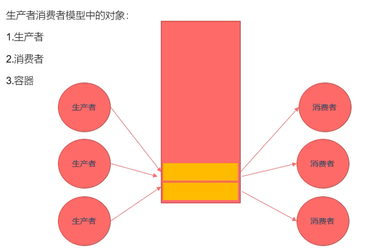

# Linux多线程开发

## 1. 线程基础

### 1.1 线程概述

**基本概念：**

- 与`进程（process）`类似，`线程（thread）`是允许应用程序**并发执行多个任务**的一种机制
- 一个进程可以包含多个线程
- 同一个程序中的所有线程均会独立执行相同程序，且共享同一份全局内存区域，其中包括初始化数据段、未初始化数据段，以及堆内存段。（传统意义上的 UNIX 进程只是多线程程序的一个特例，该进程只包含一个线程）

- **进程是 CPU 分配资源的最小单位，线程是操作系统调度执行的最小单位**

- 线程是轻量级的进程（`LWP：Light Weight Process`），在 Linux 环境下线程的本质仍是进程

- 查看指定进程的 `LWP` 号：`ps –Lf pid`，其中`pid`可以由`ps aux`得到

- 一般情况下，main函数

  所在的线程我们称之为主线程（main线程），其余创建的线程称为子线程

  - 程序中默认只有一个进程，`fork()`函数调用，2进程（父子进程）
  - 程序中默认只有一个线程，`pthread_create()`函数调用，2个线程（主线程和子线程）

**线程和进程区别：**

- **进程间的信息难以共享**。由于除去只读代码段外，父子进程并未共享内存，因此必须采用一些进程间通信方式，在进程间进行信息交换
- 调用 `fork()` 来创建进程的代价相对较高，即便利用写时复制技术，仍然需要复制诸如内存页表和文件描述符表之类的多种进程属性，这意味着 `fork()` 调用在时间上的开销依然不菲
- 线程之间能够方便、快速地共享信息。只需**将数据复制到共享（全局或堆）变量**中即可
- 创建线程比创建进程通常要快 10 倍甚至更多。线程间是共享虚拟地址空间的，无需采用写时复制来复制内存，也无需复制页表

**线程之间共享和非共享资源：**

* **共享资源**
  * 进程 ID 和父进程 ID
  * 进程组 ID 和会话 ID
  * 用户 ID 和 用户组 ID
  * 文件描述符表
  * 信号处置
  * 文件系统的相关信息：文件权限掩码（`umask`）、当前工作目录
  * 虚拟地址空间（**除栈、.text**）
* **非共享资源**
  * 线程 ID
  * 信号掩码
  * 线程特有数据
  * error 变量
  * 实时调度策略和优先级
  * 栈，本地变量和函数的调用链接信息

**NPTL：**或称为 `Native POSIX Thread Library`，是 Linux 线程的一个新实现，它克服了 `LinuxThreads `的缺点，同时也符合 `POSIX` 的需求。与 `LinuxThreads` 相比，它在性能和稳定性方面都提供了重大的改进

```shell
# 查看当前 pthread 库版本：
getconf GNU_LIBPTHREAD_VERSION
```

### 1.2 线程操作函数

**获取当前的线程的线程ID：**

```c
pthread_t pthread_self(void);
```

**比较两个线程ID是否相等：**

```c
int pthread_equal(pthread_t t1, pthread_t t2);
```

> 不同的操作系统，`pthread_t`类型的实现不一样，有的是无符号的长整型，有的是使用结构体去实现的

**线程创建：**

```c
int pthread_create(pthread_t *thread, const pthread_attr_t *attr, void *(*start_routine) (void *), void *arg);
```

**线程终止：**

```c
void pthread_exit(void *retval);
```

**线程创建：**

`int pthread_create(pthread_t *thread, const pthread_attr_t *attr, void *(*start_routine) (void *), void *arg);`

**作用：**创建一个子线程

- 参数
  - `thread`：传出参数，线程创建成功后，子线程的线程ID被
  - 写到该变量中
  - `attr` : 设置线程的属性，一般使用默认值，NULL
  - `start_routine` : 函数指针，这个函数是子线程需要处理的逻辑代码
  - `arg` : 给第三个参数(`start_routine`)使用，传参
- 返回值
  - 成功：0
  - 失败：返回错误号。这个错误号和之前`errno`不太一样。
    - 获取错误号的信息： `char * strerror(int errnum);`

```c
/*
	编译时要加上pthread动态库
*/
#include <pthread.h>
#include <string.h>
#include <stdio.h>
#include <unistd.h>
void * callBack(void *arg) {
    printf("child thread ...%d \n", *(int *)arg);
    return NULL;
}
int main() {
    // 创建一个子线程
    pthread_t tid;
    int num = 10;
    int ret = pthread_create(&tid, NULL, callBack, (void *)&num);
    // int ret = pthread_create(&tid, NULL, callBack, NULL);

    if (ret != 0) {
        char * errstr = strerror(ret);
        printf("error : %s\n", errstr);
    }
    for (int i = 0; i < 5; i++) {
        printf("%d\n", i);
    }
    // 防止子线程没有抢占到CPU且此时主线程已经执行完并退出
    sleep(1);
    return 0;
}
```

**线程终止：**

`void pthread_exit(void *retval);`

**功能：**终止一个线程，在哪个线程中调用，就表示终止哪个线程

- 参数：
  - `retval`，需要传递一个指针，作为一个返回值，可以在`pthread_join()`中获取到

```c
#include<pthread.h>
#include <stdio.h>
#include <string.h>
#include <unistd.h>

void *callback(void *arg) {
    printf("child thread id : %ld \n", pthread_self());
    return NULL;  // 等价于 pthread_exit(NULL)
}
int main() {
    // 创建一个子线程
    pthread_t tid;
    int ret = pthread_create(&tid, NULL, callback, NULL);

    if(ret != 0) {
        char * errstr = strerror(ret);
        printf("error: %s \n", errstr);
    }
    printf("child thread tid: %ld, main thread id : %ld", tid, pthread_self());
    // 主线程
    for(int i = 0; i < 5; ++ i) {
        printf("%d \n", i);
    } 
    // 让主线程退出，当主线程退出时，不会影响其他正常运行的线程
    pthread_exit(NULL);
    return 0;
}
```

**线程连接：**

`int pthread_join(pthread_t thread, void **retval);`

**作用：**和一个已经终止的线程进行连接。回收子线程的资源，这个函数是阻塞函数，调用一次只能回收一个子线程，一般在主线程中使用

- 参数
  - `thread`：需要回收的子线程的ID
  - `retval`：接收子线程退出时的返回值
- 返回值
  - 成功：0
  - 失败：返回错误号。这个错误号和之前`errno`不太一样。获取错误号的信息： `char * strerror(int errnum);`

```c
#include<pthread.h>
#include <stdio.h>
#include <string.h>
#include <unistd.h>

void *callback(void *arg) {
    printf("child thread id : %ld \n", pthread_self());
    //sleep(3);
    static int value = 10;
    pthread_exit((void *) &value); // 等价于 return (void *) &value
}
int main() {
    // 创建一个子线程
    pthread_t tid;
    int ret = pthread_create(&tid, NULL, callback, NULL);

    if(ret != 0) {
        char * errstr = strerror(ret);
        printf("error: %s \n", errstr);
    }
    printf("child thread tid: %ld, main thread id : %ld", tid, pthread_self());
    // 主线程
    for(int i = 0; i < 5; ++ i) {
        printf("%d \n", i);
    } 

    // 主线程调用pthread_join()回收子线程的资源
    int * thread_retval;
    ret = pthread_join(tid, (void **)&thread_retval);

    if(ret != 0) {
        char * errstr = strerror(ret);
        printf("error: %s \n", errstr);
    }
    printf("exit data: %d \n", *thread_retval);
    printf("回收子线程资源成功！\n");

    // 让主线程退出，当主线程退出时，不会影响其他正常运行的线程
    pthread_exit(NULL);
    return 0;
}
```

**线程分离：**

`int pthread_detach(pthread_t thread);`

**作用：**分离一个线程。被分离的线程在终止的时候，会自动释放资源返回给系统

- 不能多次分离，会产生不可预料的行为
- 不能去连接一个已经分离的线程，会报错

- 参数：需要分离的线程的ID
- 返回值
  - 成功：0
  - 失败：返回错误号。这个错误号和之前`errno`不太一样。获取错误号的信息： `char * strerror(int errnum);`

```c

#include <pthread.h>
#include <string.h>
#include <stdio.h>
void *callback() {
    printf("child thread tid: %ld \n", pthread_self()); 
}

int main() {

    // 创建一个子线程
    pthread_t tid;
    int ret = pthread_create(&tid, NULL, callback, NULL);
    if(ret != 0) {
        char * errstr = strerror(ret);
        printf("error: %s \n", errstr);
    }

    printf("child thread tid: %ld, main thread id : %ld \n", tid, pthread_self()); 

    // 设置子线程分离
    ret = pthread_detach(tid);

    if(ret != 0) {
        char * errstr = strerror(ret);
        printf("error2 : %s\n", errstr);
    }

    // 设置分离后，对分离的子线程进行连接 pthread_join()
    // ret = pthread_join(tid, NULL);
    // if(ret != 0) {
    //     char * errstr = strerror(ret);
    //     printf("error3 : %s\n", errstr);
    // }

    pthread_exit(NULL);

    return 0;
}
```

**线程取消：**

`int pthread_cancel(pthread_t thread);`

**功能：**取消线程（让线程终止）。

* **取消点**：系统规定好的一些系统调用，我们可以粗略的理解为从用户区到内核区切换的位置，可以通过`man pthreads`查看取消点

```c

#include <pthread.h>
#include <string.h>
#include <stdio.h>

void *callback() {
    printf("child thread tid: %ld \n", pthread_self()); 
    for(int i = 0; i <  5; ++ i) {
        printf("child %d\n", i);
    }
    return NULL;
}

int main() {

    // 创建一个子线程
    pthread_t tid;
    int ret = pthread_create(&tid, NULL, callback, NULL);
    if(ret != 0) {
        char * errstr = strerror(ret);
        printf("error: %s \n", errstr);
    }

    // 取消线程
    pthread_cancel(tid);

    for(int i = 0; i <  5; ++ i) {
        printf("%d\n", i);
    }
    printf("child thread tid: %ld, main thread id : %ld \n", tid, pthread_self()); 

    pthread_exit(NULL);

    return 0;
}
```

**线程属性：**

**线程属性类型：**`pthread_attr_t`

**初始化线程属性变量：**

```c
int pthread_attr_init(pthread_attr_t *attr);
```

**释放线程属性的资源：**

```c
int pthread_attr_destroy(pthread_attr_t *attr);
```

**获取线程分离的状态属性：**

```c
int pthread_attr_getdetachstate(const pthread_attr_t *attr, int *detachstate);
```

**设置线程分离的状态属性：**

```c
int pthread_attr_setdetachstate(pthread_attr_t *attr, int detachstate);
```

```c
// 通过设置线程属性实现线程分离
#include<stdio.h>
#include <string.h>
#include <pthread.h>

void *callback() {
    printf("child thread tid: %ld \n", pthread_self()); 
    for(int i = 0; i <  5; ++ i) {
        printf("child %d\n", i);
    }
    return NULL;
}


int main() {
    // 创建一个线程属性变量
    pthread_attr_t attr;
    // 初始化属性变量’
    pthread_attr_init(&attr);

    // 设置属性
    pthread_attr_setdetachstate(&attr, PTHREAD_CREATE_DETACHED);
    
    // 创建一个子线程
    pthread_t tid;
    int ret = pthread_create(&tid, NULL, callback, NULL);
    if(ret != 0) {
        char * errstr = strerror(ret);
        printf("error: %s \n", errstr);
    }
     // 获取线程的栈的大小
    size_t size;
    pthread_attr_getstacksize(&attr, &size);
    printf("thread stack size : %ld\n", size);

    // 输出主线程和子线程的id
    printf("tid : %ld, main thread id : %ld\n", tid, pthread_self());
    // 释放线程属性资源
    pthread_attr_destroy(&attr);
    
    pthread_exit(NULL);

    return 0;
    
}
```

## 2.  线程同步

### 2.1 **线程同步概念：**

- 线程的主要优势在于，**能够通过全局变量来共享信息**。不过，这种便捷的共享是有代价的：必须确保多个线程不会同时修改同一变量，或者某一线程不会读取正在由其他线程修改的变量
- `临界区`是指访问某一共享资源的代码片段，并且这段代码的执行应为`原子操作`，也就是同时访问同一共享资源的其他线程不应终端该片段的执行
- **线程同步：**即**当有一个线程在对内存进行操作时，其他线程都不可以对这个内存地址进行操作，直到该线程完成操作，其他线程才能对该内存地址进行操作，而其他线程则处于等待状态**

**卖票案例：**

```c
#include <stdio.h>
#include <pthread.h>

void* selltickets1(void* arg) {
    int tickets = 10;
    while (tickets > 0) {
        printf("线程%ld 正在售卖第%d张票\n", pthread_self(), tickets);
        tickets--;
    }

    return NULL;
}

void test1() {
    // 创建三个线程
    pthread_t tid1;
    pthread_t tid2;
    pthread_t tid3;
    pthread_create(&tid1, NULL, selltickets1, NULL);
    pthread_create(&tid2, NULL, selltickets1, NULL);
    pthread_create(&tid3, NULL, selltickets1, NULL);
    // 线程连接，回收子线程的资源，阻塞
    pthread_join(tid1, NULL);
    pthread_join(tid2, NULL);
    pthread_join(tid3, NULL);
}

int total_tickets = 10;

void* selltickets2(void* arg) {
    while (total_tickets > 0) {
        printf("线程%ld 正在售卖第%d张票\n", pthread_self(), total_tickets);
        total_tickets--;
    }

    return NULL;
}
void test2() {
    // 创建三个线程
    pthread_t tid1;
    pthread_t tid2;
    pthread_t tid3;
    pthread_create(&tid1, NULL, selltickets2, NULL);
    pthread_create(&tid2, NULL, selltickets2, NULL);
    pthread_create(&tid3, NULL, selltickets2, NULL);
    // 线程连接，回收子线程的资源，阻塞
    pthread_join(tid1, NULL);
    pthread_join(tid2, NULL);
    pthread_join(tid3, NULL);
}
int main()
{
    test2();
    pthread_exit(NULL);     // 退出main进程
    return 0;
}
```

### 2. 2 互斥量

**基本概念：**

- 为避免线程更新共享变量时出现问题，可以使用`互斥量（mutex 是 mutual exclusion的缩写）`来确保同时仅有一个线程可以访问某项共享资源。使用**互斥量能保证对任意共享资源的原子访问**
- 互斥量有两种状态：`已锁定（locked）`和`未锁定（unlocked）`。任何时候，**至多只有一个线程可以锁定该互斥量**。试图对已经锁定的某一互斥量再次加锁，将可能阻塞线程或者报错失败，具体取决于加锁时使用的方法
- 一旦线程锁定互斥量，随即成为该互斥量的所有者，**只有所有者才能给互斥量解锁**。一般情况下，对每一共享资源（可能由多个相关变量组成）会使用不同的互斥量，每一线程在访问同一资源时将采用如下协议
  - 针对共享资源锁定互斥量
  - 访问共享资源
  - 对互斥量解锁

* 如果多个线程试图执行这一块代码（一个临界区），事实上只有一个线程能够持有该互斥量（其他线程将遭到阻塞），即同时只有一个线程能够进入这段代码区域，如下


### 2.3 互斥量相关操作函数

**互斥量的类型：**

```c
pthread_mutex_t
```

**初始化互斥量：**

```c
int pthread_mutex_init(pthread_mutex_t *restrict mutex, const pthread_mutexattr_t *restrict attr);
```

- 参数
  - `mutex` ： 需要初始化的互斥量变量
  - `attr` ： 互斥量相关的属性，设置为NULL，由内核指定
  - `restrict` : C语言的修饰符，被修饰的指针，不能由另外的一个指针进行操作

**释放互斥量的资源：**

```c
int pthread_mutex_destroy(pthread_mutex_t *mutex);
```

**加锁：**

```c
int pthread_mutex_lock(pthread_mutex_t *mutex);
```

阻塞的，如果有一个线程加锁了，那么其他线程只能阻塞等待

**尝试加锁：**

```c
int pthread_mutex_lock(pthread_mutex_t *mutex);
```

尝试加锁，如果加锁失败，不会阻塞，直接返回

**解锁：**

```c
int pthread_mutex_unlock(pthread_mutex_t *mutex);
```

**实例：互斥锁实现进程同步售票：**

```c

#include <stdio.h>
#include <pthread.h>
#include <string.h>
#include <unistd.h>

// 创建一个互斥量
pthread_mutex_t mutex;

int tickets = 100;

void * sellticket(void *arg) {

    // 卖票
    while(1) {
        // 加锁
        pthread_mutex_lock(&mutex);
        if(tickets > 0) {
            // 访问共享变量
            printf("%ld 正在卖第 %d 张票 \n", pthread_self(), tickets);
            tickets --;
        } else {
            // 解锁
            pthread_mutex_unlock(&mutex);
            break;
        }
        // 解锁
        pthread_mutex_unlock(&mutex);
    }

    return NULL;
}

int main() {

    // 初始化互斥量
    pthread_mutex_init(&mutex, NULL);

    // 创建三个子线程
    pthread_t tid1, tid2, tid3;
    pthread_create(&tid1, NULL, sellticket, NULL);
    pthread_create(&tid2, NULL, sellticket, NULL);
    pthread_create(&tid3, NULL, sellticket, NULL);


    // 回收子线程的资源， 阻塞
    pthread_join(tid1, NULL);
    pthread_join(tid2, NULL);
    pthread_join(tid3, NULL);

    
    // 退出主线程
    pthread_exit(NULL);

    // 释放互斥量资源
    pthread_mutex_destroy(&mutex);


    return 0;

}
```

### 2.4 死锁

**基本概念**

- 一个线程需要同时访问两个或更多不同的共享资源，而每个资源又都由不同的互斥量管理。当超过一个线程加锁同一组互斥量时，就有可能发生`死锁`
- 两个或两个以上的进程在执行过程中，因争夺共享资源而造成的一种互相等待的现象，若无外力作用，它们都将无法推进下去。此时称系统处于死锁状态或系统产生了死锁

**死锁的几种场景：**

* `忘记释放锁`

* `重复加锁`

* `多线程多锁，抢占锁资源`

  

  ```c
  #include <stdio.h>
  #include <pthread.h>
  #include <unistd.h>
  
  // 创建2个互斥量
  pthread_mutex_t mutex1, mutex2;
  
  void * workA(void * arg) {
  
      pthread_mutex_lock(&mutex1);
      sleep(1);
      pthread_mutex_lock(&mutex2);
  
      printf("workA....\n");
  
      pthread_mutex_unlock(&mutex2);
      pthread_mutex_unlock(&mutex1);
      return NULL;
  }
  
  
  void * workB(void * arg) {
      pthread_mutex_lock(&mutex2);
      sleep(1);
      pthread_mutex_lock(&mutex1);
  
      printf("workB....\n");
  
      pthread_mutex_unlock(&mutex1);
      pthread_mutex_unlock(&mutex2);
  
      return NULL;
  }
  
  int main() {
  
      // 初始化互斥量
      pthread_mutex_init(&mutex1, NULL);
      pthread_mutex_init(&mutex2, NULL);
  
      // 创建2个子线程
      pthread_t tid1, tid2;
      pthread_create(&tid1, NULL, workA, NULL);
      pthread_create(&tid2, NULL, workB, NULL);
  
      // 回收子线程资源
      pthread_join(tid1, NULL);
      pthread_join(tid2, NULL);
  
      // 释放互斥量资源
      pthread_mutex_destroy(&mutex1);
      pthread_mutex_destroy(&mutex2);
  
      return 0;
  }
  ```

### 2.5 读写锁

**基本概念：**

- 当有一个线程已经持有互斥锁时，互斥锁将所有试图进入临界区的线程都阻塞住。但是考虑一种情形，当前持有互斥锁的线程只是要读访问共享资源，而同时有其它几个线程也想读取这个共享资源，但是由于互斥锁的排它性，所有其它线程都无法获取锁，也就无法读访问共享资源了，但是实际上多个线程同时读访问共享资源并不会导致问题
- 在对数据的读写操作中，**更多的是读操作，写操作较少**，例如对数据库数据的读写应用。为了满足当前能够允许多个读出，但只允许一个写入的需求，线程提供了读写锁来实现

**读写锁的特点：**

- 如果有其它线程读数据，则允许其它线程执行读操作，但不允许写操作
- 如果有其它线程写数据，则其它线程都不允许读、写操作
- 写是独占的，写的优先级高

**读写锁相关操作函数：**

* 读写锁的类型：

```c
pthread_rwlock_t
```

- 初始化读写锁：

```c
int pthread_rwlock_init(pthread_rwlock_t *restrict rwlock, const pthread_rwlockattr_t *restrict attr);
```

- 释放互斥量的资源：

```c
int pthread_rwlock_destroy(pthread_rwlock_t *rwlock);
```

- 读操作加锁：

```c
int pthread_rwlock_rdlock(pthread_rwlock_t *rwlock);
```

- 读操作尝试加锁：

```c
int pthread_rwlock_tryrdlock(pthread_rwlock_t *rwlock);
```

- 写操作加锁：

```c
int pthread_rwlock_wrlock(pthread_rwlock_t *rwlock);
```

- 写操作尝试加锁：

```c
int pthread_rwlock_trywrlock(pthread_rwlock_t *rwlock);
```

- 解锁：

```c
int pthread_rwlock_unlock(pthread_rwlock_t *rwlock);
```

**实例---读写锁实现读线程数量大于写线程数量:**

```
// 8个线程操作同一个全局变量。3个线程不定时写这个全局变量，5个线程不定时的读这个全局变量
#include <stdio.h>
#include <pthread.h>
#include <unistd.h>

int num = 0;
// 创建读写锁
pthread_rwlock_t rwlock;

void* workA(void* arg) {
    while (1) {
        // 加写锁
        pthread_rwlock_wrlock(&rwlock);
        num++;
        printf("++write, tid : %ld, num : %d\n", pthread_self(), num);
        // 解锁
        pthread_rwlock_unlock(&rwlock);
        usleep(100);
    }
    
    return NULL;
}

void* workB(void* arg) {
    while (1) {
        // 加读锁
        pthread_rwlock_rdlock(&rwlock);
        printf("===read, tid : %ld, num : %d\n", pthread_self(), num);
        // 解锁
        pthread_rwlock_unlock(&rwlock);
        usleep(100);
    }

    return NULL;
}

int main()
{
    // 初始化读写锁
    pthread_rwlock_init(&rwlock, NULL);
    // 创建8个线程，3个写线程，5个读线程
    pthread_t wtids[3], rtids[5];
    for (int i = 0; i < 3; i++) {
        pthread_create(&wtids[i], NULL, workA, NULL);
    }
    for (int i = 0; i < 5; i++) {
        pthread_create(&rtids[i], NULL, workB, NULL);
    }

    // 分离，回收资源
    for (int i = 0; i < 3; i++) {
        pthread_detach(wtids[i]);
    }
    for (int i = 0; i < 5; i++) {
        pthread_detach(rtids[i]);
    }
    // 回收读写锁
    pthread_rwlock_destroy(&rwlock);
    // 回收主线程
    pthread_exit(NULL);
}
```

### 2.6 生产者消费者模型(条件变量)

**关系模型：**



**存在问题：**

1. 当容器满时，无法继续生产
2. 当容器空时，无法继续消费
3. 多个生产者或消费者时，会出现线程同步问题

**实例：**初略版多生产者多消费者

```
#include<stdio.h>
#include<pthread.h>
#include <unistd.h>
#include <stdlib.h>


struct Node {
    int num;
    struct Node * next;
};

// 头结点
struct Node *head = NULL;

void * producer(void *arg) {
    // 不断地创建新的节点
    while(1) {
        struct Node *newNode = (struct Node *)malloc(sizeof(struct Node));
        newNode->num = rand() % 1000;
        newNode->next = head;
        head = newNode;
        printf("add node, num : %d, tid : %ld\n", newNode->num, pthread_self());
        usleep(100);
    }
    return NULL;
}

void *customer(void *arg) {
    while(1) {
        // 保存头结点的指针
        struct Node *tmp = head;
        head = head->next;
        printf("del node, num: %d, tid: %ld \n", tmp->num, pthread_self());
        free(tmp);
        usleep(100);
    }
    return NULL;
}
int main() {
    // 创建5个生产线程，5个消费线程

    pthread_t ptids[5], ctids[5];
    for(int i = 0; i < 5; ++ i) {
        pthread_create(&ptids[i], NULL, producer, NULL);
        pthread_create(&ctids[i], NULL, customer, NULL);
    }


    for(int i = 0; i < 5; ++ i) {
        pthread_detach(ptids[i]);
        pthread_detach(ctids[i]);
    }

    pthread_exit(NULL);
    return 0;
}
```

**实例：**引入互斥量多生产者多消费者

```c
#include<stdio.h>
#include<pthread.h>
#include <unistd.h>
#include <stdlib.h>


struct Node {
    int num;
    struct Node * next;
};

// 头结点
struct Node *head = NULL;

// 互斥量
pthread_mutex_t mutex;

void * producer(void *arg) {
    // 不断地创建新的节点
    while(1) {
        pthread_mutex_lock(&mutex);
        struct Node *newNode = (struct Node *)malloc(sizeof(struct Node));
        newNode->num = rand() % 1000;
        newNode->next = head;
        head = newNode;
        printf("add node, num : %d, tid : %ld\n", newNode->num, pthread_self());
        pthread_mutex_unlock(&mutex);
        sleep(1);
    }
    return NULL;
}

void *customer(void *arg) {
    while(1) {
        pthread_mutex_lock(&mutex);
        // 保存头结点的指针
        struct Node *tmp = head;
        if(head != NULL) {
            head = head->next;
            printf("del node, num: %d, tid: %ld \n", tmp->num, pthread_self());
            free(tmp);
            
        } 
        pthread_mutex_unlock(&mutex);
        sleep(1);
    }
    return NULL;
}
int main() {

    // 初始化互斥锁
    pthread_mutex_init(&mutex, NULL);

    // 创建5个生产线程，5个消费线程
    pthread_t ptids[5], ctids[5];
    for(int i = 0; i < 5; ++ i) {
        pthread_create(&ptids[i], NULL, producer, NULL);
        pthread_create(&ctids[i], NULL, customer, NULL);
    }


    for(int i = 0; i < 5; ++ i) {
        pthread_detach(ptids[i]);
        pthread_detach(ctids[i]);
    }
    
    pthread_exit(NULL);
    // 回收互斥锁
    pthread_mutex_destroy(&mutex);
    return 0;
}
```

**条件变量相关操作函数：**

`满足条件时，才执行，不是锁，配合互斥量使用`

- 条件变量的类型：

  ```c
  pthread_cond_t
  ```

- 初始化：

  ```c
  int pthread_cond_init(pthread_cond_t *restrict cond, const pthread_condattr_t *restrict attr);
  ```

- 回收：

  ```c
  int pthread_cond_destroy(pthread_cond_t *cond);
  ```

- 等待，调用了该函数，线程会阻塞：

- ```c
  int pthread_cond_wait(pthread_cond_t *restrict cond, pthread_mutex_t *restrict mutex);
  ```

- 等待多长时间，调用了这个函数，线程会阻塞，直到指定的时间结束：

  ```c
  int pthread_cond_timedwait(pthread_cond_t *restrict cond,  pthread_mutex_t *restrict mutex, const struct timespec *restrict abstime);
  ```

- 唤醒一个或者多个等待的线程：

  ```c
  int pthread_cond_signal(pthread_cond_t *cond);
  ```

- 唤醒所有的等待的线程：

  ```c
  int pthread_cond_broadcast(pthread_cond_t *cond);
  ```

**实例：**条件变量下的多生产者多消费者

- 当有生产者生产时，通知消费者消费，否则等待

```c
#define _DEFAULT_SOURCE

#include<stdio.h>
#include<pthread.h>
#include <unistd.h>
#include <stdlib.h>

struct Node {
    int num;
    struct Node * next;
};

// 头结点
struct Node *head = NULL;

// 互斥量
pthread_mutex_t mutex;
// 创建条件变量
pthread_cond_t cond;

void * producer(void *arg) {
    // 不断地创建新的节点
    while(1) {
        pthread_mutex_lock(&mutex);
        struct Node *newNode = (struct Node *)malloc(sizeof(struct Node));
        newNode->num = rand() % 1000;
        newNode->next = head;
        head = newNode;
        printf("add node, num : %d, tid : %ld\n", newNode->num, pthread_self());
        // 只要生产一个，就通知消费者消费
        pthread_cond_signal(&cond);
        pthread_mutex_unlock(&mutex);
        sleep(1);
    }
    return NULL;
}

void *customer(void *arg) {
    while(1) {
        pthread_mutex_lock(&mutex);
        // 保存头结点的指针
        struct Node *tmp = head;
        if(head != NULL) {
            // 有数据
            head = head->next;
            printf("del node, num: %d, tid: %ld \n", tmp->num, pthread_self());
            free(tmp);
            pthread_mutex_unlock(&mutex);
            sleep(1);
        } else {
            // 没有数据，需要等待
            // 当这个函数调用阻塞的时候，会自动对互斥锁进行解锁，当不阻塞的，继续向下执行，内部会自动重新加锁。所以才需要再解锁
            pthread_cond_wait(&cond, &mutex);
            pthread_mutex_unlock(&mutex);
        }
    }
    return NULL;
}
int main() {
    // 初始化互斥锁
    pthread_mutex_init(&mutex, NULL);
    // 初始化条件变量
    pthread_cond_init(&cond, NULL);

    // 创建5个生产线程，5个消费线程
    pthread_t ptids[5], ctids[5];
    for(int i = 0; i < 5; ++ i) {
        pthread_create(&ptids[i], NULL, producer, NULL);
        pthread_create(&ctids[i], NULL, customer, NULL);
    }

    for(int i = 0; i < 5; ++ i) {
        pthread_detach(ptids[i]);
        pthread_detach(ctids[i]);
    }  
    pthread_exit(NULL);

    // 回收条件变量
    pthread_cond_destroy(&cond);
    // 回收互斥锁
    pthread_mutex_destroy(&mutex);
    return 0;
}
```

###  2.7. 信号量

**信号量相关操作函数：**

- 信号量的类型：

  ```c
  sem_t
  ```

`int sem_init(sem_t *sem, int pshared, unsigned int value);`

**作用：**初始化信号量

- 参数
  - `sem`：信号量变量的地址
  - `pshared`：0 用在线程间 ，非0 用在进程间
  - `value `：信号量中的值，代表容器大小

`int sem_destroy(sem_t *sem);`

**作用：**释放资源

`int sem_wait(sem_t *sem);`

**功能：**对信号量加锁，调用一次对信号量的值-1，如果值为0，就阻塞

`int sem_trywait(sem_t *sem);`

`int sem_timedwait(sem_t *sem, const struct timespec *abs_timeout);`

`int sem_post(sem_t *sem);`

**作用：**对信号量解锁，调用一次对信号量的值+1

`int sem_getvalue(sem_t *sem, int *sval);`

**实例：**信号量下的多生产者多消费者

```c
// 不需要单独判断容器为空的情况
#define _DEFAULT_SOURCE

#include<stdio.h>
#include<pthread.h>
#include <unistd.h>
#include <stdlib.h>
#include <semaphore.h>

struct Node {
    int num;
    struct Node * next;
};

// 头结点
struct Node *head = NULL;

// 互斥量
pthread_mutex_t mutex;
// 信号量
sem_t psem, csem;

void * producer(void *arg) {
    // 不断地创建新的节点
    while(1) {
        sem_wait(&psem);
        pthread_mutex_lock(&mutex);
        struct Node *newNode = (struct Node *)malloc(sizeof(struct Node));
        newNode->num = rand() % 1000;
        newNode->next = head;
        head = newNode;
        printf("add node, num : %d, tid : %ld\n", newNode->num, pthread_self());
        // 只要生产一个，就通知消费者消费
        pthread_mutex_unlock(&mutex);
        sem_post(&csem);
        sleep(1);
    }
    return NULL;
}

void *customer(void *arg) {
    while(1) {
        sem_wait(&csem);
        pthread_mutex_lock(&mutex);
        // 保存头结点的指针
        struct Node *tmp = head;
        // 有数据
        head = head->next;
        printf("del node, num: %d, tid: %ld \n", tmp->num, pthread_self());
        free(tmp);
        pthread_mutex_unlock(&mutex);
        sem_post(&psem);
        sleep(1);
        
    }
    return NULL;
}
int main() {

    // 初始化互斥锁
    pthread_mutex_init(&mutex, NULL);

    // 初始化信号量
    sem_init(&psem, 0, 8);
    sem_init(&csem, 0, 0);

    // 创建5个生产线程，5个消费线程
    pthread_t ptids[5], ctids[5];
    for(int i = 0; i < 5; ++ i) {
        pthread_create(&ptids[i], NULL, producer, NULL);
        pthread_create(&ctids[i], NULL, customer, NULL);
    }


    for(int i = 0; i < 5; ++ i) {
        pthread_detach(ptids[i]);
        pthread_detach(ctids[i]);
    }
    
    pthread_exit(NULL);

    // 回收互斥锁
    pthread_mutex_destroy(&mutex);
    // 回收信号量
    sem_destroy(&psem);
    sem_destroy(&csem);
    return 0;
}
```

