# 进程概述

## 1. 程序和进程

### 1.1 程序

`程序是包含一系列信息的文件`，这些信息描述了如何在运行时创建一个进程。

**信息文件：**

* **二进制格式标识：**每个程序文件都包含用于描述可执行文件格式的元信息。内核利用此信息来解释文件中的其他信息。 (ELE可执行连接格式)
* **机器语言指令：**对程序算法进行编码
* **程序入口地址：**标识程序开始执行时的起始指令位置。
* **数据：**程序文件包含的变量初始值和程序使用的字面量值 (比如字符串)。
* **符号表及重定位表：**描述程序中函数和变量的位置及名称。这些表格有多重用途，其中包括调试和运行时的符号解析(动态链接)。
* **共享库和动态链接信息**：程序文件所包含的一些字段，列出了程序运行时需要使用的共享库，以及加载共享库的动态连接器的路径名。
* **其他信息**：程序文件还包含许多其他信息，用以描述如何创建进程。

### 1.2 进程

**狭义定义：**`进程是正在运行的程序的实例`

**广义定义**：`进程是一个具有一定独立功能的程序关于某个数据集合的一次运行活动`。**操作系统动态执行的基本单元**

在传统的[操作系统](https://so.csdn.net/so/search?q=操作系统&spm=1001.2101.3001.7020)中:

* 进程既是基本的执行单元，
* 也是基本的分配单元。
* **进程是系统资源分配的最小单位，一个进程可以有多个线程。**

**从内核的角度看，进程由用户内存空间和一系列内核数据结构组成，其中用户内存空间包含了程序代码及代码所使用的变量，而内核数据结构则用于维护进程状态信息。**

> 其中用户内存空间包含了程序代码及代码所使用的变量，而内核数据结构则用于维护进程状态信息。记录在内核数据结构中的信息包括许多`与进程相关的标识号（IDs）、虚拟内存表、打开文件的描述符表、信号传递及处理的有关信息、进程资源使用及限制、当前工作目录和大量的其他信息`

### 1.3 进程和程序的区别

* 程序是指令和数据的有序集合，是一个静态的概念。而进程是程序在处理机上的一次执行过程，它是一个动态的概念。
*  程序可以作为一种软件资料长期存在，而进程是有一定生命期的。程序是永久的，进程是暂时的。
* 进程是由进程控制块、程序段、数据段三部分组成;
*  进程具有创建其他进程的功能，而程序没有。
* 同一程序同时运行于若干个数据集合上，它将属于若干个不同的进程，也就是说同一程序可以对应多个进 程。
* 在传统的操作系统中，程序并不能独立运行，作为资源分配和独立运行的基本单元都是进程。

### 1.4 单道、多道程序设计

`单道程序:`即在计算机内存中只允许一个的程序运行

`多道程序：`设计技术是在计算机内存中同时存放几道相互独立的程序，使它们在管理程序控制下，相互穿插运行，两个或两个以上程序在计算机系统中同处于开始到结束之间的状态，这些程序共享计算机系统资源。

> 对于一个**单 CPU 系统**来说，程序同时处于运行状态只是一种宏观上的概念，他们虽然都已经开始运行，但**就微观而言，任意时刻，CPU 上运行的程序只有一个**

### 1.5 时间片

`时间片（timeslice）又称为“量子（quantum）”或“处理器片（processor slice）” 是操作系统分配给每个正在运行的进程微观上的一段 CPU 时间。`

**时间片由操作系统内核的调度程序分配给每个进程。**首先，内核会给每个进程分配相等 的初始时间片，然后每个进程轮番地执行相应的时间，当所有进程都处于时间片耗尽的 状态时，内核会重新为每个进程计算并分配时间片，如此往复。

### 1.6  并行和并发

**并行(parallel)：**`指在同一时刻，有多条指令在多个处理器上同时执行。`

**并发(concurrency)：**`指在同一时刻只能有一条指令执行，但多个进程指令被快速的 轮换执行，使得在宏观上具有多个进程同时执行的效果，但在微观上并不是同时执行的， 只是把时间分成若干段，使多个进程快速交替的执行。`

### 1.7进程控制块（PCB）

为了管理进程，内核必须对每个进程所做的事情进行清楚的描述。内核为每个进程分配一个`PCB(Processing Control Block)进程控制块`，维护进程相关的信息，Linux 内核的进程控制块是 `task_struct` 结构体

**task_struct 结构体定义地址：**

```shell
/usr/src/linux-headers-xxx/include/linux/sched.h
```

**task_struct：**

* 进程id：系统中每个进程有唯一的 id，用 pid t类型表示，其实就是一个非负整数
* 进程的状态：有就绪、运行、挂起、停止等状态
* 进程切换时需要保存和恢复的一些CPU寄存器
* 描述虚拟地址空间的信息
* 描述控制终端的信息
* 当前工作目录(Current Working Directory)
* umask 掩码
* 文件描述符表，包含很多指向 file 结构体的指针
* 和信号相关的信息
* 用户 id 和组 id
* 会话 (Session) 和进程组进程可以使用的资源上限(Resource Limit)

## 2. 进程的状态转换

`进程状态反映进程执行过程的变化。这些状态随着进程的执行和外界条件的变化而转换。`分为三态模型和五态模型。

### 2.1 进程的状态

**三态模型：**

- `运行态`：进程占有处理器正在运行
- `就绪态`：进程具备运行条件，等待系统分配处理器以便运行。当进程已分配到除CPU以外的所有必要资源后，只要再获得CPU，便可立即执行。在一个系统中处于就绪状态的进程可能有多个，通常将它们排成一个队列，称为就绪队列
- `阻塞态`：又称为等待(wait)态或睡眠(sleep)态，指进程不具备运行条件，正在等待某个事件的完成

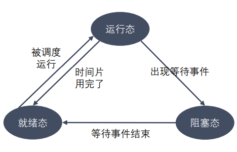

**五态模型：**

- 除`新建态`和`终止态`，其余三个状态与`三态模型`一致
- `新建态`：进程刚被创建时的状态，尚未进入就绪队列
- `终止态`：进程完成任务到达正常结束点，或出现无法克服的错误而异常终止，或被操作系统及有终止权的进程所终止时所处的状态。进入终止态的进程以后不再执行，但依然保留在操作系统中等待善后。一旦其他进程完成了对终止态进程的信息抽取之后，操作系统将删除该进程

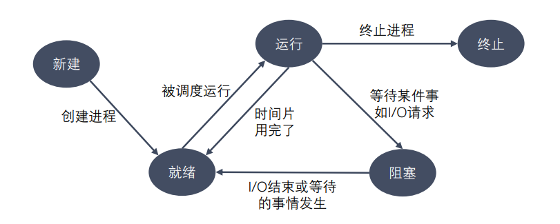

### 2.2 进程的相关命令

**查看进程：**

```shell
ps aux / ajx
# a：显示终端上的所有进程，包括其他用户的进程
# u：显示进程的详细信息
# x：显示没有控制终端的进程
# j：列出与作业控制相关的信息
```

**STAT参数意义：**

- `D ：`不可中断 Uninterruptible（usually IO）
- `R：`正在运行，或在队列中的进程
- `S(大写) ：`处于休眠状态
- `T：`停止或被追踪
- `Z：`僵尸进程
- `W：`进入内存交换（从内核2.6开始无效）
- `X`：死掉的进程
- `<：`高优先级
- `N：`低优先级
- `s：`包含子进程
- `+：`位于前台的进程组

**实时显示进程动态：**

```shell 
top
# 可以在使用 top 命令时加上 -d 来指定显示信息更新的时间间隔，在 top 命令执行后，可以按以下按键对显示的结果进行排序
# M：根据内存使用量排序
# P：根据 CPU 占有率排序
# T：根据进程运行时间长短排序
# U：根据用户名来筛选进程
# K：输入指定的 PID 杀死进程
```

**杀死进程：**

```shell
kill [-signal] pid
kill –l 列出所有信号
kill –SIGKILL 进程ID
kill -9 进程ID
killall name 根据进程名杀死进程
```

### 2.3 进程号和相关函数

* 每个进程都由进程号来标识，其类型为 pid_t（整型），进程号的范围：0～32767。 进程号总是唯一的，但可以重用。当一个进程终止后，其进程号就可以再次使用。
* 任何进程（除 init 进程）都是由另一个进程创建，该进程称为被创建进程的父进程， 对应的进程号称为父进程号（PPID）。
* 进程组是一个或多个进程的集合。他们之间相互关联，进程组可以接收同一终端的各 种信号，关联的进程有一个进程组号（PGID）。默认情况下，当前的进程号会当做当 前的进程组号。

**进程号和进程组相关函数：**

```c
pid_t getpid(void);
pid_t getppid(void);
pid_t getpgid(pid_t pid);
```

## 3. 创建进程

### 3.1 进程创建

`pid_t fork(void)`

**作用：**用于创建子进程

**返回值：**`fork()的返回值会返回两次，一次在父进程中，一次在子进程中。`

*  在父进程中返回创建的子进程ID
* 在子进程中返回0
* 在父进程中返回 -1 表示子进程创建失败，并设置 errno

  `可以通过fork的返回值区分父进程和子进程`

**创建失败的原因：**

* 当前系统的进程数已经达到了系统规定的上限，这时 errno 的值被设置 为 EAGAIN 
* 系统内存不足，这时 errno 的值被设置为 ENOMEM

```c
#include<sys/types.h>
#include<unistd.h>
#include<stdio.h>

int main() {
    // 创建子进程
    pid_t pid = fork();

    int num = 10;

    // 判断是父进程还是子进程
    if(pid > 0) {
        // 如果大于0，返回的是创建的子进程的进程号，当前是父进程
        printf("pid: %d\n", pid);
        printf("i am parent process, pid: %d, ppid: %d \n", getpid(), getppid());

        printf("parent num: %d \n", num);
        num += 10;
        printf("parent num: %d \n", num);

    } else if(pid == 0) {
        // 当前是子进程
        printf("i am child process, pid: %d, ppid: %d \n", getpid(), getppid());
        // sleep(11);

        printf("child num: %d \n", num);
        num += 100;
        printf("child num: %d \n", num);
    }

    for(int i = 0; i < 5; ++ i) {
        printf("i: %d, pid: %d \n", i, getpid());
        sleep(1);
    }
    return 0;
}
```

### 3.2 父子进程虚拟地址空间

- Linux 的 `fork()` 使用是通过**写时拷贝 (copy- on-write) 实现**。写时拷贝是一种可以推迟甚至避免拷贝数据的技术
- 内核此时并不复制整个进程的地址空间，而是让**父子进程共享同一个地址空间**，只有在**需要写入的时候**才会复制地址空间，从而使各个进程拥有各自的地址空间。即**资源的复制是在需要写入的时候才会进行，在此之前，只有以只读方式共享**（示例程序中`num`的作用）
- **fork之后父子进程共享文件**。fork产生的子进程与父进程**有相同的文件描述符，指向相同的文件表**，引用计数增加，共享文件偏移指针
- 使用**虚拟地址空间**，由于用的是**写时拷贝 (copy- on-write) ，下图不完全准确，但可帮助理解**

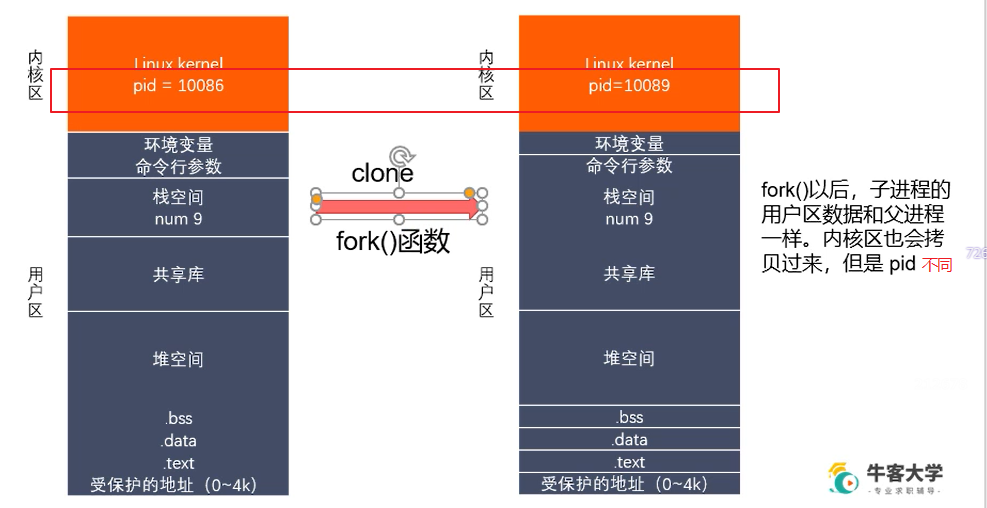

### 3.3 父子进程关系

**区别：**

* **fork()函数的返回值不同**
  * 进程中: >0 返回的是子进程的ID，
  * 子进程中: =0

- **pcb 中的一些数据不同**。
  - pcb中存的是当前进程的 ID (pid)
  - 当前进程的父ID(ppid)
  - 信号集

**共同点：**

- 在某些状态下，即**子进程刚被创建出来，还没有执行任何的写数据的操作**。此时**用户区的数据**和**文件描述符表**父进程和子进程一样

`父子进程对变量共享说明：`

- 刚开始的时候，是一样的，共享的。如果修改了数据，不共享了
- 读时共享（子进程被创建，两个进程没有做任何的写的操作），写时拷贝

### 3.4 GDB多进程调试

使用 GDB 调试的时候，GDB 默认只能跟踪一个进程，可以在 fork 函数调用之前，通过指令设置 GDB 调试工具跟踪父进程或者是跟踪子进程，默认跟踪父进程。

**设置调试父进程或者子进程：**

```shell
set follow-fork-mode [parent（默认）| child]
```

**设置调试模式：**

```shell
set detach-on-fork [on | off]
```

`默认为 on，表示调试当前进程的时候，其它的进程继续运行，如果为 off，调试当前进 程的时候，其它进程被 GDB 挂起。`

**查看调试的进程：**

```shell
info inferiors 
```

**切换当前调试的进程：**

```shell
inferior id 
```

**使进程脱离 GDB 调试：**

```shell
detach inferiors id
```

 

## 4. exec函数族

### 4.1  exec 函数族介绍

**exec 函数族的作用：**根据指定的文件名找到可执行文件，并用它来取代调用进程的内容，换句话说，就是在调用进程内部执行一个可执行文件。

`exec 函数族的函数执行成功后不会返回，因为调用进程的实体，包括代码段，数据 段和堆栈等都已经被新的内容取代，只留下进程 ID 等一些表面上的信息仍保持原样`。只有调用失败了，它们才会返回 -1，从原程序的调用点接着往下执行

### 4.2 exec函数族作用图解

**用户区替换为`a.out`的内容，内核区不变：**


### 4.3 exec 函数族


`int execl(const char *path, const char \*arg, ... /\* (char  *) NULL */);`

*  参数：

  * path：需要指定的执行文件的路径或名称

  > ​	a.out home/user/a.out  推荐使用绝对路径
  
  * arg：是可执行文件的参数列表

> 第一个参数一般没什么作用，一般写的是执行的程序的名称
>
> 从第二个参数开始往后，就是程序执行所需要的参数列表
>
>  参数最后需要以NULL 结束（哨兵）

* 返回值：
  * 只有当调用失败时，才会有返回值，返回-1 并且设置errno
  * 如果调用成功，没有返回值

```c
#include <unistd.h>
#include <sys/types.h>
#include <stdio.h>
int main() {
    // 创建一个子进程，在子进程中执行exec函数族中的函数
    pid_t pid = fork();
    if(pid > 0) {
        // 父进程
        printf("i am parent process, pid = %d\n", getpid());
        sleep(1);
    } else if(pid == 0) {
        // 子进程
        execl("./hello", "hello", NULL);
        printf("i am child process, pid =  %d\n", getpid());
    }

    for(int i = 0; i < 3; ++ i) {
        printf("i = %d, pid = %d \n", i, getpid());
    }

    return 0;
}
```

`int execlp(const char *file, const char *arg, .../* (char  *) NULL */);`

>   会到环境变量中查找指定的可执行文件，如果找到了就执行，找不到就执行不成功

*  参数：
  * file: 需要执行的可执行文件的文件名( a.out, ps)

* 返回值：
  *   只有当调用失败时，才会有返回值，返回-1 并且设置errno
  * 如果调用成功，没有返回值

```
execlp("ps", "ps", "aux", NULL);
```

`int execv(const char *path, char *const argv[]);`

> argv 参数是需要一个字符串数组
>
> char * argv[] = {"ps", "aux", NULL};

```c
execv("/bin/ps", argv)
```

```
char* argv[] = {"hello", NULL};
execv("/home/u/Desktop/Linux/hello", argv);
```

`int execle(const char *path, const char *arg, .../*, (char *) NULL, char * const envp[] */);`

- **envp：**添加路径至环境变量，注意以 **NULL** 结尾，否则报 **execle: Bad address**

```c
char* envp[] = {"/home/u/Desktop/Linux/", NULL};
execle("/home/u/Desktop/Linux/hello", "hello", NULL, envp);
```

## 5. 进程控制

### 5.1 进程退出

- 标准C库：`exit()`
- Linux系统：`_exit()`

**区别：**

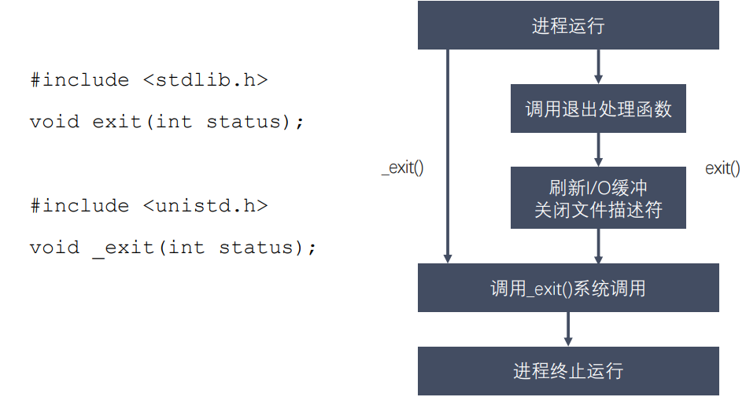

### 5.2 孤儿进程

父进程运行结束，但子进程还在运行（未运行结束），这样的子进程就称为**孤儿进程 （Orphan Process）**。

> 每当出现一个孤儿进程的时候，内核就把孤儿进程的父进程设置为 `init (pid = 1的进程)` ，而 init 进程会循环地 wait() 它的已经退出的子进程。这样，当一个孤儿进程凄凉地结束 了其生命周期的时候，init 进程就会代表党和政府出面处理它的一切善后工作。 
>
> 因此孤儿进程并不会有什么危害。

### 5.3 僵死进程

- 个进程结束之后，都会释放自己地址空间中的用户区数据，内核区的 PCB 没有办法自己释放掉，需要父进程去释放
- 进程终止时，父进程尚未回收，子进程残留资源（PCB）存放于内核中，变成`僵尸（Zombie）进程`
- **僵尸进程不能被 `kill -9` 杀死**，这样就会导致一个问题，如果父进程不调用 `wait()` 或 `waitpid()` 的话，那么保留的那段信息就不会释放，其进程号就会一直被占用，但是系统所能使用的进程号是有限的，如果大量的产生僵尸进程，将因为没有可用的进程号而导致系统不能产生新的进程，此即为僵尸进程的危害，应当避免。

`可以以通过杀死父进程，从而使僵尸进程变为孤儿进程，让init (pid = 1)领养进行释放`

### 5.4 进程回收

> 在每个进程退出的时候，内核释放该进程所有的资源、包括打开的文件、占用的内存等。但是仍然为其保留一定的信息，这些信息主要主要指进程控制块PCB的信息（包括进程号、退出状态、运行时间等）

`父进程可以通过调用wait或waitpid得到它的退出状态同时彻底清除掉这个进程。`

**`wait()` 和 `waitpid()` 函数的功能一样，区别在于**

- `wait()` 函数会阻塞
- `waitpid()` 可以设置是否阻塞，`waitpid()` 还可以指定等待哪个子进程结束

`退出信息相关宏函数`

- **WIFEXITED(status)**：非0，进程正常退出
- **WEXITSTATUS(status)：**如果上宏为真，获取进程退出的状态（exit的参数）
- **WIFSIGNALED(status)：**非0，进程异常终止
- **WTERMSIG(status)：**如果上宏为真，获取使进程终止的信号编号
- **WIFSTOPPED(status)：**非0，进程处于暂停状态
- **WSTOPSIG(status)：**如果上宏为真，获取使进程暂停的信号的编号
- **WIFCONTINUED(status)：**非0，进程暂停后已经继续运行

`pid_t wait(int *wstatus);`

  **作用：**等待任意一个子进程结束，如果任意一个子进程结束了，此函数会回收子进程的资源

* **参数：** 
  * int *wstatus 进程退出时的状态信息，传入的是一个int类型的地址，**传出参数。**

* **返回值：**
  * 成功：返回被回收的子进程的id
  * 失败：-1 (所有的子进程都结束；调用函数失败)

> 调用wait函数的进程会被挂起（阻塞），直到它的一个子进程退出或者收到一个不能被忽略的信号时才被唤醒（相当于继续往下执行）
>
> 如果没有子进程了，函数立刻返回，返回-1；如果子进程都已经结束了，也会立即返回，返回-1

```c

#include <sys/types.h>
#include <sys/wait.h>
#include <stdio.h>
#include <unistd.h>
#include <stdlib.h>

int main() {
    // 有一个父进程，创建5个子进程（兄弟）
    pid_t pid;

    for(int i = 0; i < 5; ++ i) {
        pid = fork();
        // 避免子进程再创建子进程
        if(pid == 0) {
            break;
        }
    }

    if(pid > 0) {
        // 父进程
        while (1)
        {
            printf("parent, pid = %d \n", getpid());\
            
            //int ret = wait(NULL);
            int st;
            int ret = wait(&st);
            if(ret == -1) {
                break;
            }
            if(WIFEXITED(st)) {
                // 是不是正常退出
                printf("退出的状态码：%d\n", WEXITSTATUS(st));
            }
            if(WIFSIGNALED(st)) {
                // 是不是异常终止
                printf("被那个信号干掉了：%d\n", WTERMSIG(st));
            }

            printf("child die pid = %d\n", ret);
;
            sleep(1);
        }
        
    } else if(pid == 0) {
        // 子进程
        while(1) {
            printf("child, pid = %d \n", getpid());
            sleep(1);
        }
        exit(0);
    }

}
```

`pid_t waitpid(pid_t pid, int *wstatus, int options);`

**作用：**回收指定进程号的子进程，可以选择是否阻塞

* 参数：
  * \- pid：
    *  pid > 0 : 回收某个子进程的pid
    * pid = 0 : 回收当前进程组的所有子进程
    * pid = -1 : 回收所有的子进程，相当于 wait() （最常用）
    * pid < -1 : 某个进程组的组id的绝对值，回收指定进程组中的子进程
  *  \- options：设置阻塞或者非阻塞
    *  0 : 阻塞
    * WNOHANG : 非阻塞

* 返回值
  * \> 0 : 返回子进程的id
  * 0 : options=WNOHANG, 表示还有子进程活着
  * -1 ：错误，或者没有子进程了

```c
#include <sys/types.h>
#include <sys/wait.h>
#include <stdio.h>
#include <unistd.h>
#include <stdlib.h>
int main() {
    // 有一个父进程，创建5个子进程（兄弟）
    pid_t pid;

    // 创建5个子进程
    for(int i = 0; i < 5; i++) {
        pid = fork();
        if(pid == 0) {
            break;
        }
    }
    if(pid > 0) {
        // 父进程
        while(1) {
            printf("parent, pid = %d\n", getpid());
            sleep(1);

            int st;
            // int ret = waitpid(-1, &st, 0);
            int ret = waitpid(-1, &st, WNOHANG);

            if(ret == -1) {
                break;
            } else if(ret == 0) {
                // 说明还有子进程存在
                continue;
            } else if(ret > 0) {

                if(WIFEXITED(st)) {
                    // 是不是正常退出
                    printf("退出的状态码：%d\n", WEXITSTATUS(st));
                }
                if(WIFSIGNALED(st)) {
                    // 是不是异常终止
                    printf("被哪个信号干掉了：%d\n", WTERMSIG(st));
                }
                printf("child die, pid = %d\n", ret);
            }
        }
    } else if (pid == 0){
        // 子进程
         while(1) {
            printf("child, pid = %d\n",getpid());    
            sleep(1);       
         }
        exit(0);
    }
    return 0; 
}
```

## 6. 进程间通信

### 6.1 进程间通信概念

**进程是一个独立的资源分配单元，不同进程（这里所说的进程通常指的是用户进程）之间 的资源是独立的，没有关联，不能在一个进程中`直接`访问另一个进程的资源。**但是，进程不是孤立的，不同的进程需要进行信息的交互和状态的传递等，因此需要`进程间通信( IPC：Inter Processes Communication )。`

**进程间通信的目的：**

- `数据传输：`一个进程需要将它的数据发送给另一个进程
- `通知事件：`一个进程需要向另一个或一组进程发送消息，通知它（它们）发生了某种事件（如进程终止时要通知父进程）
- `资源共享：`多个进程之间共享同样的资源。为了做到这一点，需要内核提供互斥和同步机制
- `进程控制：`有些进程希望完全控制另一个进程的执行（如 Debug 进程），此时控制进程希望能够拦截另一个进程的所有陷入和异常，并能够及时知道它的状态改变

**Linux进程间的通信方式：**

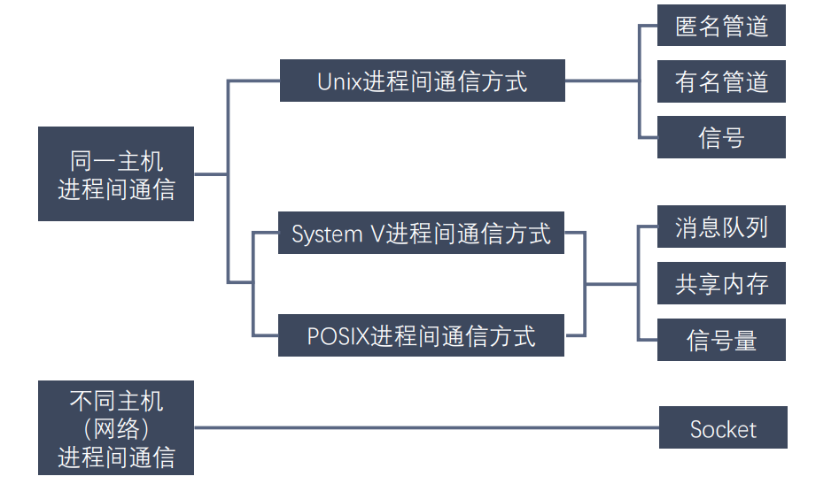

### 6.2 匿名管道（pipe）

**管道也叫无名（匿名）管道，它是是 UNIX 系统 IPC（进程间通信）的最古老形式， 所有的 UNIX 系统都支持这种通信机制。**

 统计一个目录中文件的数目命令：ls | wc –l，为了执行该命令，shell 创建了两 个进程来分别执行 ls 和 wc。

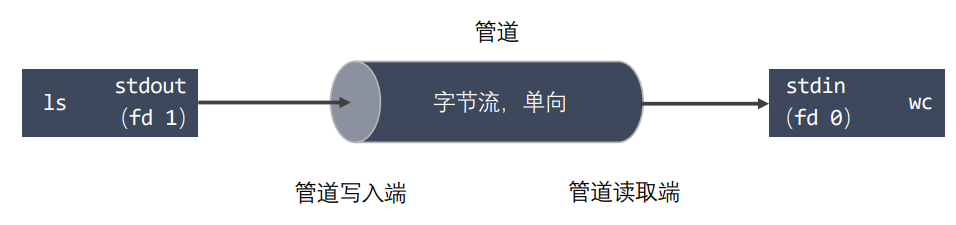

**管道特点：**

- 管道其实是一个在`内核内存中维护的缓冲器`，这个缓冲器的存储能力是有限的，不同的操作系统大小不一定相同
- 管道拥有文件的特质：**读操作、写操作**
  - **匿名管道**没有文件实体
  - `命名（有名）管道有文件实体`，但不存储数据。可以按照操作文件的方式对管道进行操作
- **一个管道是一个字节流**，使用管道时不存在消息或者消息边界的概念，从管道读取数据的进程可以读取任意大小的数据块，而不管写入进程写入管道的数据块的大小是多少
- 通过管道传递的数据是顺序的，从管道中读取出来的字节的顺序和它们被写入管道的顺序是完全一样的(**循环队列**)
- 在管道中的数据的传递方向是单向的，一端用于写入，一端用于读取，管道是`半双工`的
- 从管道读数据是一次性操作，数据一旦被读走，它就从管道中被抛弃，释放空间以便写更多的数据，管道是用唤醒队列实现的，**在管道中无法使用 lseek() 来随机的访问数据**
- `匿名管道`只能在**具有公共祖先的进程（父进程与子进程，或者两个兄弟进程，具有亲缘关系）之间使用**

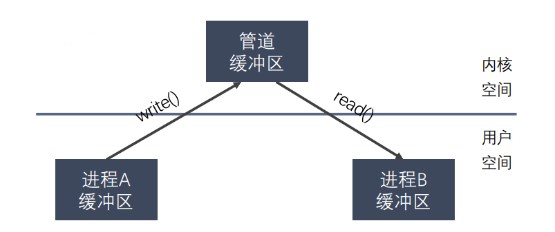

**管道实现进程通信的原理：**

* 管道相当于**一个中间媒介，共享数据**
* 父进程创建管道，得到两个文件描述符指向管道的两端
* 对于子进程，也有两个文件描述符指向管道的两端

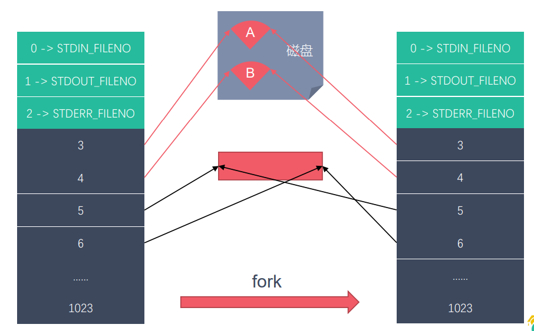**管道的数据结构：**

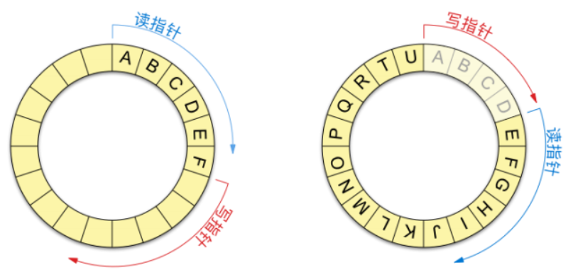

`int pipe(int pipefd[2])`

**功能：**创建一个匿名管道，用来进程间通信。

- **参数：**int pipefd[2]，这个数组是一个传出参数。
  - **pipefd[0]：** 对应的是管道的读端
  - **pipefd[1]：**对应的是管道的写端
- **返回值：**成功 0，失败 -1

`注意：`

> 管道默认是阻塞的：如果管道中没有数据，read阻塞，如果管道满了，write阻塞
>
> 匿名管道只能用于具有关系的进程之间的通信（父子进程，兄弟进程）

- 实现**子进程发送数据给父进程，父进程读取到数据输出**
  - 管道应在子进程创建前生成，否则父子进程不一定对应同一个管道
  - 单向发送时
    - 由于读写顺序不定，看起来像自己写自己读
    - 解决方法：关闭不需要的端口（即代码中的`close(pipefd[1]);`）

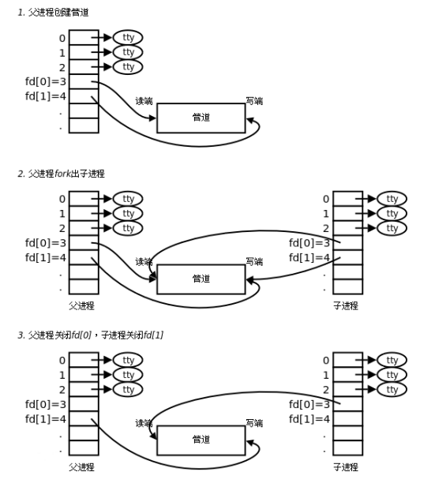

```c
#include <unistd.h>
#include <sys/types.h>
#include <stdio.h>
#include <stdlib.h>
#include <string.h>

int main() {

    // 在fork之前创建管道
    int pipefd[2];
    int ret = pipe(pipefd);
    if(ret == -1) {
        perror("pipe");
        exit(0);
    }

    // 创建子进程
    pid_t pid = fork();
    if(pid > 0) {
        // 父进程
        printf("i am parent process, pid : %d\n", getpid());

        // 关闭写端
        // close(pipefd[1]);
        
        // 从管道的读取端读取数据
        char buf[1024] = {0};
        while(1) {
            int len = read(pipefd[0], buf, sizeof(buf));
            printf("parent recv : %s, pid : %d\n", buf, getpid());
            
            // 向管道中写入数据
            //char * str = "hello,i am parent";
            //write(pipefd[1], str, strlen(str));
            //sleep(1);
        }

    } else if(pid == 0){
        // 子进程
        printf("i am child process, pid : %d\n", getpid());
        // 关闭读端
        // close(pipefd[0]);
        char buf[1024] = {0};
        while(1) {
            // 向管道中写入数据
            char * str = "hello,i am child";
            write(pipefd[1], str, strlen(str));
            sleep(1);

            // int len = read(pipefd[0], buf, sizeof(buf));
            // printf("child recv : %s, pid : %d\n", buf, getpid());
            // bzero(buf, 1024);
        }
        
    }
    return 0;
}
```

**自建管道实现shell命令(`ps aux`)：**

```c
/*
    实现 ps aux | grep xxx
    子进程：ps aux, 子进程结束后，将数据发送给父进程
    父进程：获取到数据，过滤

    pipe()
    execlp()
    子进程将标准输出 stdout_fileno 重定向到管道的写端 
    dup2 重定向文件描述符
*/
#include <unistd.h>
#include <sys/types.h>
#include <stdio.h>
#include <stdlib.h>
#include <string.h>
#include <wait.h>

int main() {
    // 创建一个管道
    int fd[2];
    int ret = pipe(fd);

    if(ret == -1) {
        perror("pipe");
        exit(0);
    }
    pid_t pid = fork();

    if(pid > 0) {
        // 父进程
        close(fd[1]);
        // 从管道中读取
        char buf[1024];
        int len = -1;
        while((len = read(fd[0], buf, sizeof(buf) - 1)) > 0) {
            // 输出
            printf("%s", buf);
            memset(buf, '\0', sizeof(buf));
        }  
        wait(NULL);
    } else if (pid == 0){
        // 子进程
        // 文件描述符重定向  stdout_fileno  -> fd[1];
        close(fd[0]);
        dup2(fd[1], STDOUT_FILENO);
        // 执行 ps aux
        execlp("ps", "ps", "aux", NULL);
        perror("execlp");
        exit(0);

    } else {
        perror("fork");
        exit(0);
    }

    return 0;
}
```

**读写特点总结:**

- 读管道
  - 管道中有数据，read返回实际读到的字节数
  - 管道中无数据
    - 写端被全部关闭，read返回0（相当于读到文件的末尾）
    - 写端没有完全关闭，read阻塞等待
- 写管道
  - 管道读端全部被关闭，进程异常终止（进程收到`SIGPIPE`信号）
  - 管道读端没有全部关闭：
    - 管道已满，write阻塞
    - 管道没有满，write将数据写入，并返回实际写入的字节数

**设置管道非阻塞：**

```c
int flags = fcntl(fd[0], F_GETFL);  // 获取原来的flag
flags |= O_NONBLOCK;            // 修改flag的值
fcntl(fd[0], F_SETFL, flags);   // 设置新的flag
```

### 6.3 命名进程（FIFO）

匿名管道，由于没有名字，只能用于亲缘关系的进程间通信。为了克服这个缺点，提出了`有名管道（FIFO），也叫命名管道、FIFO文件`。

> 有名管道（FIFO）不同于匿名管道之处在于它提供了一个路径名与之关联，以 FIFO 的文件形式存在于文件系统中，并且其打开方式与打开一个普通文件是一样的，这样 `即使与 FIFO 的创建进程不存在亲缘关系的进程，只要可以访问该路径，就能够彼此 通过 FIFO 相互通信，因此，通过 FIFO 不相关的进程也能交换数据。`
>
> 一旦打开了 FIFO，就能在它上面使用与操作匿名管道和其他文件的系统调用一样的 I/O系统调用了（如read()、write()和close()）。与管道一样，FIFO 也有一 个写入端和读取端，并且从管道中读取数据的顺序与写入的顺序是一样的。FIFO 的 名称也由此而来：先入先出。

**有名管道（FIFO)和匿名管道（pipe）的区别：**

1. `FIFO 在文件系统中作为一个特殊文件存在，但 FIFO 中的内容却存放在内存中。`
2. 当使用 FIFO 的进程退出后，FIFO 文件将继续保存在文件系统中以便以后使用。 
3. `FIFO 有名字，不相关的进程可以通过打开有名管道进行通信。`

**创建有名管道：**

* shell命令创建：`mkfifo 文件名`
* **函数创建：**`int mkfifo(const char *pathname, mode_t mode);`
  * 参数：
    *  \- pathname：管道名称的路径
    *  \- mode：文件的权限 和 open 的mode 一样  mode & ~umask  8进制的数
  *   返回值：
    *  0：成功
    * -1：失败并设置errno

```c
#include <sys/types.h>
#include <sys/stat.h>
#include <stdio.h>
#include <stdlib.h>
#include <unistd.h>

int main() {

    // 判断文件是否存在
    int ret = access("fifo1", F_OK);
    if(ret == -1) {
        printf("管道不存在，创建管道 \n");

        int res = mkfifo("fifo1", 0664);
        if(res == -1) {
            perror("mkfifo");
            exit(0);
        }
    }
    
    return 0;
}
```

**实例：两进程通过有名管道通信（单一发送）：**

* 写端：

  ```c
  #include <stdio.h>
  #include <sys/types.h>
  #include <sys/stat.h>
  #include <stdlib.h>
  #include <unistd.h>
  #include <fcntl.h>
  #include <string.h>
  
  // 向管道中写数据
  int main() 
  {
      // 1.判断文件是否存在
      int ret = access("test", F_OK);
      if(ret == -1) {
          printf("管道不存在，创建管道\n");
          
          // 2.创建管道文件
          ret = mkfifo("test", 0664);
  
          if(ret == -1) {
              perror("mkfifo");
              exit(0);
          }       
  
      }
  
      // 3.以只写的方式打开管道
      int fd = open("test", O_WRONLY);
      if(fd == -1) {
          perror("open");
          exit(0);
      }
  
      // 写数据
      for(int i = 0; i < 100; i++) {
          char buf[1024];
          sprintf(buf, "hello, %d\n", i);
          printf("write data : %s\n", buf);
          write(fd, buf, strlen(buf));
          sleep(1);
      }
  
      close(fd);
  
      return 0;
  }
  ```

* 读端：

  ```c
  #include <stdio.h>
  #include <sys/types.h>
  #include <sys/stat.h>
  #include <stdlib.h>
  #include <unistd.h>
  #include <fcntl.h>
  
  // 从管道中读取数据
  int main() 
  {
      // 1.打开管道文件
      int fd = open("test", O_RDONLY);
      if(fd == -1) {
          perror("open");
          exit(0);
      }
  
      // 读数据
      while(1) {
          char buf[1024] = {0};
          // 这里不能写strlen(buf) 因为这里的含义是每次按固定长度读取，最开始strlen(buf)=0
          int len = read(fd, buf, sizeof(buf));
          if(len == 0) {
              printf("写端断开连接了...\n");
              break;
          }
          printf("recv buf : %s\n", buf);
      }
  
      close(fd);
  
      return 0;
  }
  ```

 **有名管道的注意事项：**

1. 一个为只读而打开一个管道的一个管道的进程会阻塞，直到另外一个进程为只写而打开管道

​    2.   一个为只写而打开一个管道的进程会阻塞，直到另外一个进程为只读而打开管道

  **读管道：**

*  管道中有数据，read 返回实际读到的数据
* 管道中无数据:
  * 管道写端被全部关闭，read返回0, （相当于读到文件末尾）
  *  写端没有全部被关闭，read阻塞等待

**写管道：**

* 管道读端全部被关闭，进行异常终止（写端收到一个SIGPIPE信号）
* 管道读端没有全部关闭：
  * 管道满了，write会阻塞
  * 管道没有满，write将数据写入，并返回实际写入的字节数

**实例：简易版聊天功能（连续发送）**

- 功能：两个进程相互发送数据及接收数据，能够连续发送及接收
- 思路
  - 由于两个进程并没有亲缘关系，所以只能使用有名管道实现
  - 需要两个管道
    - 一个管道用于进程A的写与进程B的读
    - 一个管道用于进程B的写与进程A的读
  - 需要父子进程，实现连续发送及接收
    - 父进程负责写入数据到管道
    - 子进程负责从管道读取数据
- 流程（不包含父子进程，即下图所示流程不能实现连续发送功能）

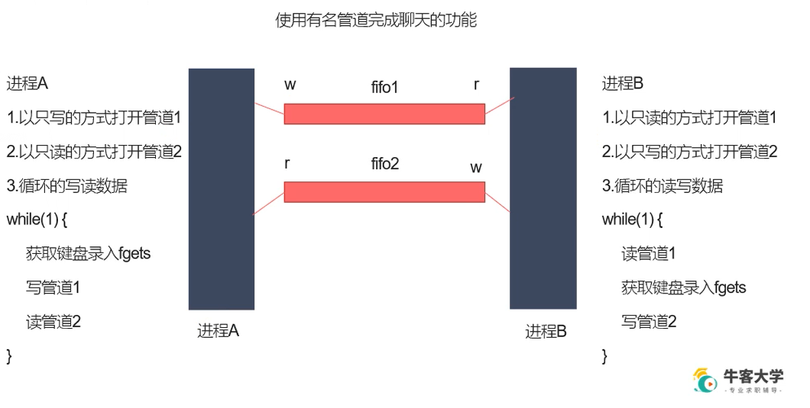

进程a:

```c
/*
chatA
1. 读、写数据分开，用两个管道
    1. fifo1用于进程A写及进程B读
    2. fifo2用于进程B写及进程A读
2. 连续发送及接收信息，使用两个进程
    1. 父进程用于写数据
    2. 子进程用于读数据
*/
#include <stdio.h>
#include <unistd.h>
#include <sys/types.h>
#include <sys/stat.h>
#include <stdlib.h>
#include <unistd.h>
#include <fcntl.h>
#include <string.h>

int main()
{
    // 判断写管道是否存在，不存在则创建
    int ret = access("fifo1", F_OK);
    if (ret == -1) {
        printf("fifo1不存在，创建...\n");
        ret = mkfifo("fifo1", 0664);
        if (ret == -1) {
            perror("mkfifo");
            exit(-1);
        }
    } 

    // 判断读管道是否存在，不存在则创建
    ret = access("fifo2", F_OK);
    if (ret == -1) {
        printf("fifo2不存在，创建...\n");
        ret = mkfifo("fifo2", 0664);
        if (ret == -1) {
            perror("mkfifo");
            exit(-1);
        }
    } 
    // 创建进程
    pid_t pid = fork();
    char buf[1024];
    if (pid > 0) {
        // 父进程
        // 打开写管道
        // 打开一次，否则系统可能会崩
        int fdw = open("fifo1", O_WRONLY);
        while (1) {
            // 从键盘读取输入
            printf("[chatA]please input: \n");
            fgets(buf, sizeof(buf), stdin);
            write(fdw, buf, strlen(buf));
            // 清空数组
            memset(buf, 0, sizeof(buf));
        }
        close(fdw);
    } else if (pid == 0) {
        // 子进程
        // 打开读管道
        // 打开一次，否则系统可能会崩
        int fdr = open("fifo2", O_RDONLY);
        while (1) {
            char buf[1024];
            int len = read(fdr, buf, sizeof(buf));
            if(len == 0) {
                printf("[chatA]写端断开连接了...\n");
                break;
            }
            printf("[chatA]recv : %s", buf);
            // 清空数组
            memset(buf, 0, sizeof(buf));
        }
        close(fdr);
    } else {
        perror("fork");
        exit(-2);
    }

    return 0;
}
```

进程b:

```c
/*
chatB
1. 读、写数据分开，用两个管道
    1. fifo1用于进程A写及进程B读
    2. fifo2用于进程B写及进程A读
2. 连续发送及接收信息，使用两个进程
    1. 父进程用于写数据
    2. 子进程用于读数据
*/
#include <stdio.h>
#include <unistd.h>
#include <sys/types.h>
#include <sys/stat.h>
#include <stdlib.h>
#include <unistd.h>
#include <fcntl.h>
#include <string.h>

int main()
{
    // 判断写管道是否存在，不存在则创建
    int ret = access("fifo1", F_OK);
    if (ret == -1) {
        printf("fifo1不存在，创建...\n");
        ret = mkfifo("fifo1", 0664);
        if (ret == -1) {
            perror("mkfifo");
            exit(-1);
        }
    } 

    // 判断读管道是否存在，不存在则创建
    ret = access("fifo2", F_OK);
    if (ret == -1) {
        printf("fifo2不存在，创建...\n");
        ret = mkfifo("fifo2", 0664);
        if (ret == -1) {
            perror("mkfifo");
            exit(-1);
        }
    } 
    // 创建进程
    pid_t pid = fork();
    char buf[1024] = { 0 };
    if (pid > 0) {
        // 父进程
        // 打开写管道
        // 打开一次，否则系统可能会崩
        int fdw = open("fifo2", O_WRONLY);
        while (1) {
            // 从键盘读取输入
            printf("[chatB]please input: \n");
            fgets(buf, sizeof(buf), stdin);
            write(fdw, buf, strlen(buf));
            // 清空数组
            memset(buf, 0, sizeof(buf));
        }
        close(fdw);
    } else if (pid == 0) {
        // 子进程
        // 打开读管道
        // 打开一次，否则系统可能会崩
        int fdr = open("fifo1", O_RDONLY);
        while (1) {
            char buf[1024];
            int len = read(fdr, buf, sizeof(buf));
            if(len == 0) {
                printf("[chatB]写端断开连接了...\n");
                break;
            }
            printf("[chatB]recv : %s", buf);
            // 清空数组
            memset(buf, 0, sizeof(buf));
        }
        close(fdr);
    } else {
        perror("fork");
        exit(-2);
    }

    return 0;
}
```

### 6.4 内存映射

`内存映射（Memory-mapped I/O）`是将**磁盘文件的数据映射到内存**，用户通过修改内存就能修改磁盘文件

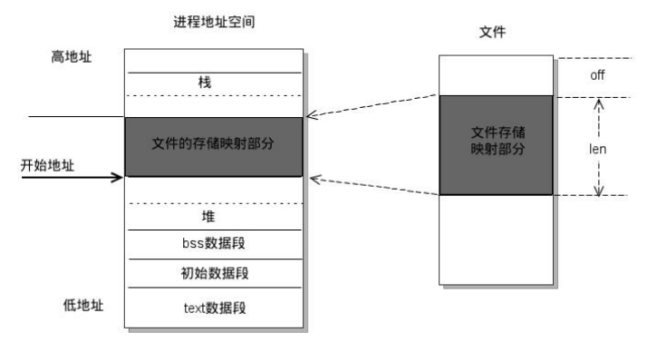

#### mmap

`void *mmap(void *addr, size_t length, int prot, int flags, int fd, off_t offset);`

**作用：**将一个文件或设备的数据映射到内存中

* **参数：**

  * **addr:**  NULL， 由内存指定

  * **length:**  要映射的数据的长度，这个值不能为0，建议使用文件的长度  (分页的整数倍 4k )

  ​         获取文件长度：stat lseek

  * **prot:** 对申请的内存映射区的操作权限

    > PROT_EXEC  可执行权限
    >
    > PROT_READ 读权限
    >
    > PROT_WRITE 写权限
    >
    > PROT_NONE  没有权限
    >
    > 要操作映射内存，必须要有读的权限
    >
    > PROT_READ， PROT_READ | PROT_WRITE	

  * flags: 

    > MAP_SHARED : 映射区的数据会自动和磁盘文件进行同步，进程间通信，必须设置这个选项
    >
    > MAP_PRIVATE: 不同步，内存映射区的数据改变，对原来的文件不会修改，会重新创建一个新的问价 （copy on write）

  * fd: 需要映射的那个文件的描述符

    > 通过open得到，open的是一个磁盘文件
    >
    > 注意： 文件的大小不能为0，open指定的权限不能和prot参数有冲突
    >
    > prot: PROT_READ  ->  open: 只读/读写  
    >
    > prot: PROT_READ | PROT_WRITE ->  open: 读写

  * offset: 偏移量，一般不用，必须指定的是4k的整数倍，0表示不偏移

* **返回值：**
  * 成功：返回创建的内存的首地址
  * 失败：MAP_FAILED (void * ) -1
  * 

#### munmap

`int munmap(void *addr, size_t length);`

**作用：**释放内存映射

* **参数：**
  * addr: 要释放的内存的首地址
  * length: 要释放内存的大小，要和mmap函数中的length参数的值一样

**使用内存映射实现进程间的映射**

1. 有关系的进程（父子进程）
   *  在还没有子进程的时候
   * 通过唯一的父进程，先创建内存映射区
   * 有了内存映射区以后，创建子进程
   * 父子进程共享创建的内存映射区

2. 没有关系的进程间通信  
   *  准备一个大小不是0的磁盘文件
   * 进程1 通过磁盘文件创建内存映射区
   * 得到一个操作这块内存的指针
   * 进程1 通过磁盘文件创建内存映射区
   * 得到一个操作这块内存的指针
   * 使用内存映射区通信

`注意：内存映射区通信，是非阻塞的`

```c
#include<sys/mman.h>
#include <stdio.h>
#include<sys/stat.h>
#include <fcntl.h>
#include <unistd.h>
#include <stdlib.h>
#include <string.h>
#include <wait.h>

int main() {
    // 打开一个文件
    int fd = open("test.txt", O_RDWR);
    // 获取文件大小
    int size = lseek(fd, 0, SEEK_END);

    // 2. 创建内存映射区
    void *ptr = mmap(NULL, size, PROT_READ | PROT_WRITE, MAP_SHARED, fd, 0);
    if(ptr == MAP_FAILED) {
        perror("mmap");
        exit(0);
    }
    // 3. 创建子进程
    pid_t pid = fork();
    if(pid > 0) {
        wait(NULL);
        // 父进程
        char buf[64];
        strcpy(buf, (char *)ptr);
        printf("read data : %s\n", buf);
    } else if(pid == 0) {
        // 子进程      
        strcpy((char *)ptr, " nihao a, son !");
    }
    // 关闭内存映射区
    munmap(ptr, size);
    return 0;

}
```

`注意事项：`

- **要操作映射内存**，**必须要有读的权限**，即权限为`PROT_READ`或`PROT_READ|PROT_WRITE`

- 在使用**内存映射**通信时，使用文件的大小不能为0，**`open`指定的权限不能和`prot`参数有冲突**

  | prot      | open                |
  | --------- | ------------------- |
  | PROT_READ | O_RDONLY` 或`O_RDWR |
  | PROT_READ | PROT_WRITE          |

- 内存映射区通信，是非阻塞

- 一个文件对应一个内存映射区

- 如果对`mmap`的返回值(`ptr`)做`++操作(ptr++)`, `munmap`是否能够成功?

  - 不能成功，因为回收资源时，需要传递指针，如果变化，将会回收失败 **（要保存首地址）**

- 如果`open`时`O_RDONLY`, `mmap`时`prot`参数指定`PROT_READ | PROT_WRITE`会怎样?

  - 错误，返回`MAP_FAILED`，`open()`函数中的权限建议和`prot`参数的权限保持一致

- 如果文件偏移量为1000会怎样?

  - 偏移量必须是`4K`的整数倍，返回`MAP_FAILED`

- `mmap`什么情况下会调用失败?

  - 第二个参数：length = 0

  - 第三个参数：

    ```
    prot
    ```

    - 只指定写权限
    - `prot`和`open()`两者的权限不匹配

- 可以open的时候`O_CREAT`一个新文件来创建映射区吗?

  - 可以的，但是创建的文件的大小如果为0的话，肯定不行(因为`mmap`调用时，长度不允许为0)

- `mmap`后关闭文件描述符，对`mmap`映射有没有影响？

  - 映射区还存在，创建映射区的`fd`被关闭，没有任何影响

- 对`ptr`越界操作会怎样？

  - 越界操作操作的是非法的内存 -> 段错误

**文件拷贝**

- 思路
  1. 需要两个文件，一个是有内容的文件（待拷贝文件），一个是空文件
  2. 由于有两个文件，需要两个内存映射区
  3. 然后将文件A的内存映射区内容拷贝给文件B的内存映射区
  4. 回收资源

```c
// 使用内存映射实现文件拷贝为功能

/*
    思路；
    1. 对原始的文件进行内存映射
    2. 创建一个新文件（拓展该文件）
    3. 把新文件的数据映射到内存中
    4. 通过内存拷贝将第一个文件的内存数据拷贝到新的文件内存中
    5. 释放资源
*/

#include <stdio.h>
#include<sys/mman.h>
#include <sys/stat.h>
#include <sys/types.h>
#include <stdlib.h>
#include <fcntl.h>
#include <string.h>
#include <unistd.h>

int main() {
    // 1. 对原始的文件进行内存映射
    int fd = open("english.txt", O_RDWR);
    if(fd == -1) {
        perror("open");
        exit(0);
    }
    // 获取原始文件的大小
    int len = lseek(fd, 0, SEEK_END);

    // 2. 创建一个新文件
    int fd1 = open("cpy.txt", O_RDWR | O_CREAT, 0664);
    if(fd1 == -1) {
        perror("open");
        exit(0);
    }

    // 对新创建的文件进行拓展
    truncate("cpy.txt", len);


    // 3. 分别做内存映射
    void *ptr = mmap(NULL, len, PROT_READ | PROT_WRITE, MAP_SHARED, fd, 0);
    void *ptr1 = mmap(NULL, len, PROT_READ | PROT_WRITE, MAP_SHARED, fd1, 0);
    if(ptr1 == MAP_FAILED || ptr == MAP_FAILED) {
        perror("mmap");
        exit(0);
    }

    // 内存拷贝
    memcpy(ptr1, ptr, len);
    // 释放资源
    munmap(ptr1, len);
    munmap(ptr, len);
    close(fd1);
    close(fd);

    return 0;
}
```

**匿名映射：**

- 思路
  1. 匿名内存映射不存在文件实体，那么只能通过父子进程实现
  2. 父子进程操作同一块区域，重点在于内存映射区在创建时新增flags参数`MAP_ANONYMOUS`
  3. 父进程读，子进程写

```c
/*
    匿名映射：不需要文件实体进行一个内存映射
*/

#define _DEFAULT_SOURCE
#include<sys/mman.h>
#include <stdio.h>
#include<sys/stat.h>
#include <fcntl.h>
#include <unistd.h>
#include <stdlib.h>
#include <string.h>
#include <wait.h>

int main() {
    // 1. 创建一个匿名内存映射区
    int len = 4096;
    void *ptr = mmap(NULL, len, PROT_READ | PROT_WRITE, MAP_SHARED |  MAP_ANONYMOUS,  -1, 0);

    if(ptr == MAP_FAILED) {
        perror("mmap");
        exit(0);
    }

    // 父子进程通信
    pid_t pid = fork();

    if(pid > 0) {
        strcpy((char *) ptr, "hello, world");
        wait(NULL);
    } else if(pid == 0) {
        // 子进程
        sleep(1);
        printf("%s\n", (char *) ptr);

    }
    munmap(ptr, len);
    return 0;
}
```

## 7. 信号

### 7.1 信号的概念

**信号**是 Linux 进程间通信的最古老的方式之一，是事件发生时对进程的通知机制，有时也称之为**软件中断**，`它是在软件层次上对中断机制的一种模拟，是一种异步通信的方式。`信号可以导致一个正在运行的进程被另一个正在运行的异步进程中断，转而处理某一个突发事件

**发往进程的诸多信号，通常都是源于内核。引发内核为进程产生信号的各类事件如下：**

- 对于前台进程，用户可以通过输入特殊的终端字符来给它发送信号。比如输入 `Ctrl+C` 通常会给进程发送一个中断信号
- 硬件发生异常，即硬件检测到一个错误条件并通知内核，随即再由内核发送相应信号给相关进程。比如执行一条异常的机器语言指令，诸如被 0 除，或者引用了无法访问的内存区域
- 系统状态变化，比如 alarm 定时器到期将引起 `SIGALRM` 信号，进程执行的 CPU 时间超限，或者该进程的某个子进程退出
- 运行 kill 命令或调用 kill 函数

**使用信号的两个主要目的是：**

- 让进程知道已经发生了一个特定的事情
- 强迫进程执行它自己代码中的信号处理程序

**信号的特点：**

- 简单
- 不能携带大量信息
- 满足某个特定条件才发送
- 优先级比较高

**查看系统定义的信号列表：**`kill –l`，前 31 个信号为常规信号，其余为实时信号

**信号一览表及特点：**

- 可通过`man 7 signal`查看帮助
- 信号的 5 中默认处理动作
  - `Term`：终止进程
  - `Ign`：当前进程忽略掉这个信号
  - `Core`：终止进程，并生成一个Core文件
  - `Stop`：暂停当前进程
  - `Cont`：继续执行当前被暂停的进程
- 信号的几种状态：`产生`、`未决`、`递达`
- `SIGKILL` 和 `SIGSTOP` 信号不能被捕捉、阻塞或者忽略，只能执行默认动作

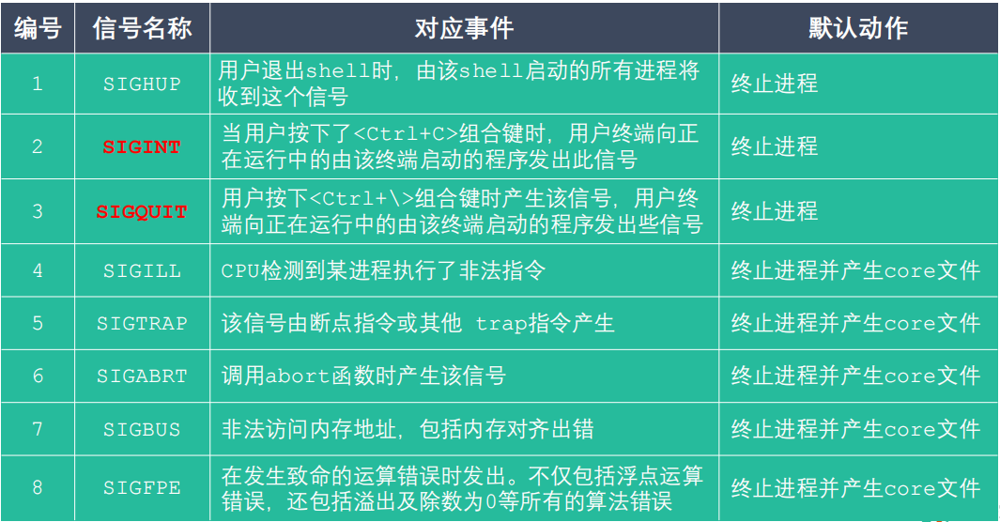

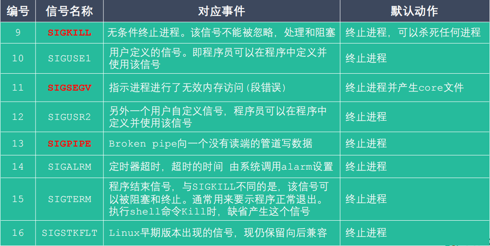

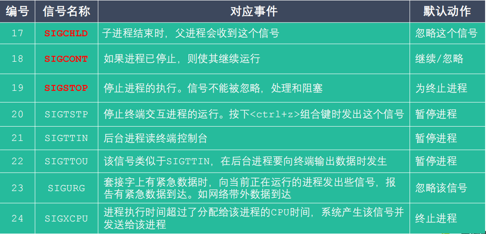

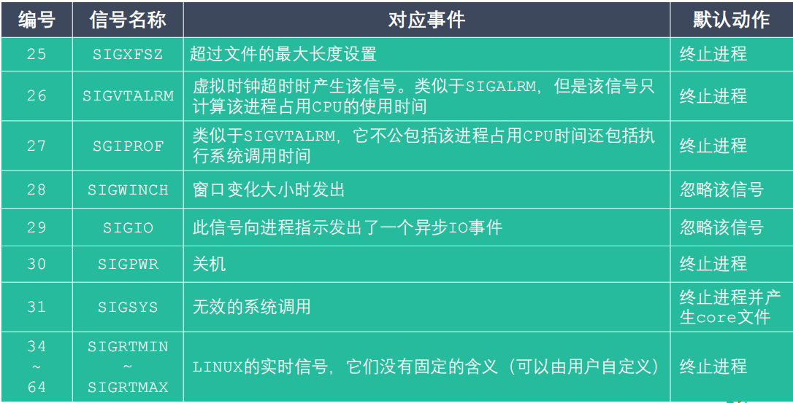

### 7.2 信号的相关函数

**core文件生成及调试：**

- 当进程异常终止时，会生成`core`文件（需要进行相应设置），可以通过`gdb`调试查看错误，调试以下程序

  ```
  #include <stdio.h>
  #include <string.h>
  
  int main()
  {
      char* buf;
      strcpy(buf, "core test");
      return 0;
  }
  ```

  生成调试`core`文件需要做以下几步：

  * 使用`ulimit -a`查看资源上限
  * 修改`core size`：`ulimit -c core-size`
  * 在编译运行程序时加上`-g`选项使得能够被`gdb`调试，运行后生成`core`文件
  * 调试`core`程序：`gdb test`进入`gdb`终端，使用`core-file core`可以查看`core`定位错误

#### kill

`int kill(pid_t pid, int sig);`

**功能：**给**任何的进程或者进程组**`pid`，发送**任何的信号** `sig`

- **参数：**

  - ```
    pid
    ```

    - `> 0` : 将信号发送给指定的进程
    - `= 0` : 将信号发送给当前的进程组
    - `= -1` : 将信号发送给每一个有权限接收这个信号的进程
    - `< -1` : 这个`pid=某个进程组的ID取反`

  - `sig` : 需要发送的信号的编号或者是宏值，0表示不发送任何信号

- 返回值：0成功，-1失败

#### raise

`int raise(int sig);`

**功能：**给**当前进程**发送信号

- 参数：`sig` : 要发送的信号

- 返回值：0成功，非0失败

  ```c
  kill(getpid(), sig)  // 等价
  ```

#### abort

`void abort(void);`

**功能：** 发送`SIGABRT`信号给当前的进程，**杀死当前进程**

```c
kill(getpid(), SIGABRT)  // 等价
```

```c
#include <stdio.h>
#include <sys/types.h>
#include <signal.h>
#include <unistd.h>

int main() 
{
    pid_t pid = fork();

    if(pid == 0) {
        // 子进程
        int i = 0;
        for(i = 0; i < 5; i++) {
            printf("child process\n");
            sleep(1);
        }

    } else if(pid > 0) {
        // 父进程
        printf("parent process\n");
        sleep(2);
        printf("kill child process now\n");
        kill(pid, SIGINT);
    }

    return 0;
}
```

### 7.3 定时器相关函数（alarm + setitimer）

#### alarm

`unsigned int alarm(unsigned int seconds);`

**作用：**设置定时器（闹钟）。函数调用，开始倒计时，当倒计时为0的时候，函数会给当前的进程发送一个信号：`SIGALARM`

- 参数：`seconds`，倒计时的时长，单位：秒。如果参数为0，定时器无效（不进行倒计时，不发信号）
- 取消一个定时器，通过`alarm(0)`
- 返回值
  - 之前没有定时器，返回0
  - 之前有定时器，返回之前的定时器剩余的时间
  - eg: alarm(10)  过了1秒 alarm(5) 返回9

`SIGALARM ：默认终止当前的进程，每一个进程都有且只有唯一的一个定时器`

`定时器，与进程的状态无关（自然定时法）。无论进程处于什么状态，alarm都会计时，即函数不阻塞`

```c
#include <stdio.h>
#include <unistd.h>

int main() {

    int seconds = alarm(5);
    printf("seconds = %d\n", seconds);  // 0

    sleep(2);
    seconds = alarm(2);    // 不阻塞
    printf("seconds = %d\n", seconds);  // 3

    while(1) {
    }

    return 0;
}
```

#### setitimer

`int setitimer(int which, const struct itimerval *new_val, struct itimerval *old_value);`

**作用：**设置定时器（闹钟）。可以替代alarm函数。精度微妙us，可以实现周期性定时

- **参数：**

  - - which: 定时器以什么时间计时

    - `ITIMER_REAL`: 真实时间，时间到达，发送 `SIGALRM` (常用)
    - `ITIMER_VIRTUAL`: 用户时间，时间到达，发送 `SIGVTALRM`
    - `ITIMER_PROF`: 以该进程在用户态和内核态下所消耗的时间来计算，时间到达，发送 `SIGPROF`

  - `- new_value`: 设置定时器的属性

  - `- old_value` ：记录上一次的定时的时间参数，一般不使用，指定NULL

- 返回值：成功 0，失败 -1 并设置错误号

**struct itimerval：**

```c
struct itimerval {      // 定时器的结构体
    struct timeval it_interval;  // 每个阶段的时间，间隔时间
    struct timeval it_value;     // 延迟多长时间执行定时器
};

struct timeval {        // 时间的结构体
    time_t      tv_sec;     //  秒数     
    suseconds_t tv_usec;    //  微秒    
};

// 过it_value秒后，每隔it_interval秒定时一次
```

```c
#include <sys/time.h>
#include <stdio.h>
#include <stdlib.h>

// 过3秒以后，每隔2秒钟定时一次  =>因为没有信号捕捉，当前进程直接被杀死了， 所以还没有实现这样的效果
int main() 
{
    struct itimerval new_value;

    // 设置间隔的时间
    new_value.it_interval.tv_sec = 2;
    new_value.it_interval.tv_usec = 0;

    // 设置延迟的时间,3秒之后开始第一次定时
    new_value.it_value.tv_sec = 3;
    new_value.it_value.tv_usec = 0;


    int ret = setitimer(ITIMER_REAL, &new_value, NULL); // 非阻塞的
    printf("定时器开始了...\n");

    if(ret == -1) {
        perror("setitimer");
        exit(0);
    }

    getchar();

    return 0;
}
```

### 7.4 信号集及相关函数

 **基本概念：**

- 许多信号相关的系统调用都需要能表示一组不同的信号，多个信号可使用一个称之为信号集的数据结构来表示，其系统数据类型为 `sigset_t`
- 在 PCB 中有两个非常重要的信号集。一个称之为 `阻塞信号集` ，另一个称之为`未决信号集`。这两个信号集都是**内核使用位图机制来实现**的。但操作系统不允许我们直接对这两个信号集进行位操作。而需自定义另外一个集合，借助信号集操作函数来对 PCB 中的这两个信号集进行修改
- 信号的 `未决` 是一种状态，指的是**从信号的产生到信号被处理前的这一段时间**
- 信号的 `阻塞` 是一个开关动作，指的是**阻止信号被处理，但不是阻止信号产生**。信号的阻塞就是让系统暂时保留信号留待以后发送。由于另外有办法让系统忽略信号，所以一般情况下信号的阻塞只是暂时的，只是为了防止信号打断敏感的操作

**阻塞信号集与非阻塞信号集说明：**

> 1. 用户通过键盘 `Ctrl + C`, 产生2号信号 `SIGINT` (信号被创建)
> 2. 信号产生但是没有被处理 （未决）
>    - 在内核中将所有的没有被处理的信号存储在一个集合中 （未决信号集）
>    - SIGINT信号状态被存储在第二个标志位上
>      - 这个标志位的值为0， 说明信号不是未决状态
>      - 这个标志位的值为1， 说明信号处于未决状态
> 3. 这个未决状态的信号，需要被处理，处理之前需要和另一个信号集（阻塞信号集），进行比较
>    - 阻塞信号集默认不阻塞任何的信号
>    - 如果想要阻塞某些信号需要用户调用系统的API
> 4. 在处理的时候和阻塞信号集中的标志位进行查询，看是不是对该信号设置阻塞了
>    - 如果没有阻塞，这个信号就被处理
>    - 如果阻塞了，这个信号就继续处于未决状态，直到阻塞解除，这个信号就被处理

**操作自定义信号集函数(sigemptyset等)：**

#### sigemptyset

`int sigemptyset(sigset_t *set);`

**作用：**清空信号集中的数据，将信号集中的所有的标志位置为0 （man 3  sigemptyset）

- 参数：`set`，传出参数，需要操作的信号集
- 返回值：成功返回0， 失败返回-1

#### sigfillset

`int sigfillset(sigset_t *set);`

**作用：**将信号集中的所有的标志位置为1

- 参数：`set`，传出参数，需要操作的信号集
- 返回值：成功返回0， 失败返回-1

#### sigaddset

`int sigaddset(sigset_t *set, int signum);`

**作用：**设置信号集中的某一个信号对应的标志位为1，表示阻塞这个信号

- 参数
  - `set`：传出参数，需要操作的信号集
  - `signum`：需要设置阻塞的那个信号
- 返回值：成功返回0， 失败返回-1

#### sigdelset

`int sigdelset(sigset_t *set, int signum);`

**作用：**设置信号集中的某一个信号对应的标志位为0，表示不阻塞这个信号

- 参数
  - `set`：传出参数，需要操作的信号集
  - `signum`：需要设置不阻塞的那个信号
- 返回值：成功返回0， 失败返回-1

#### sigismember

`int sigismember(const sigset_t *set, int signum);`

**作用：**判断某个信号是否是信号集的成员

- 参数
  - `set`：传入参数，需要操作的信号集
  - `signum`：需要判断的那个信号
- 返回值
  - 1 ： `signum`是该信号集的成员
  - 0 ： `signum`是该信号集的成员
  - -1 ： 失败

```c
#include <signal.h>
#include <stdio.h>

int main() 
{
    // 创建一个信号集
    sigset_t set;

    // 清空信号集的内容
    sigemptyset(&set);

    // 判断 SIGINT 是否在信号集 set 里
    int ret = sigismember(&set, SIGINT);
    if(ret == 0) {
        printf("SIGINT 不阻塞\n");
    } else if(ret == 1) {
        printf("SIGINT 阻塞\n");
    }

    // 添加几个信号到信号集中
    sigaddset(&set, SIGINT);
    sigaddset(&set, SIGQUIT);

    // 判断SIGINT是否在信号集中
    ret = sigismember(&set, SIGINT);
    if(ret == 0) {
        printf("SIGINT 不阻塞\n");
    } else if(ret == 1) {
        printf("SIGINT 阻塞\n");
    }

    // 判断SIGQUIT是否在信号集中
    ret = sigismember(&set, SIGQUIT);
    if(ret == 0) {
        printf("SIGQUIT 不阻塞\n");
    } else if(ret == 1) {
        printf("SIGQUIT 阻塞\n");
    }

    // 从信号集中删除一个信号
    sigdelset(&set, SIGQUIT);

    // 判断SIGQUIT是否在信号集中
    ret = sigismember(&set, SIGQUIT);
    if(ret == 0) {
        printf("SIGQUIT 不阻塞\n");
    } else if(ret == 1) {
        printf("SIGQUIT 阻塞\n");
    }

    return 0;
}
```

**操作内核信号集函数(sigprocmask & sigpending)：**

`int sigprocmask(int how, const sigset_t *set, sigset_t *oldset);`

**功能：**将自定义信号集中的数据设置到内核中（设置阻塞，解除阻塞，替换）

- 参数
  - `how:` 如何对内核阻塞信号集进行处理
    - `SIG_BLOCK`: 将用户设置的阻塞信号集添加到内核中，内核中原来的数据不变。假设内核中默认的阻塞信号集是mask， 相当于`mask | set`
    - `SIG_UNBLOCK`: 根据用户设置的数据，对内核中的数据进行解除阻塞。相当于`mask &= ~set`
    - `SIG_SETMASK`：覆盖内核中原来的值
  - `set` ：已经初始化好的用户自定义的信号集
  - `oldset` : 保存设置之前的内核中的阻塞信号集的状态，一般不使用，设置为 NULL 即可
- 返回值：成功返回0， 失败返回-1

`int sigpending(sigset_t *set);`

**功能：**获取内核中的未决信号集

- 参数：set，传出参数，保存的是内核中的未决信号集中的信息
- 返回值：成功返回0， 失败返回-1

```c
#include <stdio.h>
#include <signal.h>
#include <stdlib.h>
#include <unistd.h>

int main()
{
    // 设置自定义信号集
    sigset_t set;
    // 清空信号集
    sigemptyset(&set);
    // 设置2 3号信号阻塞
    sigaddset(&set, SIGINT);
    sigaddset(&set, SIGQUIT);
    // 修改内核中的阻塞信号集
    sigprocmask(SIG_BLOCK, &set, NULL);
    int num = 0;
    // 循环获取当前的未决信号集的数据
    while (1) {
        // 计数，用以退出循环
        num++;
        sigset_t pendingset;
        // 清空
        sigemptyset(&pendingset);
        // 获取当前的未决信号集的数据
        sigpending(&pendingset);
        // 遍历前32位
        for(int i = 1; i <= 31; i++) {
            if(sigismember(&pendingset, i) == 1) {
                printf("1");
            }else if(sigismember(&pendingset, i) == 0) {
                printf("0");
            }else {
                perror("sigismember");
                exit(0);
            }
        }
        printf("\n");
        sleep(1);
        if(num == 10) {
            // 解除阻塞
            sigprocmask(SIG_UNBLOCK, &set, NULL);
        }

    }
    return 0;
}
```

### 7.5 信号捕捉函数

#### signal

 `sighandler_t signal(int signum, sighandler_t handler);`

**功能：**设置某个信号的捕捉行为

- 参数
  - `signum`: 要捕捉的信号
  - handler: 捕捉到信号要如何处理
    - `SIG_IGN` ： 忽略信号
    - `SIG_DFL` ： 使用信号默认的行为
    - `自定义回调函数`
- 返回值
  - 成功，返回上一次注册的信号处理函数的地址。第一次调用返回NULL
  - 失败，返回SIG_ERR，设置错误号
  - 注意：返回值定义在宏`__USE_GNU`中，需要指定或者直接在程序中使用`typedef __sighandler_t sighandler_t;``
- ``SIGKILL`和`SIGSTOP`**不能被捕捉，不能被忽略**

```c
void myalarm(int num) {
    printf("捕捉到了信号的编号是：%d\n", num);
    printf("xxxxxxx\n");
}

// 过3秒以后，每隔2秒钟定时一次
int main() 
{

    // 注册信号捕捉
    // signal(SIGALRM, SIG_IGN);
    // signal(SIGALRM, SIG_DFL);
    // void (*sighandler_t)(int); 函数指针，int类型的参数表示捕捉到的信号的值
    // 捕捉的信号右定时器发出
    signal(SIGALRM, myalarm);

    struct itimerval new_value;

    // 设置间隔的时间
    new_value.it_interval.tv_sec = 2;
    new_value.it_interval.tv_usec = 0;

    // 设置延迟的时间,3秒之后开始第一次定时
    new_value.it_value.tv_sec = 3;
    new_value.it_value.tv_usec = 0;


    int ret = setitimer(ITIMER_REAL, &new_value, NULL); // 非阻塞的
    printf("定时器开始了...\n");

    if(ret == -1) {
        perror("setitimer");
        exit(0);
    }

    getchar();

    return 0;
}
```

#### sigaction

`int sigaction(int signum, const struct sigaction *act,struct sigaction *oldact);`

**功能：**检查或者改变信号的处理，即信号捕捉

- 参数
  - `signum` : 需要捕捉的信号的编号或者宏值（信号的名称）
  - `act` ：捕捉到信号之后的处理动作
  - `oldact` : 上一次对信号捕捉相关的设置，一般不使用，设置为NULL
- 返回值：成功返回0， 失败返回-1

**struct sigaction:**

```C
struct sigaction {
    // 函数指针，指向的函数就是信号捕捉到之后的处理函数
    void     (*sa_handler)(int);
    
    // 不常用
    void     (*sa_sigaction)(int, siginfo_t *, void *);
    
    // 临时阻塞信号集，在信号捕捉函数执行过程中，临时阻塞某些信号。
    sigset_t   sa_mask;
    
    // 使用哪一个信号处理对捕捉到的信号进行处理
    // 是SA_SIGINFO表示使用sa_sigaction
    int        sa_flags;
    // 被废弃掉了
    void     (*sa_restorer)(void);
};
```

```c
#include <sys/time.h>
#include <stdio.h>
#include <stdlib.h>
#include <signal.h>

void myalarm(int num) {
    printf("捕捉到了信号的编号是：%d\n", num);
    printf("xxxxxxx\n");
}

// 过3秒以后，每隔2秒钟定时一次
int main() {

    struct sigaction act;
    act.sa_flags = 0;
    act.sa_handler = myalarm;
    sigemptyset(&act.sa_mask);  // 清空临时阻塞信号集
   
    // 注册信号捕捉
    sigaction(SIGALRM, &act, NULL);

    struct itimerval new_value;

    // 设置间隔的时间
    new_value.it_interval.tv_sec = 2;
    new_value.it_interval.tv_usec = 0;

    // 设置延迟的时间,3秒之后开始第一次定时
    new_value.it_value.tv_sec = 3;
    new_value.it_value.tv_usec = 0;

    int ret = setitimer(ITIMER_REAL, &new_value, NULL); // 非阻塞的
    printf("定时器开始了...\n");

    if(ret == -1) {
        perror("setitimer");
        exit(0);
    }

    // getchar();
    while(1);

    return 0;
}
```

**signal和sigaction区别：**

- 参数区别
- 版本区别，`signal`在不同版本Linux中，行为不一致，所以推荐使用`sigaction`（`ubutun`下两者一致）

**内核实现信号捕捉的过程：**

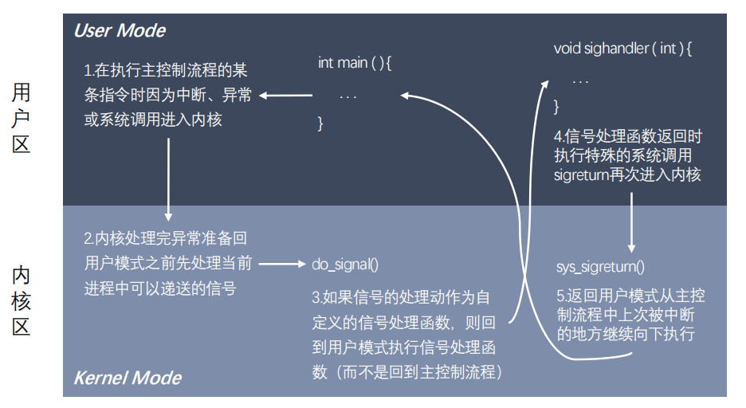

### 7.6 SIGCHLD信号

**作用：**解决**僵尸进程问题**，能够在不阻塞父进程的情况下，回收子进程的资源

实例：僵尸问题解决

```c
#include <stdio.h>#include <stdio.h>
#include <sys/types.h>
#include <sys/stat.h>
#include <unistd.h>
#include <signal.h>
#include <sys/wait.h>

void myalarm(int num) {
    printf("捕捉到了信号的编号是：%d\n", num);
    // 回收子进程PCB的资源
    // 因为可能多个子进程同时死了，所以使用while循环
    // 不使用wait是因为会造成阻塞，父进程不能继续
    // 使用waitpid可以设置非阻塞
    while (1) {
        int ret = waitpid(-1, NULL, WNOHANG);
        if(ret > 0) {
            // 回收一个子进程
           printf("child die , pid = %d\n", ret);
       } else if(ret == 0) {
           // 说明还有子进程活着
           break;
       } else if(ret == -1) {
           // 没有子进程
           break;
       }
    }
}

int main()
{
    // 提前设置好阻塞信号集，阻塞SIGCHLD，因为有可能子进程很快结束，父进程还没有注册完信号捕捉
    sigset_t set;
    sigemptyset(&set);
    sigaddset(&set, SIGCHLD);
    sigprocmask(SIG_BLOCK, &set, NULL);

    pid_t pid;
    // 创建一些子进程
    for (int i = 0; i < 20; i++) {
        pid = fork();
        // 如果是子进程，不在作为父进程继续创建子进程
        if (pid == 0) {
            break;
        }
    }
    // 子进程先结束，父进程循环=>产生僵尸进程
    if (pid > 0) {
        // 父进程
        // 使用sigaction捕捉子进程死亡时发送的SIGCHLD信号
        struct sigaction act;
        act.sa_flags = 0;
        act.sa_handler = myalarm;
        sigemptyset(&act.sa_mask);
        sigaction(SIGCHLD, &act, NULL);

        // 注册完信号捕捉以后，解除阻塞
        sigprocmask(SIG_UNBLOCK, &set, NULL);
        
        while (1) {
            printf("parent process : %d\n", getpid());
            sleep(2);
        }
    } else {
        // 子进程
        printf("child process : %d\n", getpid());
    }

    return 0;
}
```

可能会出现段错误（不一定能复现）:

> 可重入函数的意思是：函数由两条或多条线程调用时，即便是交叉执行，其效果也与各线程以未定义顺序依次调用时一致。通俗点讲，就是存在一个函数，A线程执行一半，B线程抢过CPU又来调用该函数，执行到1/4倍A线程抢回执行权。在这样不断来回执行中，不出问题的，就是可重入函数。多线程中每个线程都有自己的堆栈，所以如果函数中只用到局部变量肯定是可重入的，没问题的。但是更新了全局变量或静态数据结构的函数可能是不可重入的。假设某线程正在为一个链表结构添加一个新的链表项，而另外一个线程也视图更新同一链表。由于中间涉及多个指针，一旦另一线程中断这些步骤并修改了相同指针，结果就会产生混乱。但是并不是一定会出现，一定是A线程刚好在修改指针，另外一线程又去修改才会出现。这就是为什么该问题复现难度较高的原因。
>
> 作者在文中指出，将静态数据结构用于内部记账的函数也是不可重入的。其中最明显的例子就是stdio函数库成员（printf()、scanf()等），它们会为缓冲区I/O更新内部数据结构。所以，如果在捕捉信号处理函数中调用了printf()，而主程序又在调用printf()或其他stdio函数期间遭到了捕捉信号处理函数的中断，那么有时就会看到奇怪的输出，设置导致程序崩溃。虽然printf()不是异步信号安全函数，但却频频出现在各种示例中，是因为在展示对捕捉信号处理函数的调用，以及显示函数中相关变量的内容时，printf()都不失为一种简单而又便捷的方式。真正的应用程序应当避免使用该类函数。
>
> printf函数会使用到一块缓冲区，这块缓冲区是使用malloc或类似函数分配的一块静态内存。所以它是不可重入函数。

### 7.7 共享内存

**基本概念：**

- **共享内存允许两个或者多个进程共享物理内存的同一块区域（通常被称为段）**。由于一个共享内存段会称为一个进程用户空间的一部分，因此这种 `IPC` 机制无需内核介入。所有需要做的就是让一个进程将数据复制进共享内存中，并且这部分数据会对其他所有共享同一个段的进程可用
- 与管道等要求发送进程将数据从用户空间的缓冲区复制进内核内存和接收进程将数据从内核内存复制进用户空间的缓冲区的做法相比，这种 `IPC` 技术的速度更快

**共享内存使用步骤：**

1. 调用 `shmget()` 创建一个新共享内存段或取得一个既有共享内存段的标识符（即由其他进程创建的共享内存段）。这个调用将返回后续调用中需要用到的共享内存标识符
2. 使用 `shmat()`来附上共享内存段，即使该段成为调用进程的虚拟内存的一部分
3. 此刻在程序中可以像对待其他可用内存那样对待这个共享内存段。为引用这块共享内存，程序需要使用由 `shmat()` 调用返回的 `addr` 值，它是一个指向进程的虚拟地址空间中该共享内存段的起点的指针
4. 调用 `shmdt()` 来分离共享内存段。在这个调用之后，进程就无法再引用这块共享内存了。这一步是可选的，并且在进程终止时会自动完成这一步
5. 调用 `shmctl()` 来操作共享内存段。删除共享内存段只有当当前所有附加内存段的进程都与之分离之后内存段才会销毁。只有一个进程需要执行这一步

**共享内存操作函数**

#### shmget

`int shmget(key_t key, size_t size, int shmflg);`

**作用：**创建一个新的共享内存段（新创建的内存段中的数据都会被初始化为0），或者获取一个既有的共享内存段的标识

- 参数
  - `key`：`key_t`类型是一个整形，通过这个找到或者创建一个共享内存。一般使用**16进制**表示，非0值
  - `size`：共享内存的大小
  - shmflg：属性
    - 访问权限
    - 附加属性：创建/判断共享内存是不是存在
      - 创建：`IPC_CREAT`
      - 判断共享内存是否存在： `IPC_EXCL` , 需要和`IPC_CREAT`一起使用，即`IPC_CREAT | IPC_EXCL | 0664`
- 返回值
  - 失败：-1 并设置错误号
  - 成功：>0 返回共享内存的引用的ID，后面操作共享内存都是通过这个值

#### shmat

`void *shmat(int shmid, const void *shmaddr, int shmflg);`

**作用：**和当前的进程进行关联

- 参数
  - `shmid` : 共享内存的标识（ID），由`shmget`返回值获取
  - `shmaddr`: 申请的共享内存的起始地址，设置为NULL，表示由内核指定
  - shmflg: 对共享内存的操作
    - 读 ： `SHM_RDONLY`，必须要有读权限
    - 读写： 指定为0即为有读写权限
- 返回值：成功：返回共享内存的首（起始）地址。 失败`(void *) -1`

#### shmdt

`int shmdt(const void *shmaddr);`

**作用：**解除当前进程和共享内存的关联

- 参数：`shmaddr`：共享内存的首地址
- 返回值：成功 0， 失败 -1

#### shmctl

`int shmctl(int shmid, int cmd, struct shmid_ds *buf);`

**作用：**对共享内存进行操作。删除共享内存，共享内存要删除才会消失，创建共享内存的进程被销毁了对共享内存是没有任何影响

- 参数

  - `shmid`：共享内存的ID

  - ```
    cmd: 要做的操作
    ```

    - `IPC_STAT`：获取共享内存的当前的状态
    - `IPC_SET`：设置共享内存的状态
    - `IPC_RMID`：标记共享内存被销毁

  - buf：需要设置或者获取的共享内存的属性信息

    - `IPC_STAT`：`buf`存储数据
    - `IPC_SET`：`buf`中需要初始化数据，设置到内核中
    - `IPC_RMID`：没有用，设置为NULL

#### ftok

`key_t ftok(const char *pathname, int proj_id);`

**作用：**根据指定的路径名，和int值，生成一个共享内存的key

- 参数
  - `pathname`：指定一个**存在的路径**
  - `proj_id`：int类型的值，但是系统调用只会使用其中的1个字节，范围 ： 0-255 一般指定一个字符 `'a'`
- 返回值：`shmget`中用到的`key`

**共享内存操作命令：**

`ipcs`

- `ipcs -a`：打印当前系统中**所有的**进程间通信方式的信息
- `ipcs -m`：打印出**使用共享内存**进行进程间通信的信息
- `ipcs -q`：打印出**使用消息队列**进行进程间通信的信息
- `ipcs -s`：打印出**使用信号**进行进程间通信的信息

`ipcr：m`

- `ipcrm -M shmkey`：移除用`shmkey`创建的**共享内存段**
- `ipcrm -m shmid`：移除用`shmid`标识的**共享内存段**
- `ipcrm -Q msgkey`：移除用`msqkey`创建的**消息队列**
- `ipcrm -q msqid`：移除用`msqid`标识的**消息队列**
- `ipcrm -S semkey`：移除用`semkey`创建的**信号**
- `ipcrm -s semid`：移除用`semid`标识的**信号**

**常见问题：**

- 操作系统如何知道一块共享内存被多少个进程关联？
  - 共享内存维护了一个结构体`struct shmid_ds`，这个结构体中有一个成员 `shm_nattch`
  - `shm_nattach` 记录了关联的进程个数
- 可不可以对共享内存进行多次删除 shmctl
  - 可以，因为执行`shmctl` 表示**标记删除共享内存（key变为0），不是直接删除**。当和共享内存关联的进程数为0的时候，就真正被删除
  - 如果一个进程和共享内存取消关联，那么这个进程就不能继续操作这个共享内存

**共享内存与内存映射区别：**

- **共享内存**可以直接创建，**内存映射**需要磁盘文件（匿名映射除外）
- 共享内存效率更高
- **共享内存**所有的进程操作的是同一块共享内存，**内存映射**，每个进程在自己的虚拟地址空间中有一个独立的内存
- 数据安全
  - 进程突然退出：**共享内存**还存在，**内存映射区**消失
  - 运行进程的电脑死机(宕机)：**共享内存**中的数据消失，内存映射区的数据也消失 ，但由于磁盘文件中的数据还在，所以**可以说内存映射区的数据还存在**
- 生命周期
  - 共享内存
    - 进程退出时共享内存还在，只会标记删除
    - 只有当所有的关联的进程数为0或者关机时，才会真正删除
    - 如果一个进程退出，会自动和共享内存进行取消关联
  - 内存映射区：进程退出，内存映射区销毁

### 7.8 守护进程

**终端：**

- 在 `UNIX` 系统中，用户通过终端登录系统后得到一个 `shell` 进程，这个终端成为 shell 进程的`控制终端（Controlling Terminal）`，进程中，控制终端是保存在 PCB 中的信息，而 fork() 会复制 PCB 中的信息，因此由 shell 进程启动的其它进程的控制终端也是这个终端
- 默认情况下（没有重定向），每个进程的标准输入、标准输出和标准错误输出都指向控制终端
  - 进程从标准输入读也就是读用户的键盘输入
  - 进程往标准输出或标准错误输出写也就是输出到显示器上
- 在控制终端输入一些特殊的控制键可以给前台进程发信号，例如 `Ctrl + C` 会产生 `SIGINT` 信号，`Ctrl + \` 会产生 `SIGQUIT` 信号

**进程组：**

- 进程组和会话在进程之间形成了一种两级层次关系
  - 进程组是一组相关进程的集合，会话是一组相关进程组的集合
  - 进程组和会话是为支持 shell 作业控制而定义的抽象概念，用户通过 shell 能够交互式地在前台或后台运行命令
- 进程组由一个或多个共享同一进程组标识符（`PGID`）的进程组成
- **一个进程组拥有一个进程组首进程，该进程是创建该组的进程，其进程 ID 为该进程组的 ID，新进程会继承其父进程所属的进程组 ID**
- 进程组拥有一个生命周期，其**开始时间为首进程创建组的时刻**，**结束时间为最后一个成员进程退出组的时刻**
- 一个进程可能会因为终止而退出进程组，也可能会因为加入了另外一个进程组而退出进程组
- 进程组首进程无需是最后一个离开进程组的成员

**会话：**

- **会话**是一组进程组的集合
- **会话首进程是创建该新会话的进程，其进程 ID 会成为会话 ID。新进程会继承其父进程的会话 ID**
- 一个会话中的所有进程共享单个控制终端。控制终端会在会话首进程首次打开一个终端设备时被建立
- **一个终端最多可能会成为一个会话的控制终端**
- **在任一时刻，会话中的其中一个进程组会成为终端的前台进程组，其他进程组会成为后台进程组**。只有前台进程组中的进程才能从控制终端中读取输入。当用户在控制终端中输入终端字符生成信号后，该信号会被发送到前台进程组中的所有成员
- 当控制终端的连接建立起来之后，会话首进程会成为该终端的控制进程

**进程组、会话、控制终端之间的关系：**

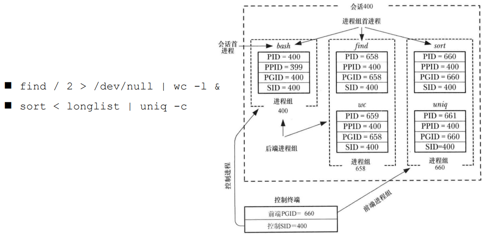

**进程组、会话操作函数：**

- `pid_t getpgrp(void);`
- `pid_t getpgid(pid_t pid);`
- `int setpgid(pid_t pid, pid_t pgid);`
- ` pid_t getsid(pid_t pid);`
- `pid_t setsid(void);`

**守护进程概念：**

- `守护进程（Daemon Process）`，也就是通常说的 Daemon 进程（精灵进程），是Linux 中的后台服务进程。它是一个生存期较长的进程，通常独立于控制终端并且周期性地执行某种任务或等待处理某些发生的事件。一般采用以 d 结尾的名字
- 守护进程特征
  - 生命周期很长，守护进程会在系统启动的时候被创建并一直运行直至系统被关闭
  - 它在后台运行并且不拥有控制终端。没有控制终端确保了内核永远不会为守护进程自动生成任何控制信号以及终端相关的信号（如 `SIGINT`、`SIGQUIT`）
- Linux 的大多数服务器就是用守护进程实现的。比如，Internet 服务器 `inetd`，Web 服务器 `httpd` 等

**守护进程的创建步骤：**

1. 执行一个 `fork()`，之后父进程退出，子进程继续执行

1. 子进程调用 `setsid()` 开启一个新会话
2. 清除进程的 `umask` 以确保当守护进程创建文件和目录时拥有所需的权限 (非必须)
3. 修改进程的当前工作目录，通常会改为根目录（`/`）
4. 关闭守护进程从其父进程继承而来的所有打开着的文件描述符
5. 在关闭了文件描述符0、1、2之后，守护进程通常会打开`/dev/null` 并使用`dup2()` 使所有这些描述符指向这个设备
6. 核心业务逻辑

**实例：守护进程实现每隔两秒获取时间并写入磁盘**

```c
/*
    写一个守护进程，每个两秒获取以下系统时间，将这个时间写入到磁盘文件中
*/

#include<stdio.h>
#include<sys/stat.h>
#include<sys/types.h>
#include<unistd.h>
#include<stdlib.h>
#include<fcntl.h>
#include<sys/time.h>
#include<signal.h>
#include<time.h>
#include <string.h>

void work(int num) {
    // 捕捉到信号之后，获取系统时间，写入磁盘文件
    time_t tm = time(NULL);
    struct tm * loc = localtime(&tm);

    // char buf[1024];
    // sprintf(buf, "%d-%d-%d %d:%d:%d\n", loc->tm_year, loc->tm_mon, loc->tm_mday, loc->tm_hour, loc->tm_min, loc->tm_sec);

    char* str = asctime(loc);
    int fd = open("time.txt", O_RDWR | O_CREAT | O_APPEND, 0664);
    write(fd ,str, strlen(str));
    close(fd);
}

int main() {
    // 创建子进程, 退出父进程
    pid_t pid = fork();

    if(pid > 0) {
        exit(0);
    }

    // 2. 将子进程重新创建一个会话
    setsid();

    // 3. 设置掩码
    umask(022);

     // 4. 修改进程的当前工作目录，通常设为/，这里应该是权限不够，所以改为当前目录
    chdir("/home/user/Linux");

    // 5. 关闭、重定向文件描述符
    int fd = open("/dev/null", O_RDWR);
    dup2(fd, STDIN_FILENO);
    dup2(fd, STDOUT_FILENO);
    dup2(fd, STDERR_FILENO);

    // 6. 业务逻辑
    // 捕捉定时信号
    struct sigaction act;
    act.sa_flags = 0;
    act.sa_handler = work;
    sigemptyset(&act.sa_mask);
    sigaction(SIGALRM, &act, NULL);

    struct itimerval val;
    val.it_value.tv_sec = 2;
    val.it_value.tv_usec = 0;
    val.it_interval.tv_sec = 2;
    val.it_interval.tv_usec = 0;
    
    // 创建定时器
    setitimer(ITIMER_REAL, &val, NULL);

    // 不让进程结束
    while(1) {
        sleep(10);
    }

    return 0;
}
```

