# Linux网络编程

## 网络基础

### 1. 网络结构模式

#### 1.1 C/S结构

**简介：**

- 服务器 - 客户机，即 `Client - Server（C/S）`结构。C/S 结构通常采取两层结构。服务器负责数据的管理，客户机负责完成与用户的交互任务。客户机是因特网上访问别人信息的机器，服务器则是提供信息供人访问的计算机。
- 客户机通过局域网与服务器相连，接受用户的请求，并通过网络向服务器提出请求，对数据库进行操作。服务器接受客户机的请求，将数据提交给客户机，客户机将数据进行计算并将结果呈现给用户。服务器还要提供完善安全保护及对数据完整性的处理等操作，并允许多个客户机同时访问服务器，这就对服务器的硬件处理数据能力提出了很高的要求。
- 在C/S结构中，应用程序分为两部分：服务器部分和客户机部分。服务器部分是多个用户共享的信息与功能，执行后台服务，如控制共享数据库的操作等；客户机部分为用户所专有，负责执行前台功能，在出错提示、在线帮助等方面都有强大的功能，并且可以在子程序间自由切换。

**优点：**

- 能充分发挥客户端 PC 的处理能力，很多工作可以在客户端处理后再提交给服务器，所以 C/S 结构客户端响应速度快
- 操作界面漂亮、形式多样，可以充分满足客户自身的个性化要求
- C/S 结构的管理信息系统具有较强的事务处理能力，能实现复杂的业务流程
- 安全性较高，C/S 一般面向相对固定的用户群，程序更加注重流程，它可以对权限进行多层次校验，提供了更安全的存取模式，对信息安全的控制能力很强，一般高度机密的信息系统采用 C/S 结构适宜

**缺点：**

- 客户端需要安装专用的客户端软件。首先涉及到安装的工作量，其次任何一台电脑出问题，如病毒、硬件损坏，都需要进行安装或维护。系统软件升级时，每一台客户机需要重新安装，其维护和升级成本非常高
- 对客户端的操作系统一般也会有限制，不能够跨平台

#### 1.2 B/S结构

**简介:**

- `B/S 结构（Browser/Server，浏览器/服务器模式）`，是 WEB 兴起后的一种网络结构模式，WEB浏览器是客户端最主要的应用软件。这种模式统一了客户端，将系统功能实现的核心部分集中到服务器上，简化了系统的开发、维护和使用。
- 客户机上只要安装一个浏览器，如 Firefox 或 InternetExplorer，服务器安装 SQL Server、Oracle、MySQL 等数据库。浏览器通过 Web Server 同数据库进行数据交互

**优点：**

- B/S 架构最大的优点是总体拥有成本低、维护方便、 分布性强、开发简单，可以不用安装任何专门的软件就能实现在任何地方进行操作，客户端零维护，系统的扩展非常容易，只要有一台能上网的电脑就能使用

**缺点：**

- 通信开销大、系统和数据的安全性较难保障
- 个性特点明显降低，无法实现具有个性化的功能要求
- 协议一般是固定的：http/https
- 客户端服务器端的交互是请求-响应模式，通常动态刷新页面，响应速度明显降低

### 2. MAC地址、IP和端口

#### 2.1 MAC地址

**网卡：**

- `网卡`是一块被设计用来允许计算机在计算机网络上进行通讯的计算机硬件，又称为`网络适配器`或`网络接口卡NIC`。其拥有 MAC 地址，属于 `OSI` 模型的第 2 层，它使得用户可以通过电缆或无线相互连接。
- 每一个网卡都有一个被称为 MAC 地址的独一无二的 **48 位串行号**
- 网卡的主要功能：1.数据的封装与解封装、2.链路管理、3.数据编码与译码

**MAC地址：**

- `MAC 地址（Media Access Control Address）`，直译为媒体存取控制位址，也称为局域网地址、以太网地址、物理地址或硬件地址，它是一个用来确认网络设备位置的位址，由网络设备制造商生产时烧录在网卡中
- 在 `OSI` 模型中，**第三层网络层负责 IP 地址**，**第二层数据链路层则负责 MAC位址**
- MAC 地址用于在网络中唯一标识一个网卡，一台设备若有一或多个网卡，则每个网卡都需要并会有一个唯一的 MAC 地址

#### 2.2 IP地址

**简介：**

- `IP 协议`是为计算机网络相互连接进行通信而设计的协议。在因特网中，它是**能使连接到网上的所有计算机网络实现相互通信的一套规则，规定了计算机在因特网上进行通信时应当遵守的规则**。任何厂家生产的计算机系统，只要遵守 `IP 协议`就可以与因特网互连互通。各个厂家生产的网络系统和设备，如以太网、分组交换网等，它们相互之间不能互通，**不能互通的主要原因是因为它们所传送数据的基本单元（技术上称之为“帧”）的格式不同**
- `IP 协议`实际上是一套由软件程序组成的协议软件，它把各种不同“帧”统一转换成`IP 数据报`格式，这种转换是因特网的一个最重要的特点，使所有各种计算机都能在因特网上实现互通，即具有“开放性”的特点。正是因为有了 IP 协议，因特网才得以迅速发展成为世界上最大的、开放的计算机通信网络。因此，IP 协议也可以叫做“因特网协议”
- IP 地址（Internet Protocol Address）是指互联网协议地址，又译为网际协议地址。
- IP 地址是 IP协议提供的一种统一的地址格式，它为互联网上的每一个网络和每一台主机分配一个逻辑地址，以此来屏蔽物理地址的差异
- **IP 地址是一个 32 位的二进制数，通常被分割为 4 个“ 8 位二进制数”（也就是 4 个字节）**
- IP 地址通常用`点分十进制`表示成（`a.b.c.d`）的形式，其中，a,b,c,d都是 0~255 之间的十进制整数。例：点分十进IP地址（100.4.5.6），实际上是 32 位二进制数（01100100.00000100.00000101.00000110）

**IP地址编址方式：**

- 最初设计互联网络时，**为了便于寻址以及层次化构造网络，每个 IP 地址包括两个标识码（ID）**，即`网络ID` 和`主机 ID`。同一个物理网络上的所有主机都使用同一个网络 ID，网络上的一个主机（包括网络上工作站，服务器和路由器等）有一个主机 ID 与其对应
- Internet 委员会定义了 5 种 IP 地址类型以适合不同容量的网络，即 A 类~ E 类
- 其中 A、B、C 3类（如下表格）由 InternetNIC 在全球范围内统一分配，D、E 类为特殊地址
  - A类最高位不能为1，所以是$2^7$
  - 主机数要减去2是因为去掉`x.x.x.0`和`x.x.x.255`这两个特殊的地址

| 类别 | 最大网络数   | IP地址范围                | 单个网段最大主机数 | 私有IP地址范围              |
| ---- | ------------ | ------------------------- | ------------------ | --------------------------- |
| A    | 126(27−1)    | 1.0.0.1~126.255.255.254   | 16777214(224−2)    | 10.0.0.0~10.255.255.255     |
| B    | 16384(214)   | 128.0.0.1~191.255.255.254 | 65534(216−2)       | 172.16.0.0~172.31.255.255   |
| C    | 2097152(221) | 192.0.0.1~223.255.255.254 | 254(28−2)          | 192.168.0.0~192.168.255.255 |

**A类IP地址：**

- 一个 A 类 IP 地址是指， 在 IP 地址的四段号码中，**第一段号码为网络号码，剩下的三段号码为本地计算机的号码**
- 如果用二进制表示 IP 地址的话，A 类 IP 地址就由 1 字节的网络地址和 3 字节主机地址组成，**网络地址的最高位必须是`0`**
- A 类 IP 地址中网络的标识长度为 8 位，主机标识的长度为 24 位，A类网络地址数量较少，有 126 个网络，每个网络可以容纳主机数达 1600 多万台
- A 类 IP 地址 地址范围 `1.0.0.1 - 126.255.255.254`（二进制表示为：`00000001 00000000 00000000 00000001 - 01111111 11111111 11111111 11111110`），最后一个是广播地址
- A 类 IP 地址的子网掩码为 255.0.0.0，每个网络支持的最大主机数为$2^{24}-2$

**B类IP地址：**

- 一个 B 类 IP 地址是指，在 IP 地址的四段号码中，**前两段号码为网络号码，剩下的两段号码为本地计算机的号码**
- 如果用二进制表示 IP 地址的话，B 类 IP 地址就由 2 字节的网络地址和 2 字节主机地址组成，**网络地址的最高位必须是`10`**
- B 类 IP地址中网络的标识长度为 16 位，主机标识的长度为 16 位，B 类网络地址适用于中等规模的网络，有16384 个网络，每个网络所能容纳的计算机数为 6 万多台
- B 类 IP 地址地址范围 `128.0.0.1 - 191.255.255.254` （二进制表示为：`10000000 00000000 00000000 00000001 - 10111111 11111111 11111111 11111110`）， 最后一个是广播地址
- B 类 IP 地址的子网掩码为 255.255.0.0，每个网络支持的最大主机数为$2^{16}-2$

**C类IP地址：**

- 一个 C 类 IP 地址是指，在 IP 地址的四段号码中，**前三段号码为网络号码，剩下的一段号码为本地计算机的号码**
- 如果用二进制表示 IP 地址的话，C 类 IP 地址就由 3 字节的网络地址和 1 字节主机地址组成，**网络地址的最高位必须是`110`**
- C 类 IP 地址中网络的标识长度为 24 位，主机标识的长度为 8 位，C 类网络地址数量较多，有 209 万余个网络。适用于小规模的局域网络，每个网络最多只能包含254台计算机
- C 类 IP 地址范围 `192.0.0.1-223.255.255.254` （二进制表示为: `11000000 00000000 00000000 00000001 - 11011111 11111111 11111111 11111110`），最后一个是广播地址
- C类IP地址的子网掩码为 255.255.255.0，每个网络支持的最大主机数为$2^8-2$

**D类IP地址：**

- D 类 IP 地址在历史上被叫做`多播地址（multicast address）`，即`组播地址`

- 在以太网中，多播地址命名了一组应该在这个网络中应用接收到一个分组的站点。多播地址的最高位必须是 `1110`，范围从`224.0.0.0 - 239.255.255.255`

- 划分

  | IP地址                    | 说明                                                         |
  | ------------------------- | ------------------------------------------------------------ |
  | 224.0.0.0~224.0.0.255     | 局部链接多播地址：是为路由协议和其它用途保留的地址，路由器并不转发属于此范围的IP包 |
  | 224.0.1.0~224.0.1.255     | 预留多播地址：公用组播地址，可用于Internet；使用前需要申请   |
  | 224.0.2.0~238.255.255.255 | 预留多播地址：用户可用组播地址(临时组地址)，全网范围内有效   |
  | 239.0.0.0~239.255.255.255 | 本地管理组播地址，可供组织内部使用，类似于私有 IP 地址，不能用于 Internet，可限制多播范围 |

**特殊的网址：**

- 每一个字节都为 0 的地址（ `0.0.0.0` ）对应于**当前主机**
- IP 地址中的每一个字节都为 1 的 IP 地址（ `255.255.255.255` ）是**当前子网的广播地址**
- IP 地址中凡是以 `11110` 开头的 E 类 IP 地址都保留用于将来和实验使用
- IP地址中**不能以十进制 `127` 作为开头**，该类地址中数字 `127.0.0.1 ~ 127.255.255.255` 用于回路测试，如：`127.0.0.1`可以代表**本机IP地址**

**子网掩码：**

- `子网掩码（subnet mask）`又叫网络掩码、地址掩码、子网络遮罩，它是一种用来指明一个 IP 地址的哪些位标识的是主机所在的子网，以及哪些位标识的是主机的位掩码
- 子网掩码不能单独存在，它必须结合 IP 地址一起使用
- 子网掩码只有一个作用，就是将某个 IP 地址划分成`网络地址`和`主机地址`两部分
- 子网掩码是一个 **32 位地址**，用于屏蔽 IP 地址的一部分以区别网络标识和主机标识，并说明该 IP地址是在局域网上，还是在广域网上

> 子网掩码是在 IPv4 地址资源紧缺的背景下为了解决 lP 地址分配而产生的虚拟 lP 技术，通过子网掩码将A、B、C 三类地址划分为若干子网，从而显著提高了 IP 地址的分配效率，有效解决了 IP 地址资源紧张的局面。另一方面，在企业内网中为了更好地管理网络，网管人员也利用子网掩码的作用，人为地将一个较大的企业内部网络划分为更多个小规模的子网，再利用三层交换机的路由功能实现子网互联，从而有效解决了网络广播风暴和网络病毒等诸多网络管理方面的问题
>
> 在大多数的网络教科书中，一般都将子网掩码的作用描述为通过逻辑运算，将 IP 地址划分为网络标识(Net.ID) 和主机标识(Host.ID)，只有网络标识相同的两台主机在无路由的情况下才能相互通信
>
> 根据 RFC950 定义，子网掩码是一个 32 位的 2 进制数， 其对应网络地址的所有位都置为 1，对应于主机地址的所有位置都为 0。子网掩码告知路由器，地址的哪一部分是网络地址，哪一部分是主机地址，使路由器正确判断任意 IP 地址是否是本网段的，从而正确地进行路由。网络上，数据从一个地方传到另外一个地方，是依靠 IP 寻址。从逻辑上来讲，是两步的。第一步，从 IP 中找到所属的网络，好比是去找这个人是哪个小区的；第二步，再从 IP 中找到主机在这个网络中的位置，好比是在小区里面找到这个人
>
> 子网掩码的设定必须遵循一定的规则。与二进制 IP 地址相同，子网掩码由 1 和 0 组成，且 1 和 0 分别连续。子网掩码的长度也是 32 位，左边是网络位，用二进制数字 “1” 表示，1 的数目等于网络位的长度；右边是主机位，用二进制数字 “0” 表示，0 的数目等于主机位的长度。这样做的目的是为了让掩码与 IP 地址做按位与运算时用 0 遮住原主机数，而不改变原网络段数字，而且很容易通过 0 的位数确定子网的主机数（ 2 的主机位数次方 - 2，因为主机号全为 1 时表示该网络广播地址，全为 0 时表示该网络的网络号，这是两个特殊地址）。通过子网掩码，才能表明一台主机所在的子网与其他子网的关系，使网络正常工作

#### 2.3 端口

**简介：**

- `端口` 是英文 port 的意译，可以认为是设备与外界通讯交流的出口
- 端口可分为`虚拟端口`和`物理端口`
  - 虚拟端口指计算机内部或交换机路由器内的端口，不可见，是特指TCP/IP协议中的端口，是逻辑意义上的端口，例如计算机中的 80 端口、21 端口、23 端口等
  - 物理端口又称为接口，是可见端口，计算机背板的 RJ45 网口，交换机路由器集线器等 RJ45 端口。电话使用 RJ11 插口也属于物理端口的范畴
- 端口是通过端口号来标记的，端口号只有整数，范围是从 0 到65535（$2^{16}$）

**周知端口（Well Known Ports）：**

- 周知端口是众所周知的端口号，也叫知名端口、公认端口或者常用端口，**范围从 0 到 1023**，它们紧密绑定于一些特定的服务，例如 80 端口分配给 WWW 服务，21 端口分配给 FTP 服务，23 端口分配给Telnet服务等等
- 我们在 IE 的地址栏里输入一个网址的时候是不必指定端口号的，因为在默认情况下WWW 服务的端口是 “80”
- 网络服务是可以使用其他端口号的，如果不是默认的端口号则应该在地址栏上指定端口号，方法是**在地址后面加上冒号“:”（半角），再加上端口号**。比如使用 “8080” 作为 WWW服务的端口，则需要在地址栏里输入`网址:8080`
- 有些系统协议使用固定的端口号，它是不能被改变的，比如 139 端口专门用于 NetBIOS 与 TCP/IP 之间的通信，不能手动改变

**注册端口（Registered Ports）：**

- **端口号从 1024 到 49151**，它们松散地绑定于一些服务，分配给用户进程或应用程序，这些进程主要是用户选择安装的一些应用程序，而不是已经分配好了公认端口的常用程序。这些端口在没有被服务器资源占用的时候，可以用用户端动态选用为源端口

**动态端口 / 私有端口（Dynamic Ports / Private Ports）：**

- 动态端口的范围是从 **49152 到 65535**，之所以称为动态端口，是因为它一般不固定分配某种服务，而是动态分配


### 3. 网络通信流程

 

#### 3.1 封装与分用

**发送端**通过TCP/IP中每一层时需要将消息`封装`对应信息，然后**接收端**通过过TCP/IP中每一层时需要将消息`分用（解封装）`对应信息

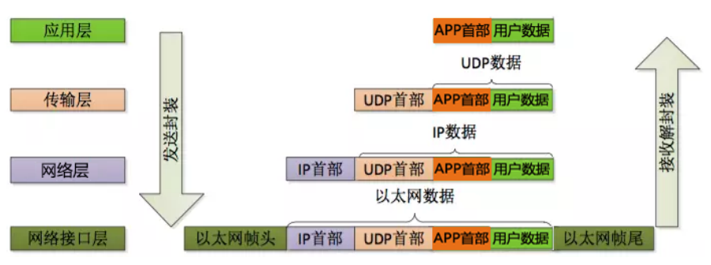

* 封装

> 上层协议是如何使用下层协议提供的服务的呢？其实这是通过封装（encapsulation）实现的。应用程序数据在发送到物理网络上之前，将沿着协议栈从上往下依次传递。每层协议都将在上层数据的基础上加上自己的头部信息（有时还包括尾部信息），以实现该层的功能，这个过程就称为封装


* 分用

> 当帧到达目的主机时，将沿着协议栈自底向上依次传递。各层协议依次处理帧中本层负责的头部数据，以获取所需的信息，并最终将处理后的帧交给目标应用程序。这个过程称为分用（demultiplexing）。分用是依靠头部信息中的类型字段实现的

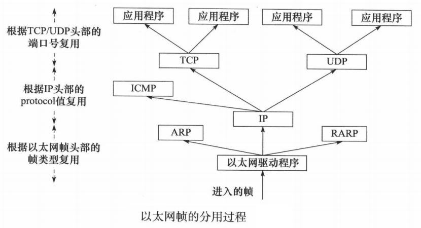

#### 3.2 实例：QQ发送消息简易流程

- 存在的问题：在数据链路层封装以太网帧时，怎么知道目标机器的MAC地址？=>通过`arp协议`


**ARP协议**

- arp协议通过IP地址找到MAC地址，通过**广播arp请求找到**，局域网内根据信息解析得到`arp应答`
- rarp协议通过MAC地址找IP地址

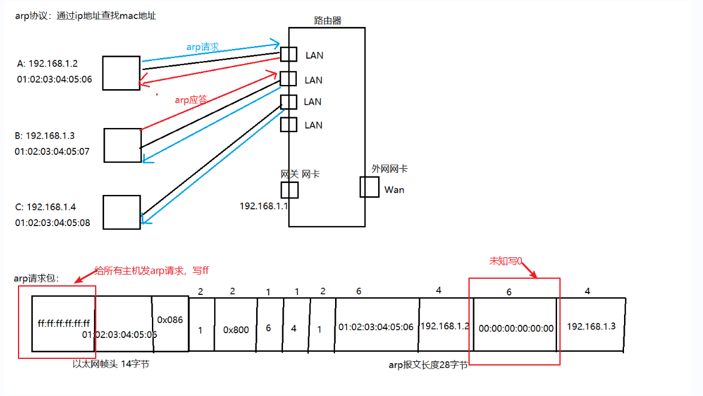

##  Socket通信基础

### 1. socket介绍

- `socket（套接字）`，就是对网络中**不同主机**上的应用进程之间进行**双向通信**的端点的抽象

  > 一个套接字就是网络上进程通信的一端，提供了应用层进程利用网络协议交换数据的机制。从所处的地位来讲，套接字上联应用进程，下联网络协议栈，是应用程序通过网络协议进行通信的接口，是应用程序与网络协议根进行交互的接口

- socket 可以看成是两个网络应用程序进行通信时，各自通信连接中的端点，这是一个逻辑上的概念

  > 它是网络环境中进程间通信的 API，也是可以被命名和寻址的通信端点，使用中的每一个套接字都有其类型和一个与之相连进程。通信时其中一个网络应用程序将要传输的一段信息写入它所在主机的 socket 中，该 socket 通过与网络接口卡（NIC）相连的传输介质将这段信息送到另外一台主机的 socket 中，使对方能够接收到这段信息。socket 是由 IP 地址和端口结合的，提供向应用层进程传送数据包的机制

- socket 本身有“插座”的意思，在 Linux 环境下，用于表示进程间网络通信的特殊文件类型。**本质为内核借助缓冲区形成的伪文件**

  > 既然是文件，那么理所当然的，我们可以使用文件描述符引用套接字。与管道类似的，Linux 系统将其封装成文件的目的是为了统一接口，使得读写套接字和读写文件的操作一致。区别是管道主要应用于本地进程间通信，而套接字多应用于网络进程间数据的传递

- 套接字通信分两部分

  - 服务器端：被动接受连接，一般不会主动发起连接
  - 客户端：主动向服务器发起连接

- socket是一套通信的接口，Linux 和 Windows 都有，但是有一些细微的差别

### 2. 字节序

#### 2.1 简介

- `字节序`，顾名思义字节的顺序，就是**大于一个字节类型的数据在内存中的存放顺序**(一个字节的数据当然就无需谈顺序的问题了)
- 字节序分为`大端字节序`（Big-Endian）和`小端字节序`（Little-Endian）
  - **大端字节序**：指一个整数的最高位字节（23 ~ 31 bit）存储在内存的低地址处，低位字节（0 ~ 7 bit）存储在内存的高地址处
  - **小端字节序**：指整数的高位字节存储在内存的高地址处，而低位字节则存储在内存的低地址处

> 现代 CPU 的累加器一次都能装载（至少）4 字节（这里考虑 32 位机），即一个整数。那么这 4字节在内存中排列的顺序将影响它被累加器装载成的整数的值，这就是字节序问题
>
> 在各种计算机体系结构中，对于字节、字等的存储机制有所不同，因而引发了计算机通信领域中一个很重要的问题，即通信双方交流的信息单元（比特、字节、字、双字等等）应该以什么样的顺序进行传送。如果不达成一致的规则，通信双方将无法进行正确的编码/译码从而导致通信失败

**字节序详解：**

* 大端字节序

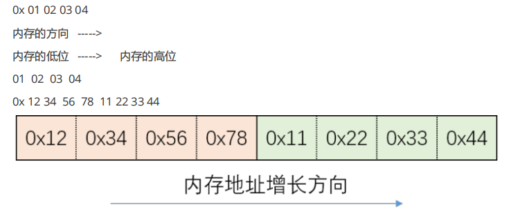

* 小端字节序

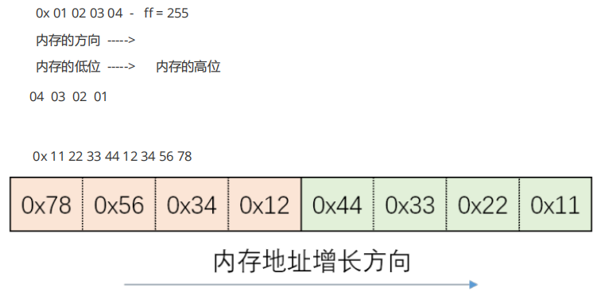

**查看机器字节序：**

```c
/*
    字节序：字节在内存中存储的顺序
    小端字节序：数据的高位字节存储在内存的高位地址，低位字节存储在内存的低位字节
    大端字节序：数据的低位字节存储在内存的高位地址，高位字节存储在内存的低位地址
*/

#include <stdio.h>

int main()
{
    union{
        short value;                // 两字节
        char bytes[sizeof(short)];  // 两字节
    }test;
    
    test.value = 0x0102;
    if (test.bytes[0] == 1 && test.bytes[1] == 2) {
        printf("大端机器\n");
    } else if (test.bytes[0] == 2 && test.bytes[1] == 1) {
        printf("小端机器\n");
    } else {
        printf("未知\n");
    }

    return 0;
}
```

#### 2.2 字节序转换函数

- 当格式化的数据在两台使用不同字节序的主机之间直接传递时，接收端必然错误的解释之。解决问题的方法是：**发送端总是把要发送的数据转换成大端字节序数据后再发送**，而接收端知道对方传送过来的数据总是采用大端字节序，所以接收端可以根据自身采用的字节序决定是否对接收到的数据进行转换（小端机转换，大端机不转换）
- **网络字节顺序**是 TCP/IP 中规定好的一种数据表示格式，它与具体的 CPU 类型、操作系统等无关，从而可以保证数据在不同主机之间传输时能够被正确解释，网络字节顺序采用大端排序方式
- BSD Socket提供了封装好的转换接口，方便程序员使用
  - 从主机字节序到网络字节序的转换函数：`htons`、`htonl`
  - 从网络字节序到主机字节序的转换函数：`ntohs`、`ntohl`

```c
/*
    网络通信时，需要将主机字节序转化成网络的字节序（网络字节序一般为大端）
    另外一端获取到数据以后根据情况将网络字节序转换成主机的字节序
*/

h  - host 主机，主机字节序 
to - 转换成什么 
n  - network 网络字节序 
s  - short unsigned short 
l  - long unsigned int
    
#include <arpa/inet.h> 
// 转换端口 
uint16_t htons(uint16_t hostshort); // 主机字节序 => 网络字节序 
uint16_t ntohs(uint16_t netshort); // 主机字节序 => 网络字节序 
// 转IP 
uint32_t htonl(uint32_t hostlong); // 主机字节序 => 网络字节序 
uint32_t ntohl(uint32_t netlong); // 主机字节序 => 网络字节序
```

```c

#include<stdio.h>
#include <arpa/inet.h>

int main()  {

    // htons 转换端口
    unsigned short a = 0x0102;
    printf("a: %x\n", a);
    unsigned short b = htons(a);
    printf("b: %x\n", b);

    // htonl 转换ip
    char buf[4] = {192, 168, 1, 100};
    int num = *(int *)buf;
    int sum = htonl(num);
    unsigned char *p = (char *)&sum;
    printf("%d %d %d %d \n", *p, *(p + 1), *(p + 2), *(p + 3));


    // ntohl
    char buf1[4] = {1, 1, 168, 192};
    int num1 = *(int *)buf1;
    int sum1 = ntohl(num1);
    unsigned char *p1 = (char *)&sum1;
    printf("%d %d %d %d \n", *p1, *(p1 + 1), *(p1 + 2), *(p1 + 3));


    // ntohs 
    unsigned short a1 = 0x0102;
    printf("a: %x\n", a1);
    unsigned short b1 = ntohs(a);
    printf("b: %x\n", b1);


    return 0;
}
```

### 3 socket地址

#### 3.1 socket地址简介

- socket地址其实是一个`结构体`，**封装端口号和IP等信息**
- 后面的socket相关的api中需要使用到这个 socket地址

#### 3.2 **通用socket 地址**

* socket 网络编程接口中表示 socket 地址的是结构体 `sockaddr`，其定义如下

```c
#include <bits/socket.h> 
struct sockaddr { 
    sa_family_t sa_family; 
    char sa_data[14]; 
};

typedef unsigned short int sa_family_t;
```

- `sa_family`

  - `sa_family` 成员是地址族类型（`sa_family_t`）的变量
  - `地址族类型`通常与`协议族类型`对应
  - 宏 `PF_*` 和 `AF_*` 都定义在 `bits/socket.h` 头文件中，且后者与前者有完全相同的值，所以二者通常混用

  | 协议族   | 地址族   | 描述             |
  | -------- | -------- | ---------------- |
  | PF_UNIX  | AF_UNIX  | UNIX本地域协议族 |
  | PF_INET  | AF_INET  | TCP/IPv4协议族   |
  | PF_INET6 | AF_INET6 | TCP/IPv6协议族   |

- `sa_data`

  - `sa_data` 成员用于存放 socket 地址值，不同的协议族的地址值具有不同的含义和长度

  | 协议族   | 地址值含义和长度                                             |
  | -------- | ------------------------------------------------------------ |
  | PF_UNIX  | 文件的路径名，长度可达到108字节                              |
  | PF_INET  | 16 bit 端口号和 32 bit IPv4 地址，共 6 字节                  |
  | PF_INET6 | 16 bit 端口号，32 bit 流标识，128 bit IPv6 地址，32 bit 范围 ID，共 26 字节 |

  - 由上表可知，14 字节的 sa_data 根本无法容纳多数协议族的地址值。因此，Linux 定义了下面这个新的通用的 socket 地址结构体，这个结构体不仅提供了足够大的空间用于存放地址值，而且是内存对齐的

    ```c
    #include <bits/socket.h> 
    struct sockaddr_storage { 
        sa_family_t sa_family; 
        unsigned long int __ss_align; 
        char __ss_padding[ 128 - sizeof(__ss_align) ]; 
    };
    
    typedef unsigned short int sa_family_t;
    ```

#### 3.3 专用socket地址

- 很多网络编程函数诞生早于 IPv4 协议，那时候都使用的是 `struct sockaddr` 结构体，为了向前兼容，现在`sockaddr` 退化成了（void *）的作用，传递一个地址给函数，至于这个函数是 `sockaddr_in` 还是`sockaddr_in6`，由地址族确定，然后函数内部再强制类型转化为所需的地址类型
- 不同socket地址对比图

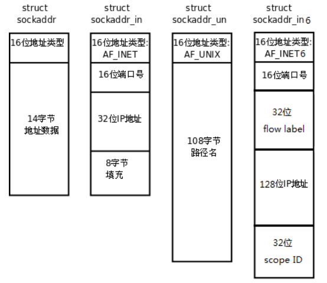

- 所有专用 socket 地址（以及 sockaddr_storage）类型的变量在实际使用时都需要转化为通用 socket 地址类型 sockaddr（强制转化即可），因为所有 socket 编程接口使用的地址参数类型都是 sockaddr

**UNIX 本地域协议族**

```c
#include <sys/un.h> 
struct sockaddr_un { 
    sa_family_t sin_family; 
    char sun_path[108]; 
};
```

**TCP/IP协议族**

```
// IPV4
#include <netinet/in.h> 
struct sockaddr_in { 
    sa_family_t sin_family; /* __SOCKADDR_COMMON(sin_) */ 
    in_port_t sin_port; /* Port number. */ 
    struct in_addr sin_addr; /* Internet address. */ 
    /* Pad to size of `struct sockaddr'. */ 
    unsigned char sin_zero[sizeof (struct sockaddr) - __SOCKADDR_COMMON_SIZE - sizeof (in_port_t) - sizeof (struct in_addr)]; 
};

struct in_addr { 
    in_addr_t s_addr; 
};

// IPV6
struct sockaddr_in6 { 
    sa_family_t sin6_family; 
    in_port_t sin6_port; /* Transport layer port # */ 
    uint32_t sin6_flowinfo; /* IPv6 flow information */ 
    struct in6_addr sin6_addr; /* IPv6 address */ 
    uint32_t sin6_scope_id; /* IPv6 scope-id */ 
};

// 相关定义
typedef unsigned short uint16_t; 
typedef unsigned int uint32_t; 
typedef uint16_t in_port_t; 
typedef uint32_t in_addr_t; 
#define __SOCKADDR_COMMON_SIZE (sizeof (unsigned short int))
```


#### 3.4 IP地址转换

- `点分十进制`IP地址与`网络字节序整数`IP地址相互转换

  > 通常，人们习惯用可读性好的字符串来表示 IP 地址，比如用点分十进制字符串表示 IPv4 地址，以及用十六进制字符串表示 IPv6 地址。但编程中我们需要先把它们转化为整数（二进制数）方能使用。而记录日志时则相反，我们要把整数表示的 IP 地址转化为可读的字符串

- 旧版（已弃用）：只适用于IPV4间的转换

  ```c
  #include <arpa/inet.h> 
  in_addr_t inet_addr(const char *cp); 
  int inet_aton(const char *cp, struct in_addr *inp); 
  char *inet_ntoa(struct in_addr in);
  ```

- 新版：同时适用于IPV4和IPV6

  - 字母含义
    - `p`：点分十进制的IP字符串
    - `n`：表示network，网络字节序的整数

  ```C
  int inet_pton(int af, const char *src, void *dst);
  const char *inet_ntop(int af, const void *src, char *dst, socklen_t size);
  ```

`int inet_pton(int af, const char *src, void *dst);` 

- 功能：将点分十进制的IP地址字符串，转换成网络字节序的整数
- 参数
  - af：地址族
    - IPV4：`AF_INET`
    - IPV6：`AF_INET6(IPV6)`
  - `src`：需要转换的点分十进制的IP字符串
  - `dst`：转换后的结果保存在这个里面
- 返回值
  - 1：成功
  - 0：源IP地址有误
  - -1：地址族包含不可用的地址协议

`const char *inet_ntop(int af, const void *src, char *dst, socklen_t size);`

- 功能：将网络字节序的整数，转换成点分十进制的IP地址字符串
- 参数
  - af：地址族
    - IPV4：`AF_INET`
    - IPV6：`AF_INET6(IPV6)`
  - `src`：要转换的ip的整数的地址
  - `dst`：转换成IP地址字符串保存的地方
  - `size`：第三个参数的大小（数组的大小）
- 返回值：返回转换后的数据的地址（字符串），和 dst 是一样的

```c
/*
    #include <arpa/inet.h>
    // p:点分十进制的IP字符串，n:表示network，网络字节序的整数
    int inet_pton(int af, const char *src, void *dst);
        af:地址族： AF_INET  AF_INET6
        src:需要转换的点分十进制的IP字符串
        dst:转换后的结果保存在这个里面

    // 将网络字节序的整数，转换成点分十进制的IP地址字符串
    const char *inet_ntop(int af, const void *src, char *dst, socklen_t size);
        af:地址族： AF_INET  AF_INET6
        src: 要转换的ip的整数的地址
        dst: 转换成IP地址字符串保存的地方
        size：第三个参数的大小（数组的大小）
        返回值：返回转换后的数据的地址（字符串），和 dst 是一样的
*/

#include <stdio.h>
#include <arpa/inet.h>


int main() {
    // 创建一个ip字符串，点分十进制的IP地址字符串
    char buf[] = "192.168.1.4";
    unsigned int num = 0;

    inet_pton(AF_INET, buf, &num);  // 将点分十进制的ip字符串转换成网络字节序的整数

    unsigned char *p = (unsigned char *)&num;
    printf("%d %d %d %d \n", *p, *(p + 1), *(p + 2), *(p + 3));

    // 将网络字节序的IP整数转换成点分十进制的IP地址
    char ip[16] = "";

    const char *str = inet_ntop(AF_INET, &num, ip, sizeof(ip));
    printf("str : %s\n", str);
    printf("ip : %s\n", ip);
    return 0;
}
```

### 4. TCP通信

#### 4.1 TCP与UDP的区别

 **简介**

- `UDP`：用户数据报协议，面向无连接，可以单播，多播，广播， 面向数据报，不可靠
- `TCP`：传输控制协议，面向连接的，可靠的，基于字节流，仅支持单播传输

**对比**

|                | UDP                            | TCP                        |
| -------------- | ------------------------------ | -------------------------- |
| 是否创建连接   | 无连接                         | 面向连接                   |
| 是否可靠       | 不可靠                         | 可靠的                     |
| 连接的对象个数 | 一对一、一对多、多对一、多对多 | 仅支持一对一               |
| 传输的方式     | 面向数据报                     | 面向字节流                 |
| 首部开销       | 8个字节                        | 最少20个字节               |
| 适用场景       | 实时应用（视频会议，直播）     | 可靠性高的应用（文件传输） |

#### 4.2 TCP通信流程

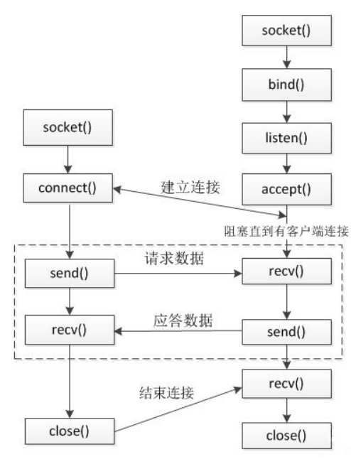

**服务器端（被动接收连接）**

1. 创建一个用于监听的套接字
   - 监听：监听有客户端的连接
   - 套接字：这个套接字其实就是一个文件描述符
2. 将这个监听文件描述符和本地的IP和端口绑定（IP和端口就是服务器的地址信息）
   - 客户端连接服务器的时候使用的就是这个IP和端口
3. 设置监听，`监听的fd`开始工作
4. 阻塞等待，当有客户端发起连接，解除阻塞，接受客户端的连接，会得到一个`和客户端通信的套接字(fd)`
5. 通信
   - 接收数据
   - 发送数据
6. 通信结束，断开连接

**客户端**

1. 创建一个用于通信的套接字(fd)
2. 连接服务器，需要指定连接的服务器的 IP 和 端口
3. 连接成功了，客户端可以直接和服务器通信
   - 接收数据
   - 发送数据
4. 通信结束，断开连接

#### 4.3 socket函数

- 包含在下列头文件中

  ```c
  #include <sys/types.h> 
  #include <sys/socket.h> 
  #include <arpa/inet.h> // 包含了这个头文件，上面两个就可以省略(因为已经包含上面两个)
  
  int socket(int domain, int type, int protocol);
  int bind(int sockfd, const struct sockaddr *addr, socklen_t addrlen);
  int listen(int sockfd, int backlog);
  int accept(int sockfd, struct sockaddr *addr, socklen_t *addrlen);
  int connect(int sockfd, const struct sockaddr *addr, socklen_t addrlen);
  ```

`int socket(int domain, int type, int protocol);`

- 参数：
  - domain：协议族(常用如下)
    - `AF_INET` ：`ipv4`
    - `AF_INET`6 ：`ipv6`
    - `AF_UNIX`, `AF_LOCAL`：本地套接字通信（进程间通信）
  - type：通信过程中使用的协议类型
    - `SOCK_STREAM` : 流式协议
    - `SOCK_DGRAM` : 报式协议
  - protocol：具体的一个协议，一般写0，用于指定type参数的默认协议类型
    - `SOCK_STREAM` : 流式协议默认使用 TCP
    - `SOCK_DGRAM` : 报式协议默认使用 UDP
- 返回值
  - 成功：返回文件描述符，操作的就是内核缓冲区
  - 失败：-1

`int bind(int sockfd, const struct sockaddr *addr, socklen_t addrlen); `

- 功能：绑定，将fd 和本地的IP和端口进行绑定
- 参数：
  - `sockfd`：通过socket函数得到的文件描述符
  - `addr`：需要绑定的socket地址，这个地址封装了**本地的ip和端口号的信息**
  - `addrlen`：第二个参数结构体占的内存大小
- 返回值：成功：0，失败：-1

`int listen(int sockfd, int backlog);`

- 功能：监听这个socket上的连接
- 参数：
  - `sockfd`：通过socket()函数得到的文件描述符
  - `backlog`：未连接的和已经连接的和的最大值，可用`cat /proc/sys/net/core/somaxconn`查看Linux设置值，
- 返回值：成功：0，失败：-1

`int accept(int sockfd, struct sockaddr *addr, socklen_t *addrlen); `

- 功能：接收客户端连接，默认是一个阻塞的函数，阻塞等待客户端连接
- 参数：
  - `sockfd` : 用于监听的文件描述符
  - `addr` : 传出参数，记录了连接成功后**客户端的地址信息**（ip，port）
  - `addrlen` : 指定第二个参数的对应的内存大小
- 返回值：
  - 成功：用于通信的文件描述符
  - 失败：-1

`int connect(int sockfd, const struct sockaddr *addr, socklen_t addrlen);`

- 功能： 客户端连接服务器
- 参数：
  - `sockfd` : 用于**通信的文件描述符 **
  - `addr` : 客户端要连接的服务器的地址信息
  - `addrlen` : 指定第二个参数的对应的内存大小
- 返回值：成功 0， 失败 -1

- 其他读写函数：

  ```c
  ssize_t write(int fd, const void *buf, size_t count); // 写数据 
  ssize_t read(int fd, void *buf, size_t count); // 读数据
  ```

**实例：TCP通信**

```c
// TCP通信服务端

/*
int socket(int domain, int type, int protocol);
int bind(int sockfd, const struct sockaddr *addr, socklen_t addrlen);
int listen(int sockfd, int backlog);
int accept(int sockfd, struct sockaddr *addr, socklen_t *addrlen);
int connect(int sockfd, const struct sockaddr *addr, socklen_t addrlen);
*/

#include <stdio.h>
#include <arpa/inet.h>
#include <string.h>
#include <unistd.h>
#include <stdlib.h>

int main() {

    // 1.创建socket(用于监听的套接字)
    int lfd = socket(AF_INET, SOCK_STREAM, 0);

    if(lfd == -1) {
        perror("socker");
        exit(-1);
    }

    // 2. 绑定
    struct sockaddr_in saddr;
    saddr.sin_family = AF_INET;
     // 点分十进制转换为网络字节序
    // inet_pton(AF_INET, "192.168.80.131", saddr.sin_addr.s_addr);
    saddr.sin_addr.s_addr = INADDR_ANY; // 0.0.0.0
    saddr.sin_port = htons(9999);
    int ret = bind(lfd, (struct sockaddr *)&saddr, sizeof(saddr));

    if(ret == -1) {
        perror("bind");
        exit(-1);
    }

    // 3.监听
    ret = listen(lfd, 8);
    if(ret == -1) {
        perror("listren");
        exit(-1);
    }
    printf("开始监听：。。。。");

    // 4. 接收客户端连接
    struct sockaddr_in clientaddr;
    socklen_t len = sizeof(clientaddr);
    int cfd = accept(lfd, (struct sockaddr *)&clientaddr, &len);

    if(cfd == -1) {
        perror("accept");
        exit(-1);
    }
    // 输出客户端信息
    char clientIp[16] = {0};
    inet_ntop(AF_INET, &clientaddr.sin_addr.s_addr, clientIp, sizeof(clientIp));
    unsigned short client_port = ntohs(clientaddr.sin_port);
    printf("ip:%s, port:%d\n", clientIp, client_port);
    
    // 5. 
    // 获取客户端的数据
    char recvBuf[1024] = {0};
    int length = read(cfd, recvBuf, sizeof(recvBuf));
    if(length == -1) {
        perror("read");
        exit(0);
    } else if(length > 0) {
        printf("rev client data: %s\n", recvBuf);
    } else if(length == 0) {
        // 表示客户端断开连接
    printf("client closed");
    }

    //给客户端发送数据
    char *data = "你好客户端";
    write(cfd, data, strlen(data));
    // 关闭文件描述符
    close(cfd);
    close(lfd);
    return 0;
}
```

```c
// TCP通信客户端

/*
int socket(int domain, int type, int protocol);
int bind(int sockfd, const struct sockaddr *addr, socklen_t addrlen);
int listen(int sockfd, int backlog);
int accept(int sockfd, struct sockaddr *addr, socklen_t *addrlen);
int connect(int sockfd, const struct sockaddr *addr, socklen_t addrlen);
*/

#include <stdio.h>
#include <arpa/inet.h>
#include <string.h>
#include <unistd.h>
#include <stdlib.h>

int main() {
    // 创建套接字
    int cfd = socket(AF_INET, SOCK_STREAM, 0);
    if(cfd == -1) {
        perror("socket");
        exit(0);
    }

    // 连接服务端
    struct sockaddr_in serveraddr;
    inet_pton(PF_INET, "192.168.80.131", &serveraddr.sin_addr.s_addr);
    serveraddr.sin_port = htons(9999);
    serveraddr.sin_family = AF_INET;
    int ret = connect(cfd, (struct sockaddr *)&serveraddr, sizeof(serveraddr));
    if(ret == -1) {
        perror("connect");
        exit(0);
    }

    // 通信
    //给客户端发送数据
    char *data = "你好服务端";
    write(cfd, data, strlen(data));

    // 获取客户端的数据
    char recvBuf[1024] = {0};
    int len = read(cfd, recvBuf, sizeof(recvBuf));
    if(len == -1) {
        perror("read");
        exit(0);
    } else if(len > 0) {
        printf("rev server data: %s\n", recvBuf);
    } else if(len == 0) {
        // 表示服务端断开连接
    printf("client closed");
    }

    // 关闭文件描述符
    close(cfd);
    return 0;
}
```

#### 4.4 TCP三次握手

**握手流程：**

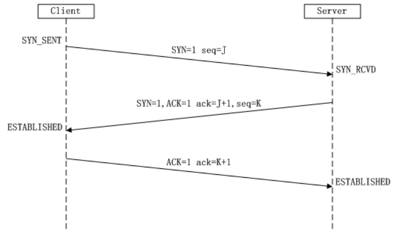

**第一次握手**

- 客户端将SYN标志位置为1
- 生成一个随机的32位的序号seq=J ， 这个序号后边是可以携带数据（数据的大小）

**第二次握手**

- 服务器端接收客户端的连接： ACK=1
- 服务器会回发一个确认序号： ack=客户端的序号 + 数据长度 + SYN/FIN(按一个字节算)
- 服务器端会向客户端发起连接请求： SYN=1
- 服务器会生成一个随机序号：seq = K

**第三次握手**

- 客户端应答服务器的连接请求：ACK=1
- 客户端回复收到了服务器端的数据：ack=服务端的序号 + 数据长度 + SYN/FIN(按一个字节算)

**示例：携带数据通信流程**

- 括号内数字代表携带数据大小


#### 4.5 滑动窗口——流量控制

**简介:**

- `滑动窗口`是 TCP 中实现诸如 ACK 确认、流量控制、拥塞控制的承载结构
- TCP 中采用滑动窗口来进行传输控制，滑动窗口的大小意味着**接收方还有多大的缓冲区可以用于接收数据**。**发送方可以通过滑动窗口的大小来确定应该发送多少字节的数据**。当滑动窗口为 0时，发送方一般不能再发送数据报

> 滑动窗口（Sliding window）是一种流量控制技术。早期的网络通信中，通信双方不会考虑网络的拥挤情况直接发送数据。由于大家不知道网络拥塞状况，同时发送数据，导致中间节点阻塞掉包，谁也发不了数据，所以就有了滑动窗口机制来解决此问题
>
> 滑动窗口协议是用来改善吞吐量的一种技术，即容许发送方在接收任何应答之前传送附加的包。接收方告诉发送方在某一时刻能送多少包（称窗口尺寸）

**滑动窗口与缓冲区**

- **滑动窗口可以理解为缓冲区的大小**
- 滑动窗口的大小会随着发送数据和接收数据而变化，通信的双方都有发送缓冲区和接收数据的缓冲区
- 图示说明：单向发送数据（发送端->接收端）

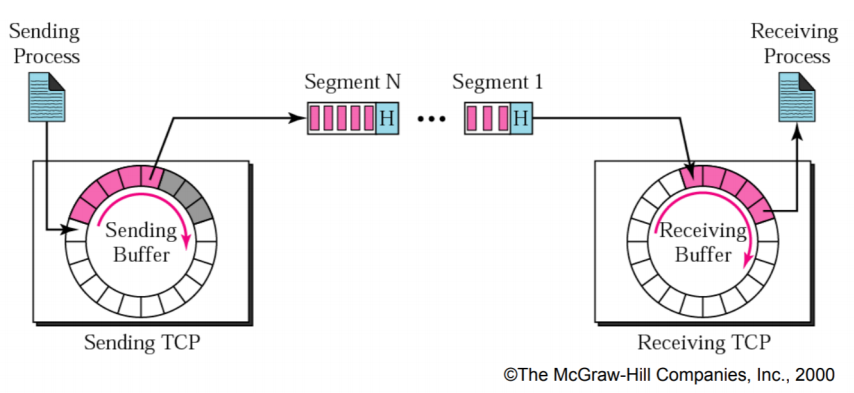

- 发送方的缓冲区
  - 白色格子：空闲的空间
  - 灰色格子：数据已经被发送出去了，但是还没有被接收
  - 紫色格子：还没有发送出去的数据
- 接收方的缓冲区
  - 白色格子：空闲的空间
  - 紫色格子：已经接收到的数据

#### 4.6 TCP四次挥手——断开连接

**挥手流程**

- 四次挥手发生在断开连接的时候，在程序中当调用了`close()`会使用TCP协议进行四次挥手
- 客户端和服务器端都可以主动发起断开连接，谁先调用`close()`谁就是发起方
- 因为在TCP连接的时候，采用三次握手建立的的连接是双向的，在断开的时候需要双向断开

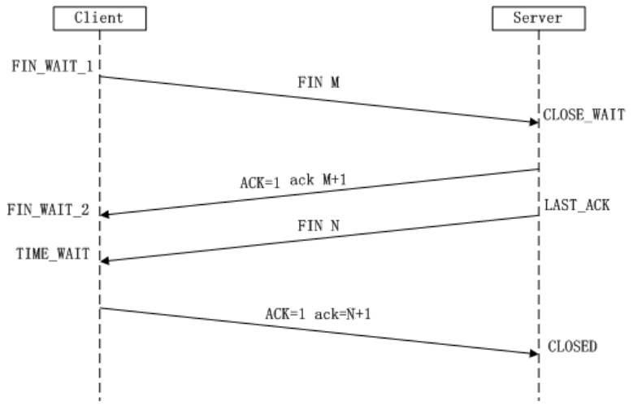


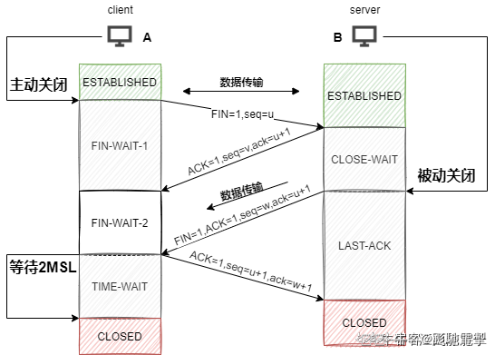


#### 4.7 三次握手？四次挥手？

**为什么要三次握手：**

`为了确保双方都有发送与接收的能力，第一次客户端给服务端发送请求，服务端知道客户端有发送的能力，于是第二次回信；当客户端收到回信后，知道服务端有接受与发送的能力，且为了让服务器知道自己有接收的能力，于是第三次发送信息，在服务器接收到信息时知道客户端有接收的能力，于是建立好了连接`

**为什么不能只进行两次握手：**

1. 如果只进行两次握手，那么服务器只能确认客户端的请求，但是客户端无法确认服务器是否已经收到自己的请求，从而无法保证连接的可靠性。
2. 可能存在历史连接的延续。假设客户端发送一个连接请求，但是由于某种原因导致服务器没有收到请求，客户端可能会认为连接已经建立，但是服务器并不知道。如果后来有其他客户端向服务器发送请求，而请求中恰好包含了与之前客户端相同的源地址和端口号，那么服务器就会误认为这是之前客户端发送的请求，从而建立连接，这就导致了历史连接的延续，可能会给网络带来安全隐患。

#### 4.8 完整的TCP通信

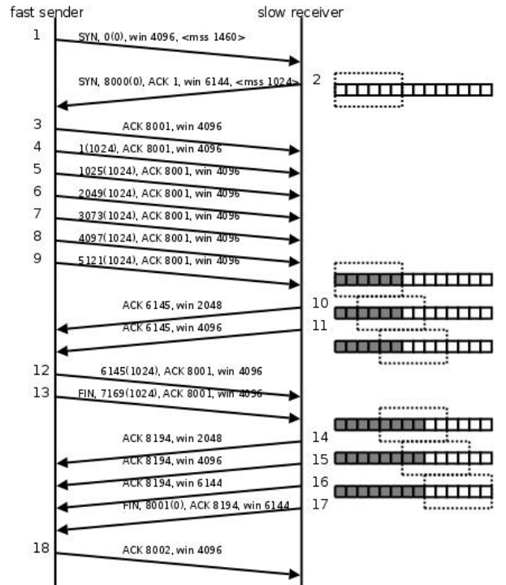

**注解**

- 图中`MSS`表示Maximum Segment Size(一条数据的最大的数据量)
- `win`表示滑动窗口大小
- 图中部分`ACK`应为确认号`ack`，而非标志位`ACK`

**流程说明**

1. 第1次，**第一次握手**，客户端向服务器发起连接，客户端的滑动窗口大小是4096，一次发送的最大数据量是1460
2. 第2次，**第二次握手**，服务器接收连接情况，告诉客户端服务器的窗口大小是6144，一次发送的最大数据量是1024
3. 第3次，**第三次握手**
4. 第4-9次，客户端连续给服务器发送了6k的数据，每次发送1k
5. 第10次，服务器告诉客户端：发送的6k数据以及接收到，存储在缓冲区中，缓冲区数据已经处理了2k，窗口大小是2k(还剩4k未处理，后面同理，不再做单独说明)
6. 第11次，服务器告诉客户端：发送的6k数据以及接收到，存储在缓冲区中，缓冲区数据已经处理了4k，窗口大小是4k
7. 第12次，客户端给服务器发送了1k的数据
8. 第13次，**第一次挥手**，客户端主动请求和服务器断开连接，并且给服务器发送了1k的数据
9. 第14-16次，**第二次挥手**，服务器回复ACK 8194(包含FIN标记，所以结果上多加了1)，表示**同意断开连接的请求**，并通知客户端依次已经处理了2k，4k，6k数据，滑动窗口大小依次为2k，4k，6k
10. 第17次，**第三次挥手**，服务器端给客户端发送FIN，请求断开连接
11. 第18次，**第四次回收**，客户端同意了服务器端的断开请求

#### 4.9 TCP状态转换

**通信过程状态转换图1**


**通信过程状态转换图2**

- 红色实线代表客户端（主动发起连接）
- 绿色虚线代表服务端（被动接收连接）
- 黑色实现代表特殊情况
- 数字代表三次握手流程

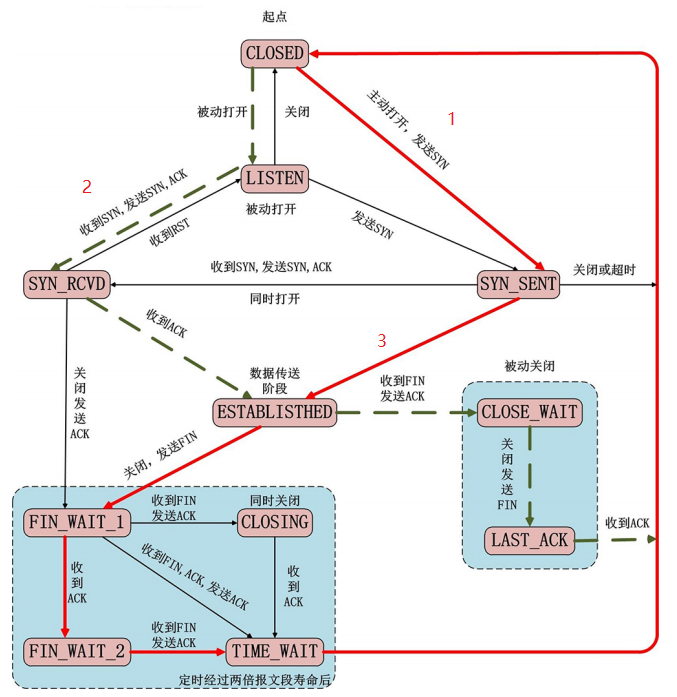

**MSL与半关闭:**

- 主动断开连接的一方，最后会进入一个 `TIME_WAIT`状态，这个状态会持续`2msl`

- `msl(Maximum Segment Lifetime)`：官方建议2分钟，实际是30s，**主要是为了防止挥手信息丢失**

  > 当 TCP 连接主动关闭方接收到被动关闭方发送的 FIN 和最终的 ACK 后，连接的主动关闭方必须处于TIME_WAIT 状态并持续 2MSL 时间
  >
  > 这样就能够让 TCP 连接的主动关闭方在它发送的 ACK 丢失的情况下重新发送最终的 ACK
  >
  > 主动关闭方重新发送的最终 ACK 并不是因为被动关闭方重传了 ACK（它们并不消耗序列号，被动关闭方也不会重传），而是因为被动关闭方重传了它的 FIN。事实上，被动关闭方总是重传 FIN 直到它收到一个最终的 ACK

**第一次挥手丢失了，会发送什么？**

>  当客户端调用close()函数后，就会向客户端发送FIN报文，假如当这个FIN报文丢失
>  了之后，那么客户端将会收不到服务端发送的ACK，则会触发重传机制，重传FIN，
>  而重传次数存储在tcp_orphan_retries中。

**第二次挥手丢失后，会发生什么？**

> 假如这个ACK丢失了，客户端就会以为自己发送的FIN报文丢失了，便会触发超时重
> 传机制，进行重传，此时，重传次数和第一次挥手的重传次数，都是同一个变量，保存在tcp_orhan_retries中。
>
> `假如说超过重传次数后，还没有收到服务端的第二次挥手，那么客户端就会断开连接。`

**第三次挥手丢失了，会发生什么？**

> 假如说这个FIN丢失了，那么它此时一直收不到客户端发送的ACK，它此时就会触发
> 重传机制，重传FIN报文，重传次数依然由tcp_orphan_retries控制。
>
> 1.对于服务端来说 : 假如一直丢失FIN，当超过重传次数后，服务端一直接收不到客户端发送的ACK（即第四次挥手），此时服务端就会断开连接。
>
> 2.对于客户端来说 : 因为客户端此时处于FIN_WAIT_2状态，这个状态是有时间限制的，为tcp_fin_timeout时间，超过这个时间，还没有收到服务端发送的FIN，而它就会断开连接。

 **第四次挥手丢失了，会发生什么？**

>  假如说ACK报文丢失了，服务端一直收不到ACK，则会认为自己发送的FIN丢失了，
>  则会重新发送FIN，重发次数仍然是tcp_orphan_retries。

#### 4.10 半关闭

- `半关闭`：当 TCP 连接中 A 向 B 发送 FIN 请求关闭，另一端 B 回应 ACK 之后（A 端进入 FIN_WAIT_2状态），并没有立即发送 FIN 给 A，A 方处于半连接状态（半开关），此时 **A 可以接收 B 发送的数据，但是 A 已经不能再向 B 发送数据**
- API 来控制实现半连接状态的方法：` shutdown函数`

`int shutdown(int sockfd, int how);` 

- 功能：实现半连接状态
- 参数
  - `sockfd`：需要关闭的socket的描述符
  - how：允许为shutdown操作选择以下几种方式
    - `SHUT_RD(0)`：关闭sockfd上的读功能，此选项将不允许sockfd进行读操作，该套接字不再接收数据，任何当前在套接字接受缓冲区的数据将被无声的丢弃掉
    - `SHUT_WR(1)`：关闭sockfd的写功能，此选项将不允许sockfd进行写操作。进程不能在对此套接字发 出写操作
    - `SHUT_RDWR(2)`：关闭sockfd的读写功能。相当于调用shutdown两次：首先调用`SHUT_RD`,然后调用 `SHUT_WR`

**shutdown与close**

- 使用 `close` 中止一个连接，但它只是**减少描述符的引用计数，并不直接关闭连接**，只有当描述符的引用计数为 0 时才关闭连接
- `shutdown` 不考虑描述符的引用计数，**直接关闭描述符**。也可选择中止一个方向的连接，只中止读或只中止写
- 如果有多个进程共享一个套接字，close 每被调用一次，计数减 1 ，直到计数为 0 时，也就是所用进程都调用了 close，套接字将被释放
- **在多进程中如果一个进程调用了 `shutdown(sfd, SHUT_RDWR)` 后，其它的进程将无法进行通信**。但如果一个进程 `close(sfd)` 将不会影响到其它进程=>==难怪800那个项目调shutdown之后其他线程就不能用了==

#### 4.11 端口复用

**用途**

- 防止服务器重启时之前绑定的端口还未释放
- 程序突然退出而系统没有释放端口

**方法——**`setsockopt`

`int setsockopt(int sockfd, int level, int optname, const void *optval, socklen_t optlen);` 

- 功能：设置套接字的属性（不仅仅能设置端口复用），以下说明仅针对端口复用，其他详细内容可查看`slide/04Linux网络编程/02 socket通信/UNP（Unix网络编程）.pdf`第七章相关内容
- 参数
  - `sockfd`：要操作的文件描述符
  - `level`：级别，`SOL_SOCKET` (端口复用的级别)
  - `optname`：选项的名称，使用`SO_REUSEADDR`或`SO_REUSEPORT`
  - `optval`：端口复用的值（整形） ，1表示可复用，0表示不可复用
  - `optlen`：optval参数的大小

#### 注意

- 端口复用的设置时机是**在服务器绑定端口之前**
- 如果不设置端口复用，那么在程序异常终止后，再次启动服务会出现`Bind error:Address already in use`

**查看看网络相关信息命令——netstat**

- 格式：`netstat -参数名`
- 常用参数
  - `a`：所有的socket
  - `p`：显示正在使用socket的程序的名称
  - `n`：直接使用IP地址，而不通过域名服务器


### 5 TCP通信并发

 注解

- 要实现TCP通信服务器处理并发的任务，使用多进程或者多线程来解决

#### 5.1 客户端

```c
// TCP通信的客户端
#include <stdio.h>
#include <arpa/inet.h>
#include <unistd.h>
#include <string.h>
#include <stdlib.h>

int main() {

    // 1.创建套接字
    int fd = socket(AF_INET, SOCK_STREAM, 0);
    if(fd == -1) {
        perror("socket");
        exit(-1);
    }

    // 2.连接服务器端
    struct sockaddr_in serveraddr;
    serveraddr.sin_family = AF_INET;
    inet_pton(AF_INET, "192.168.80.131", &serveraddr.sin_addr.s_addr);
    serveraddr.sin_port = htons(9999);
    int ret = connect(fd, (struct sockaddr *)&serveraddr, sizeof(serveraddr));

    if(ret == -1) {
        perror("connect");
        exit(-1);
    }
    
    // 3. 通信
    char recvBuf[1024];
    int i = 0;
    while(1) {
        
        sprintf(recvBuf, "data : %d\n", i++);
        
        // 给服务器端发送数据
        write(fd, recvBuf, strlen(recvBuf)+1);

        int len = read(fd, recvBuf, sizeof(recvBuf));
        if(len == -1) {
            perror("read");
            exit(-1);
        } else if(len > 0) {
            printf("recv server : %s\n", recvBuf);
        } else if(len == 0) {
            // 表示服务器端断开连接
            printf("server closed...");
            break;
        }

        sleep(1);
    }

    // 关闭连接
    close(fd);

    return 0;
}
```

#### 5.2 多进程实现服务端

**思路**

- 服务端使用一个父进程，多个子进程
  - 父进程负责等待并接受客户端的连接
  - 子进程：完成通信，接受一个客户端连接，就创建一个子进程用于通信
- 客户端不需要改变（同一对一通信）

**遇到问题及解决**

- 断开连接后，服务器端如何处理子进程，回收资源？
  - 使用信号处理
- 使用信号捕捉回收子进程资源后，出现服务端 `accept: Interrupted system call`，且不能有新客户端连接，如何解决？
  - 产生`EINTR`信号，具体说明通过`man 2 accept`查看
  - 在`accept`返回值处进行判断处理，不输出错误即可
- 当停止所有的客户端连接后，出现`read: Connection reset by peer`，如何解决？
  - 产生的原因：连接断开后的读和写操作引起的
  - 简单修改：将客户端中休眠语句的位置进行更改
  - 方法：[[261\]Connection reset by peer的常见原因及解决办法](https://blog.csdn.net/xc_zhou/article/details/80950753)
- 解决上一个问题后，服务端出现两次 `client closed...`，如何解决？
  - 是因为在关闭连接后，应该退出循环，所以在该`printf`语句后，添加`break`即可

```c
#include <stdio.h>
#include <arpa/inet.h>
#include <unistd.h>
#include <stdlib.h>
#include <string.h>
#include <signal.h>
#include <wait.h>
#include <errno.h>

void recyleChild(int arg) {
    while(1) {
        int ret = waitpid(-1, NULL, WNOHANG);
        if(ret == -1) {
            // 所有的子进程都回收了
            break;
        }else if(ret == 0) {
            // 还有子进程活着
            break;
        } else if(ret > 0){
            // 被回收了
            printf("子进程 %d 被回收了\n", ret);
        }
    }
}

int main() {

    struct sigaction act;
    act.sa_flags = 0;
    sigemptyset(&act.sa_mask);
    act.sa_handler = recyleChild;
    // 注册信号捕捉
    sigaction(SIGCHLD, &act, NULL);
    

    // 创建socket
    int lfd = socket(PF_INET, SOCK_STREAM, 0);
    if(lfd == -1){
        perror("socket");
        exit(-1);
    }

    struct sockaddr_in saddr;
    saddr.sin_family = AF_INET;
    saddr.sin_port = htons(9999);
    saddr.sin_addr.s_addr = INADDR_ANY;

    // 绑定
    int ret = bind(lfd,(struct sockaddr *)&saddr, sizeof(saddr));
    if(ret == -1) {
        perror("bind");
        exit(-1);
    }

    // 监听
    ret = listen(lfd, 128);
    if(ret == -1) {
        perror("listen");
        exit(-1);
    }

    // 不断循环等待客户端连接
    while(1) {

        struct sockaddr_in cliaddr;
        int len = sizeof(cliaddr);
        // 接受连接
        int cfd = accept(lfd, (struct sockaddr*)&cliaddr, &len);
        if(cfd == -1) {
            if(errno == EINTR) {
                continue;
            }
            perror("accept");
            exit(-1);
        }

        // 每一个连接进来，创建一个子进程跟客户端通信
        pid_t pid = fork();
        if(pid == 0) {
            // 子进程
            // 获取客户端的信息
            char cliIp[16];
            inet_ntop(AF_INET, &cliaddr.sin_addr.s_addr, cliIp, sizeof(cliIp));
            unsigned short cliPort = ntohs(cliaddr.sin_port);
            printf("client ip is : %s, prot is %d\n", cliIp, cliPort);

            // 接收客户端发来的数据
            char recvBuf[1024];
            while(1) {
                int len = read(cfd, &recvBuf, sizeof(recvBuf));

                if(len == -1) {
                    perror("read");
                    exit(-1);
                }else if(len > 0) {
                    printf("recv client : %s\n", recvBuf);
                } else if(len == 0) {
                    printf("client closed....\n");
                    break;
                }
                write(cfd, recvBuf, strlen(recvBuf) + 1);
            }
            close(cfd);
            exit(0);    // 退出当前子进程
        }

    }
    close(lfd);
    return 0;
}
```

#### 5.3 多线程实现服务端

**思路**

- 服务端使用一个主线程，多个子线程
  - 主线程负责等待并接受客户端的连接
  - 子线程：完成通信，接受一个客户端连接，就创建一个子进程用于通信
- 客户端不需要改变（同一对一通信）

```c
#include <stdio.h>
#include <arpa/inet.h>
#include <unistd.h>
#include <stdlib.h>
#include <string.h>
#include <pthread.h>

struct sockInfo {
    int fd; // 通信的文件描述符
    struct sockaddr_in addr;
    pthread_t tid;  // 线程号
};

struct sockInfo sockinfos[128];

void * working(void * arg) {
    // 子线程和客户端通信   cfd 客户端的信息 线程号
    // 获取客户端的信息
    struct sockInfo * pinfo = (struct sockInfo *)arg;

    char cliIp[16];
    inet_ntop(AF_INET, &pinfo->addr.sin_addr.s_addr, cliIp, sizeof(cliIp));
    unsigned short cliPort = ntohs(pinfo->addr.sin_port);
    printf("client ip is : %s, prot is %d\n", cliIp, cliPort);

    // 接收客户端发来的数据
    char recvBuf[1024];
    while(1) {
        int len = read(pinfo->fd, &recvBuf, sizeof(recvBuf));

        if(len == -1) {
            perror("read");
            exit(-1);
        }else if(len > 0) {
            printf("recv client : %s\n", recvBuf);
        } else if(len == 0) {
            printf("client closed....\n");
            break;
        }
        write(pinfo->fd, recvBuf, strlen(recvBuf) + 1);
    }
    close(pinfo->fd);
    return NULL;
}

int main() {

    // 创建socket
    int lfd = socket(PF_INET, SOCK_STREAM, 0);
    if(lfd == -1){
        perror("socket");
        exit(-1);
    }

    struct sockaddr_in saddr;
    saddr.sin_family = AF_INET;
    saddr.sin_port = htons(9999);
    saddr.sin_addr.s_addr = INADDR_ANY;

    // 绑定
    int ret = bind(lfd,(struct sockaddr *)&saddr, sizeof(saddr));
    if(ret == -1) {
        perror("bind");
        exit(-1);
    }

    // 监听
    ret = listen(lfd, 128);
    if(ret == -1) {
        perror("listen");
        exit(-1);
    }

    // 初始化数据
    int max = sizeof(sockinfos) / sizeof(sockinfos[0]);
    for(int i = 0; i < max; i++) {
        bzero(&sockinfos[i], sizeof(sockinfos[i]));
        sockinfos[i].fd = -1;
        sockinfos[i].tid = -1;
    }

    // 循环等待客户端连接，一旦一个客户端连接进来，就创建一个子线程进行通信
    while(1) {

        struct sockaddr_in cliaddr;
        int len = sizeof(cliaddr);
        // 接受连接
        int cfd = accept(lfd, (struct sockaddr*)&cliaddr, &len);

        struct sockInfo * pinfo;
        for(int i = 0; i < max; i++) {
            // 从这个数组中找到一个可以用的sockInfo元素
            if(sockinfos[i].fd == -1) {
                pinfo = &sockinfos[i];
                break;
            }
            if(i == max - 1) {
                sleep(1);
                i = -1;
            }
        }

        pinfo->fd = cfd;
        memcpy(&pinfo->addr, &cliaddr, len);

        // 创建子线程
        pthread_create(&pinfo->tid, NULL, working, pinfo);

        pthread_detach(pinfo->tid);
    }

    close(lfd);
    return 0;
}
```

### 6. IO多路复用（IO多路转接）

#### 6.1 阻塞等待

**简介：**

遇到`read`/`recv`/`accept`时，阻塞等待，直接有数据或者连接时才继续往下执行

**单任务：**

- 好处：不占用CPU宝贵的时间片
- 缺点：同一时刻只能处理一个操作, 效率低
- 克服缺点：多线程或者多进程解决，一个线程/进程对应一个任务


**多任务:**

- 优点：能够同时处理多个任务，一个线程/进程对应一个任务
- 缺点：
  - 线程或者进程会消耗资源
  - 线程或进程调度消耗CPU资源
- 根本问题：阻塞(`blocking`)


#### 6.2 非阻塞，忙轮询(NIO模型)

- 优点：提高了程序的执行效率
- 缺点：需要占用更多的CPU和系统资源，每循环都需要 O(n) 系统调用（用来查找哪个任务可执行）
- 克服缺点：使用IO多路转接技术select/poll/epoll

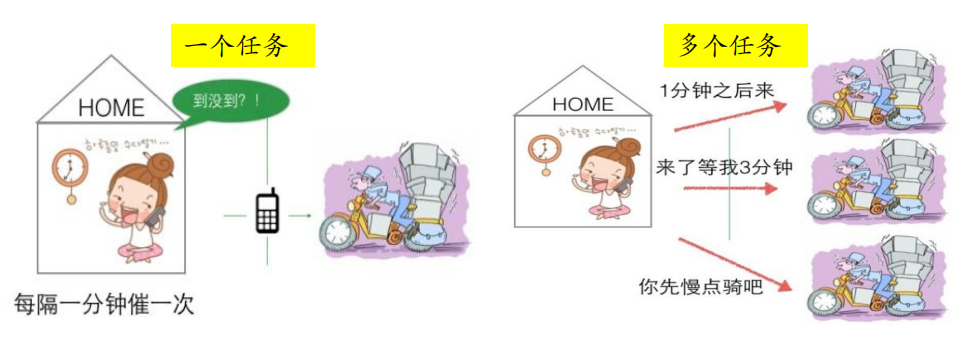

#### 6.3 IO多路转接技术(简介)

**elect/poll**

- 委托内核进行操作
- 只会通知有几个任务可用，但不知道具体哪几个任务，还需遍历（与NIO模型略有不同）


**epoll**

- 委托内核进行操作
- 会通知具体有哪几个任务可用

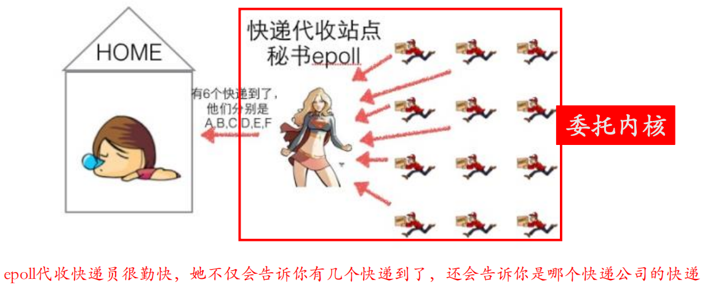

#### 6.4 select

**主旨思想：**

1. 首先要构造一个关于文件描述符的列表，将要监听的文件描述符添加到该列表中
2. 调用一个系统函数(select)，监听该列表中的文件描述符，直到这些描述符中的一个或者多个进行I/O操作时，该函数才返回
   - 这个函数是阻塞
   - 函数对文件描述符的检测的操作是由内核完成的
3. 在返回时，它会告诉进程有多少（哪些）描述符要进行I/O操作

**函数说明：**

```c
// sizeof(fd_set) = 128 1024
#include <sys/time.h>
#include <sys/types.h>
#include <unistd.h>
#include <sys/select.h>
int select(int nfds, fd_set *readfds, fd_set *writefds,
fd_set *exceptfds, struct timeval *timeout);
	/*- 参数：
        - nfds : 委托内核检测的最大文件描述符的值 + 1
        - readfds : 要检测的文件描述符的读的集合，委托内核检测哪些文件描述符的读的属性
            - 一般检测读操作
            - 对应的是对方发送过来的数据，因为读是被动的接收数据，检测的就是读缓冲
            区
            - 是一个传入传出参数
        - writefds : 要检测的文件描述符的写的集合，委托内核检测哪些文件描述符的写的属性
        	- 委托内核检测写缓冲区是不是还可以写数据（不满的就可以写）
        - exceptfds : 检测发生异常的文件描述符的集合
        - timeout : 设置的超时时间
            struct timeval {
                long tv_sec; // seconds 
                long tv_usec; // microseconds 
            };
            - NULL : 永久阻塞，直到检测到了文件描述符有变化
            - tv_sec = 0 tv_usec = 0， 不阻塞
            - tv_sec > 0 tv_usec > 0， 阻塞对应的时间
	 返回值 :
        - -1 : 失败
        - >0(n) : 检测的集合中有n个文件描述符发生了变化
     */
// 将参数文件描述符fd对应的标志位设置为0
void FD_CLR(int fd, fd_set *set);
// 判断fd对应的标志位是0还是1， 返回值 ： fd对应的标志位的值，0，返回0， 1，返回1
int FD_ISSET(int fd, fd_set *set);
// 将参数文件描述符fd 对应的标志位，设置为1
void FD_SET(int fd, fd_set *set);
// fd_set一共有1024 bit, 全部初始化为0
void FD_ZERO(fd_set *set);
```

**工作过程分析：**

1. 初始设定

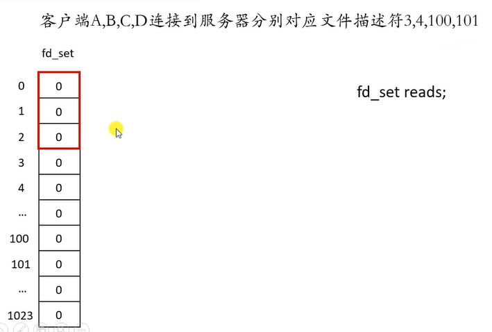

2. 设置监听文件描述符，将`fd_set`集合相应位置为1

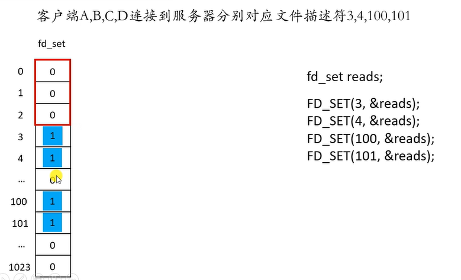

3. 调用`select`委托内核检测


4. 内核检测完毕后，返回给用户态结果


**注意事项**

- select中需要的监听集合需要两个
  - 一个是用户态真正需要监听的集合`rSet`
  - 一个是内核态返回给用户态的修改集合`tmpSet`
- 需要先判断监听文件描述符是否发生改变
  - 如果改变了，说明有客户端连接，此时需要将**新的连接文件描述符加入到`rSet`**，并更新最大文件描述符
  - 如果没有改变，说明没有客户端连接
- 由于`select`无法确切知道哪些文件描述符发生了改变，所以需要执行遍历操作，使用`FD_ISSET`判断是否发生了改变
- 如果客户端断开了连接，需要从`rSet`中清除需要监听的文件描述符

**服务端**

```c
#include <stdio.h>
#include <string.h>
#include <unistd.h>
#include <stdlib.h>
#include <arpa/inet.h>
#include <sys/select.h>

int main() {
    // 创建socket
    int lfd = socket(AF_INET, SOCK_STREAM, 0);
    struct sockaddr_in saddr;
    saddr.sin_addr.s_addr = INADDR_ANY;
    saddr.sin_family = AF_INET;
    saddr.sin_port = htons(9999);

    // 绑定
    int ret = bind(lfd, (struct sockaddr *)&saddr, sizeof(saddr));

    // 监听
    ret = listen(lfd, 128);

    // 创建一个fd_set集合，存放的是需要检测的文件描述符
    fd_set rdset, tmp;
    FD_ZERO(&rdset);
    FD_SET(lfd, &rdset);
    int maxfd = lfd;
    while(1) {
        tmp = rdset;
        // 调用select 系统函数 让内核帮忙检测哪些文件文件描述符有数据
        ret = select(maxfd + 1, &tmp, NULL, NULL, NULL);
        if(ret == -1) {
            perror("select");
            exit(-1);
        } else if(ret == 0) {
            // 阻塞状态下不可能返回0， 非阻塞状态下返回0，表示没有文件描述符状态发生改变
        } else if(ret > 0) {
            // 说明检测到了有文件描述符的对应的缓冲区的数据发生了改变
            if(FD_ISSET(lfd, &tmp)) {
                // 表示有新的客户端连接进来了
                struct sockaddr_in cliaddr;
                int len0 = sizeof(cliaddr);
                int cfd = accept(lfd, (struct sockaddr *)&cliaddr, &len0);
                // 将新的文件描述符加入到集合中
                FD_SET(cfd, &rdset);

                // 更新最大的文件描述符
                maxfd = maxfd > cfd ? maxfd : cfd;
            }
            for(int i = lfd + 1; i <= maxfd; ++ i) {
                if(FD_ISSET(i, &tmp)) {
                    // 说明这个文件描述符对应的客户端发来了数据
                    char buf[1024] = {0};
                    int len = read(i, buf, sizeof(buf));
                    if(len == -1) {
                        perror("read");
                        exit(-1);
                    } else if(len == 0) {
                        printf("client closed ...\n");
                        close(i);
                        FD_CLR(i, &rdset);
                    } else if(len > 0) {
                        printf("read buf = %s\n", buf);
                        write(i, buf, strlen(buf) + 1);
                    }

                }
            }
        }
    }

    close(lfd);
    return 0;

}
```

**客户端：**

```c
#include <stdio.h>
#include <arpa/inet.h>
#include <stdlib.h>
#include <unistd.h>
#include <string.h>

int main() {

    // 创建socket
    int fd = socket(PF_INET, SOCK_STREAM, 0);
    if(fd == -1) {
        perror("socket");
        return -1;
    }

    struct sockaddr_in seraddr;
    inet_pton(AF_INET, "127.0.0.1", &seraddr.sin_addr.s_addr);
    seraddr.sin_family = AF_INET;
    seraddr.sin_port = htons(9999);

    // 连接服务器
    int ret = connect(fd, (struct sockaddr *)&seraddr, sizeof(seraddr));

    if(ret == -1){
        perror("connect");
        return -1;
    }

    int num = 0;
    while(1) {
        char sendBuf[1024] = {0};
        sprintf(sendBuf, "send data %d", num++);
        write(fd, sendBuf, strlen(sendBuf) + 1);

        // 接收
        int len = read(fd, sendBuf, sizeof(sendBuf));
        if(len == -1) {
            perror("read");
            return -1;
        }else if(len > 0) {
            printf("read buf = %s\n", sendBuf);
        } else {
            printf("服务器已经断开连接...\n");
            break;
        }
        sleep(1);

    }

    close(fd);

    return 0;
}

```

**高并发优化思考**

问题：

- 每次都需要利用`FD_ISSET`轮训`[0, maxfd]`之间的连接状态，如果位于中间的某一个客户端断开了连接，此时不应该再去利用`FD_ISSET`轮训，造成资源浪费
- 如果在处理客户端数据时，某一次read没有对数据读完，那么造成重新进行下一次时select，获取上一次未处理完的文件描述符，从0开始遍历到maxfd，对上一次的进行再一次操作，效率十分低下

 解决

- 考虑到select只有1024个最大可监听数量，可以申请等量客户端数组
  - 初始置为-1，当有状态改变时，置为相应文件描述符
  - 此时再用`FD_ISSET`轮训时，跳过标记为-1的客户端，加快遍历速度
- 对于问题二：对读缓存区循环读，直到返回`EAGAIN`再处理数据

**存在问题(缺点)**

- 每次调用select，都需要把fd集合从用户态拷贝到内核态，这个开销在fd很多时会很大
- 同时每次调用select都需要在内核遍历传递进来的所有fd，这个开销在fd很多时也很大
- select支持的文件描述符数量太小了，默认是1024
- fds集合不能重用，每次都需要重置


#### 6.5 poll

**主旨思想**

- 用一个结构体记录文件描述符集合，并记录用户态状态和内核态状态

**函数说明：**

```c
#include <poll.h>
struct pollfd {
    int fd; /* 委托内核检测的文件描述符 */
    short events; /* 委托内核检测文件描述符的什么事件 */
    short revents; /* 文件描述符实际发生的事件 */
};

int poll(struct pollfd *fds, nfds_t nfds, int timeout);
/*
	- 参数：
        - fds : 是一个struct pollfd 结构体数组，这是一个需要检测的文件描述符的集合
        - nfds : 这个是第一个参数数组中最后一个有效元素的下标 + 1
        - timeout : 阻塞时长
             0 : 不阻塞
            -1 : 阻塞，当检测到需要检测的文件描述符有变化，解除阻塞
            >0 : 阻塞的时长
	- 返回值：
        -1 : 失败
        >0（n） : 成功,n表示检测到集合中有n个文件描述符发生变化
*/
```

* events`及`revents`取值，如果有多个事件需要检测，用`|`即可，如同时检测读和写：`POLLIN | POLLOUT


**注意事项**

- `nfds`表示的监听文件描述符的下标，所以在遍历时，需要使用`fds[i].fd`取得相应的文件描述符

**服务端：**

```c
#include <stdio.h>
#include <string.h>
#include <unistd.h>
#include <stdlib.h>
#include <arpa/inet.h>
#include <sys/select.h>
#include <poll.h>

int main() {
    // 创建socket
    int lfd = socket(AF_INET, SOCK_STREAM, 0);
    struct sockaddr_in saddr;
    saddr.sin_addr.s_addr = INADDR_ANY;
    saddr.sin_family = AF_INET;
    saddr.sin_port = htons(9999);

    // 绑定
    int ret = bind(lfd, (struct sockaddr *)&saddr, sizeof(saddr));

    // 监听
    ret = listen(lfd, 128);
    // 初始化检测的文件描述符
    struct pollfd fds[1024];
    for(int i = 0; i < 1024; ++ i) {
        fds[i].fd = -1;
        fds[i].events = POLLIN;
    }
    fds[0].fd = lfd;
    int nfds = 0;

    while(1) {
        // 调用poll 系统函数 让内核帮忙检测哪些文件文件描述符有数据
        
        int ret = poll(fds, nfds + 1,  -1); // 阻塞
        if(ret == -1) {
            perror("poll");
            exit(-1);
        } else if(ret == 0) {
            // 阻塞状态下不可能返回0， 非阻塞状态下返回0，表示没有文件描述符状态发生改变
        } else if(ret > 0) {
            // 说明检测到了有文件描述符的对应的缓冲区的数据发生了改变
            if(fds[0].revents & POLLIN) {
                // 表示有新的客户端连接进来了
                struct sockaddr_in cliaddr;
                int len0 = sizeof(cliaddr);
                int cfd = accept(lfd, (struct sockaddr *)&cliaddr, &len0);
                // 将新的文件描述符加入到集合中
                for(int i = 1; i < 1024; ++ i) {
                    if(fds[i].fd == -1) {
                        fds[i].fd = cfd;
                        fds[i].events = POLLIN;
                        // 更新最大的文件描述符
                        nfds = nfds > i ? nfds : i;
                        break;
                    }
                }
                
            }
            for(int i = 1; i <= nfds; ++ i) {
                if(fds[i].fd != -1 && fds[i].revents & POLLIN) {
                    // 说明这个文件描述符对应的客户端发来了数据
                    char buf[1024] = {0};
                    int len = read(fds[i].fd, buf, sizeof(buf));
                    if(len == -1) {
                        perror("read");
                        exit(-1);
                    } else if(len == 0) {
                        printf("client closed ...\n");
                        close(fds[i].fd);
                        fds[i].fd = -1;
                        if(i == nfds) nfds -= 1;
                    } else if(len > 0) {
                        printf("read buf = %s\n", buf);
                        write(fds[i].fd, buf, strlen(buf) + 1);
                    }

                }
            }
        }
    }

    close(lfd);
    return 0;

}
```

**存在问题：**

- 缺点同`select`第一点和第二点(如下)，即解决了第三点和第四点
- 每次调用select，都需要把fd集合从用户态拷贝到内核态，这个开销在fd很多时会很大
- 同时每次调用select都需要在内核遍历传递进来的所有fd，这个开销在fd很多时也很大

#### 6.6 epoll

**主旨思想：**

- 直接在**内核态**创建` eventpoll实例`(结构体)，通过`epoll`提供的API操作该实例
- 结构体中有`红黑树`和`双链表`，分别用来**存储需要检测的文件描述符**和**存储已经发生改变的文件描述符**

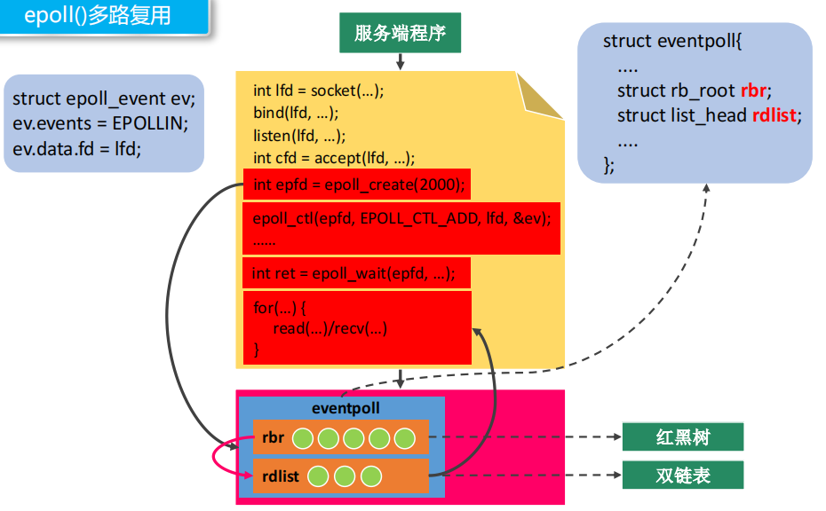

**函数说明：**

```c
#include <sys/epoll.h>
/*
创建一个新的epoll实例。在内核中创建了一个数据，这个数据中有两个比较重要的数据，一个是需要检测的文件描述符的信息（红黑树），还有一个是就绪列表，存放检测到数据发送改变的文件描述符信息（双向链表）。
*/
int epoll_create(int size);
/*
    - 参数：
    	size : 目前没有意义了。随便写一个数，必须大于0
    - 返回值：
        -1 : 失败
        > 0 : 文件描述符，操作epoll实例的
*/

typedef union epoll_data {
    void *ptr;
    int fd;
    uint32_t u32;
    uint64_t u64;
} epoll_data_t;
struct epoll_event {
    uint32_t events; /* Epoll events */
    epoll_data_t data; /* User data variable */
};
/*
    常见的Epoll检测事件：
        - EPOLLIN
        - EPOLLOUT
        - EPOLLERR
        - EPOLLET  边缘触发
*/
// 对epoll实例进行管理：添加文件描述符信息，删除信息，修改信息
int epoll_ctl(int epfd, int op, int fd, struct epoll_event *event);
/*
    - 参数：
        - epfd : epoll实例对应的文件描述符
        - op : 要进行什么操作
            EPOLL_CTL_ADD: 添加
            EPOLL_CTL_MOD: 修改
            EPOLL_CTL_DEL: 删除
        - fd : 要检测的文件描述符
        - event : 检测文件描述符什么事情
*/
// 检测函数
int epoll_wait(int epfd, struct epoll_event *events, int maxevents, int
timeout);
/*
    - 参数：
        - epfd : epoll实例对应的文件描述符
        - events : 传出参数，保存了发送了变化的文件描述符的信息
        - maxevents : 第二个参数结构体数组的大小
        - timeout : 阻塞时间
            - 0 : 不阻塞
            - -1 : 阻塞，直到检测到fd数据发生变化，解除阻塞
            - > 0 : 阻塞的时长（毫秒）
    - 返回值：
        - 成功，返回发送变化的文件描述符的个数 > 0
        - 失败 -1
*/
```

#### 6.7 epoll工作模式(LT与ET)

**水平触发(level triggered, LT)：**

- epoll的缺省的工作方式，并且同时支持 block 和 non-block socket
- 在这种做法中，内核告诉你一个文件描述符是否就绪了，然后你可以对这个就绪的 fd 进行 IO 操作。如果你不作任何操作，内核还是会继续通知你的

**边沿触发(edge triggered, ET)：**

- 是高速工作方式，只支持 non-block socket，需要对监听文件描述符设置才能实现
- 在这种模式下，当描述符从未就绪变为就绪时，内核通过epoll告诉你。然后它会假设你知道文件描述符已经就绪，并且不会再为那个文件描述符发送更多的就绪通知，直到你做了某些操作导致那个文件描述符不再为就绪状态了。但是请注意，如果一直不对这个 fd 作 IO 操作（从而导致它再次变成未就绪），内核不会发送更多的通知（only once）

**区别与说明：**

- ET 模式在很大程度上减少了 epoll 事件被重复触发的次数，因此效率要比 LT 模式高
- epoll工作在 ET 模式的时候，必须使用非阻塞套接口，以避免由于一个文件句柄的阻塞读/阻塞写操作把处理多个文件描述符的任务饿死
- 所以如果使用ET且缓冲区内容不能一次性读完，**需要写一个循环将内容全部读取，且需要将套接字设置为非阻塞**
- 说明：假设委托内核检测读事件，即检测fd的读缓冲区，那么如果读缓冲区有数据 ，epoll检测到了会给用户通知
  - LT
    - 用户不读数据，数据一直在缓冲区，epoll 会一直通知
    - 用户只读了一部分数据，epoll会通知
    - 缓冲区的数据读完了，不通知
  - ET
    - 用户不读数据，数据一致在缓冲区中，epoll下次检测的时候就不通知了
    - 用户只读了一部分数据，epoll不通知
    - 缓冲区的数据读完了，不通知

**代码(ET)服务端：**

```c
#include <stdio.h>
#include <string.h>
#include <unistd.h>
#include <stdlib.h>
#include <arpa/inet.h>
#include <sys/select.h>
#include <sys/epoll.h>
#include <sys/fcntl.h>
#include <errno.h>
int main() {
    // 创建socket
    int lfd = socket(AF_INET, SOCK_STREAM, 0);
    struct sockaddr_in saddr;
    saddr.sin_addr.s_addr = INADDR_ANY;
    saddr.sin_family = AF_INET;
    saddr.sin_port = htons(9999);

    // 绑定
    int ret = bind(lfd, (struct sockaddr *)&saddr, sizeof(saddr));

    // 监听
    ret = listen(lfd, 128);

    // 调用epoll_create()创建一个epoll实例
    int epfd = epoll_create(100);

    // 将监听的文件描述符相关的监测信息添加到epoll实例中
    struct epoll_event epev;
    epev.events = EPOLLIN;
    epev.data.fd = lfd;
    epoll_ctl(epfd, EPOLL_CTL_ADD, lfd, &epev);

    struct epoll_event epevs[1024];
    while (1)
    {
        //
        int ret = epoll_wait(epfd, epevs, 1024, -1);
        if(ret == -1) {
            perror("epoll_wait");
            exit(-1);
        } else if( ret == 0) {
            continue;
        } else {
            printf("ret = %d \n", ret);
            for(int i = 0; i < ret; ++ i) {
            int curfd = epevs[i].data.fd;
            if(curfd == lfd) {
                // 监听的文件描述符有数据到达（有客户端连接）
                struct sockaddr_in cliaddr;
                int len0 = sizeof(cliaddr);
                int cfd = accept(lfd, (struct sockaddr *)&cliaddr, &len0);

                // 设置cfd属性非阻塞
                int flag = fcntl(cfd, F_GETFL);
                flag |= O_NONBLOCK;
                fcntl(cfd, F_SETFL, flag);

                // 将新的文件描述符加入到集合中
                // epev.events = EPOLLIN | EPOLLOUT;
                epev.events = EPOLLIN | EPOLLET; // 设置边缘触发
                epev.data.fd = cfd;
                epoll_ctl(epfd, EPOLL_CTL_ADD, cfd, &epev);
            } else {

                if(epevs[i].events & EPOLLOUT)
                {

                }

                if(epevs[i].events & EPOLLIN) {
                    // 有数据到达，需要通信
                    // 循环读出缓冲区所有数据
                    char buf[5];
                    int len = 0;
                    while((len = read(curfd, buf, sizeof(buf))) > 0) {
                        // 打印数据
                        // printf("recv data : %s \n", buf);
                        write(STDOUT_FILENO, buf, len);
                        write(curfd, buf, len);
                    }
                    if(len == 0) {
                        printf("client closed ...\n");
                    } else if(len == -1) {
                        if(errno == EAGAIN) {
                            printf("recv over\n");
                        } else {
                            perror("read");
                            exit(-1);
                        }
                    }
                }
            }
        }
        }    
    }

    close(lfd);
    close(epfd);
    return 0;
}

```

**客户端：**

```c
#include <stdio.h>
#include <arpa/inet.h>
#include <stdlib.h>
#include <unistd.h>
#include <string.h>
int main() {

    // 创建socket
    int fd = socket(PF_INET, SOCK_STREAM, 0);
    if(fd == -1) {
        perror("socket");
        return -1;
    }
    struct sockaddr_in seraddr;
    inet_pton(AF_INET, "127.0.0.1", &seraddr.sin_addr.s_addr);
    seraddr.sin_family = AF_INET;
    seraddr.sin_port = htons(9999);

    // 连接服务器
    int ret = connect(fd, (struct sockaddr *)&seraddr, sizeof(seraddr));

    if(ret == -1){
        perror("connect");
        return -1;
    }

    int num = 0;
    while(1) {
        char sendBuf[1024] = {0};
        // sprintf(sendBuf, "send data %d", num++);
        // 从键盘录入数据
        fgets(sendBuf, sizeof(sendBuf), stdin);
        write(fd, sendBuf, strlen(sendBuf) + 1);

        // 接收
        int len = read(fd, sendBuf, sizeof(sendBuf));
        if(len == -1) {
            perror("read");
            return -1;
        }else if(len > 0) {
            printf("read buf = %s\n", sendBuf);
        } else {
            printf("服务器已经断开连接...\n");
            break;
        }
        // sleep(1);

    }
    close(fd);
    return 0;
}
```

### 7 UDP通信

#### 7.1 UDP通信方式

**通信流程：**


**消息收发函数：**

```c
#include <sys/types.h>
#include <sys/socket.h>

ssize_t sendto(int sockfd, const void *buf, size_t len, int flags,const struct sockaddr *dest_addr, socklen_t addrlen);
/*
	- 参数：
        - sockfd : 通信的fd
        - buf : 要发送的数据
        - len : 发送数据的长度
        - flags : 0
        - dest_addr : 通信的另外一端的地址信息
        - addrlen : 地址的内存大小
	- 返回值：
		失败-1，否则返回发送数据大小
*/
ssize_t recvfrom(int sockfd, void *buf, size_t len, int flags,
struct sockaddr *src_addr, socklen_t *addrlen);
/*
    - 参数：
        - sockfd : 通信的fd
        - buf : 接收数据的数组
        - len : 数组的大小
        - flags : 0
        - src_addr : 用来保存另外一端的地址信息，不需要可以指定为NULL
        - addrlen : 地址的内存大小
    - 返回值：
		失败-1，否则返回发送数据大小
*/
```

**说明：**

- 服务端不需要设置监听文件描述符=>因为不需要三次握手
- 不需要多进程/多线程，或者IO多路复用即可实现多并发

```c
// 服务端
#include <stdio.h>
#include <stdlib.h>
#include <unistd.h>
#include <string.h>
#include <arpa/inet.h>

int main() {
    // 创建一个通信的socket
    int fd = socket(PF_INET, SOCK_DGRAM, 0);

    if(fd == -1) {
        perror("socket");
        exit(-1);
    }

    // 绑定
    struct sockaddr_in addr;
    addr.sin_family = AF_INET;
    addr.sin_port = htons(9999);
    addr.sin_addr.s_addr = INADDR_ANY;
    int ret = bind(fd, (struct sockaddr *)&addr, sizeof(addr));
    if(ret == -1) {
        perror("bind");
        exit(-1);
    }

    // 通信
    while(1) {
        char recvbuf[128];
        char ipbuf[16];

        struct sockaddr_in cliaddr;
        int len = sizeof(cliaddr);
        // 接受数据
        int num = recvfrom(fd, recvbuf, sizeof(recvbuf), 0, (struct sockaddr *)&cliaddr, &len);
        if(num == -1) {
            perror("recvfrom");
            exit(-1);
        }

        printf("client IP : %s, Port : %d\n", 
            inet_ntop(AF_INET, &cliaddr.sin_addr.s_addr, ipbuf, sizeof(ipbuf)),
            ntohs(cliaddr.sin_port));

        printf("client say : %s\n", recvbuf);

        // 发送数据
        sendto(fd, recvbuf, strlen(recvbuf) + 1, 0, (struct sockaddr *)&cliaddr, sizeof(cliaddr));
    }
    close(fd);
    return 0;
} 
```

```c
// 客户端
#include <stdio.h>
#include <arpa/inet.h>
#include <stdlib.h>
#include <string.h>
#include <unistd.h>

#define SERVERIP "127.0.0.1"
#define PORT 9999

int main()
{
    // 1. 创建通信套接字
    int fd = socket(PF_INET, SOCK_DGRAM, 0);
    // 2. 通信
    // 设置服务器信息
    struct sockaddr_in server_addr;
    server_addr.sin_family = AF_INET;
    server_addr.sin_port = htons(PORT);
    inet_pton(AF_INET, SERVERIP, &server_addr.sin_addr.s_addr);
    int num = 0;
    while (1) {
        // 发送数据
        char sendBuf[128];
        sprintf(sendBuf, "hello , i am client %d \n", num++);
        sendto(fd, sendBuf, strlen(sendBuf) + 1, 0, (struct sockaddr *)&server_addr, sizeof(server_addr));

        // 接收数据
        int num = recvfrom(fd, sendBuf, sizeof(sendBuf), 0, NULL, NULL);
        printf("server say : %s\n", sendBuf);

        sleep(1);
    }
    close(fd);
    return 0; 
}
```

#### 7.2 广播

**简介：**

- 只能在局域网中使用
- 客户端需要绑定服务器广播使用的端口，才可以接收到广播消息

> 向子网中多台计算机发送消息，并且子网中所有的计算机都可以接收到发送方发送的消息，每个广播消息都包含一个特殊的IP地址，这个IP中子网内主机标志部分的二进制全部为1

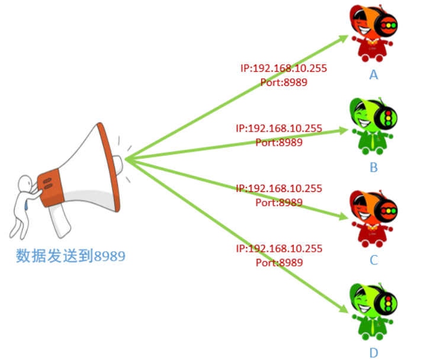

```c
// 设置广播属性的函数
int setsockopt(int sockfd, int level, int optname,const void *optval, socklen_t
optlen);
    - sockfd : 文件描述符
    - level : SOL_SOCKET
    - optname : SO_BROADCAST
    - optval : int类型的值，为1表示允许广播
    - optlen : optval的大小
```

** 服务端：**

```c
#include <stdio.h>
#include <stdlib.h>
#include <unistd.h>
#include <string.h>
#include <arpa/inet.h>

int main() {
    // 创建一个通信的socket
    int fd = socket(PF_INET, SOCK_DGRAM, 0);

    if(fd == -1) {
        perror("socket");
        exit(-1);
    }

    // 设置广播属性
    int op = 1;
    setsockopt(fd, SOL_SOCKET, SO_BROADCAST, &op, sizeof(op));

    // 创建一个广播的地址
    struct sockaddr_in cliaddr;
    cliaddr.sin_family = AF_INET;
    cliaddr.sin_port = htons(9999);
    inet_pton(AF_INET, "192.168.80.131", &cliaddr.sin_addr.s_addr);
    
    int num = 0;
    // 通信
    while(1) {
        char sendBuf[128];
        sprintf(sendBuf, "hello, client ... %d \n", num ++);
        // 发送数据
        sendto(fd, sendBuf, strlen(sendBuf) + 1, 0, (struct sockaddr *)&cliaddr, sizeof(cliaddr));
        printf("广播的数据： %s\n", sendBuf);
        sleep(1);
    }
    close(fd);
    return 0;
} 
```

**客户端：**

```c
#include <stdio.h>
#include <arpa/inet.h>
#include <stdlib.h>
#include <string.h>
#include <unistd.h>

int main()
{
    // 1. 创建通信套接字
    int fd = socket(PF_INET, SOCK_DGRAM, 0);

    // 绑定本地的ip和端口
    struct sockaddr_in addr;
    addr.sin_family = AF_INET;
    addr.sin_port = htons(9999);
    addr.sin_addr.s_addr = INADDR_ANY;
    int ret = bind(fd, (struct sockaddr *)&addr, sizeof(addr));


    while (1) {     
        char buf[128];
        // 接收数据
        int num = recvfrom(fd, buf, sizeof(buf), 0, NULL, NULL);
        printf("server say : %s\n", buf);

        sleep(1);
    }
    close(fd);
    return 0;
}
```

#### 7.3 组播（多播）

> 单播地址标识单个 IP 接口，广播地址标识某个子网的所有 IP 接口，多播地址标识一组 IP 接口。 单播和广播是寻址方案的两个极端（要么单个要么全部），多播则意在两者之间提供一种折中方 案。多播数据报只应该由对它感兴趣的接口接收，也就是说由运行相应多播会话应用系统的主机上 的接口接收。另外，广播一般局限于局域网内使用，而多播则既可以用于局域网，也可以跨广域网 使用。
>
> a.组播既可以用于局域网，也可以用于广域网 
>
> b.客户端需要加入多播组，才能接收到多播的数据

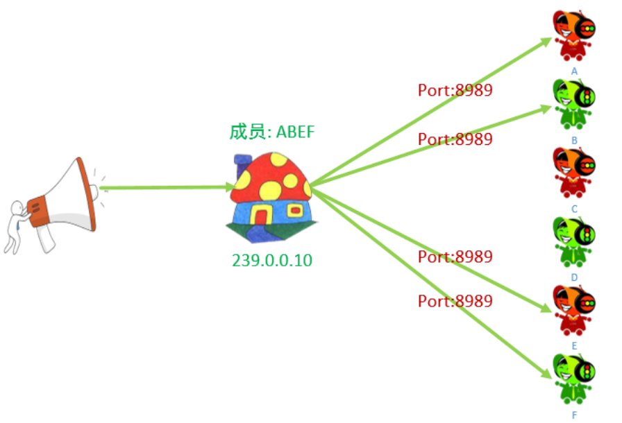

**组播地址** 

> IP 多播通信必须依赖于 IP 多播地址，在 IPv4 中它的范围从 224.0.0.0 到 239.255.255.255 ， 并被划分为局部链接多播地址、预留多播地址和管理权限多播地址三类:

| IP地址                    | 说明                                                         |
| ------------------------- | ------------------------------------------------------------ |
| 224.0.0.0~224.0.0.255     | 局部链接多播地址：是为路由协议和其它用途保留的地址，路由 器并不转发属于此范围的IP包 |
| 224.0.1.0~224.0.1.255     | 预留多播地址：公用组播地址，可用于Internet；使用前需要申请   |
| 224.0.2.0~238.255.255.255 | 预留多播地址：用户可用组播地址(临时组地址)，全网范围内有效   |
| 239.0.0.0~239.255.255.255 | 本地管理组播地址，可供组织内部使用，类似于私有 IP 地址，不 能用Internet可限制多播范围 |

**设置组播：**

```c
int setsockopt(int sockfd, int level, int optname,const void *optval,
socklen_t optlen);

	// 服务器设置多播的信息，外出接口
    - level : IPPROTO_IP
    - optname : IP_MULTICAST_IF
    - optval : struct in_addr
        
    // 客户端加入到多播组：
    - level : IPPROTO_IP
    - optname : IP_ADD_MEMBERSHIP
    - optval : struct ip_mreq
        
struct ip_mreq
{
    /* IP multicast address of group. */
    struct in_addr imr_multiaddr; // 组播的IP地址
    /* Local IP address of interface. */
    struct in_addr imr_interface; // 本地的IP地址
};

typedef uint32_t in_addr_t;

struct in_addr
{
	in_addr_t s_addr;
};
```

**注意事项**

- 服务端通过`setsockopt`设置`optval`时，需要指定多播地址，即`239.0.0.0~239.255.255.255`其中一个即可

**服务端：**

```c
#include <stdio.h>
#include <stdlib.h>
#include <unistd.h>
#include <string.h>
#include <arpa/inet.h>

int main() {
    // 创建一个通信的socket
    int fd = socket(PF_INET, SOCK_DGRAM, 0);

    if(fd == -1) {
        perror("socket");
        exit(-1);
    }

    // 设置多播属性，设置外出接口
    struct in_addr imr_multuaddr;
    // 初始化多播地址
    inet_pton(AF_INET, "239.0.0.10", &imr_multuaddr.s_addr);
    setsockopt(fd, IPPROTO_IP, IP_MULTICAST_IF, &imr_multuaddr,sizeof(imr_multuaddr));

    // 初始化多播地址
    struct sockaddr_in cliaddr;
    cliaddr.sin_family = AF_INET;
    cliaddr.sin_port = htons(9999);
    inet_pton(AF_INET, "239.0.0.10", &cliaddr.sin_addr.s_addr);
    
    int num = 0;
    // 通信
    while(1) {
        char sendBuf[128];
        sprintf(sendBuf, "hello, client ... %d \n", num ++);
        // 发送数据
        sendto(fd, sendBuf, strlen(sendBuf) + 1, 0, (struct sockaddr *)&cliaddr, sizeof(cliaddr));
        printf("组播的数据： %s\n", sendBuf);
        sleep(1);
    }
    close(fd);
    return 0;
} 
```

**客户端：**

```c
#include <stdio.h>
#include <arpa/inet.h>
#include <stdlib.h>
#include <string.h>
#include <unistd.h>

int main()
{
    // 1. 创建通信套接字
    int fd = socket(PF_INET, SOCK_DGRAM, 0);

    // 绑定本地的ip和端口
    struct sockaddr_in addr;
    addr.sin_family = AF_INET;
    addr.sin_port = htons(9999);
    addr.sin_addr.s_addr = INADDR_ANY;
    int ret = bind(fd, (struct sockaddr *)&addr, sizeof(addr));

   struct ip_mreq op;
    inet_pton(AF_INET, "239.0.0.10", &op.imr_multiaddr.s_addr);
    op.imr_interface.s_addr = INADDR_ANY;
    // 加入到多播组
    setsockopt(fd, IPPROTO_IP, IP_ADD_MEMBERSHIP,  &op, sizeof(op));
    while (1) {     
        char buf[128];
        // 接收数据
        int num = recvfrom(fd, buf, sizeof(buf), 0, NULL, NULL);
        printf("server say : %s\n", buf);

        sleep(1);
    }
    close(fd);
    return 0;
}
```

#### 7.4 本地套接字通信

 **简介**

- 本地套接字的作用：本地的进程间通信，包括`有关系的进程通信(父子进程)`和`没有关系的进程间通信`
- 本地套接字实现流程和网络套接字类似，一般采用`TCP的通信流程`

**通信流程：**

```c
// 本地套接字通信的流程 - tcp

// 服务器端
1. 创建监听的套接字
	int lfd = socket(AF_UNIX/AF_LOCAL, SOCK_STREAM, 0);
2. 监听的套接字绑定本地的套接字文件 -> server端
    struct sockaddr_un addr;
    // 绑定成功之后，指定的sun_path中的套接字文件会自动生成。
    bind(lfd, addr, len);
3. 监听
	listen(lfd, 100);
4. 等待并接受连接请求
    struct sockaddr_un cliaddr;
    int cfd = accept(lfd, &cliaddr, len);
5. 通信
    接收数据：read/recv
    发送数据：write/send
6. 关闭连接
	close();

// 客户端的流程
1. 创建通信的套接字
	int fd = socket(AF_UNIX/AF_LOCAL, SOCK_STREAM, 0);
2. 监听的套接字绑定本地的IP 端口
    struct sockaddr_un addr;
    // 绑定成功之后，指定的sun_path中的套接字文件会自动生成。
    bind(lfd, addr, len);
3. 连接服务器
    struct sockaddr_un serveraddr;
    connect(fd, &serveraddr, sizeof(serveraddr));
4. 通信
    接收数据：read/recv
    发送数据：write/send
5. 关闭连接
	close();
```

```c
// 头文件: sys/un.h
#define UNIX_PATH_MAX 108
struct sockaddr_un {
    sa_family_t sun_family; // 地址族协议 af_local
    char sun_path[UNIX_PATH_MAX]; // 套接字文件的路径, 这是一个伪文件, 大小永远=0
};
```

```c
#include <stdio.h>
#include <arpa/inet.h>
#include <sys/un.h>
#include <stdlib.h>
#include <string.h>
#include <unistd.h>

int main()
{
    // 本地套接字通信通过文件，如果不用unlink解除占用，则会出现"bind: Address already in use"
    unlink("/home/user/Linux/lesson33/server.sock");
    // 1. 创建监听的套接字
    int lfd = socket(AF_LOCAL, SOCK_STREAM, 0);
    if(lfd == -1) {
        perror("socket");
        exit(-1);
    }

    // 绑定本地的套接字文件
    struct sockaddr_un addr;
    addr.sun_family = AF_LOCAL;
    strcpy(addr.sun_path, "/home/user/Linux/lesson33/server.sock");
    int ret = bind(lfd, (struct sockaddr *)&addr, sizeof(addr));
    if(ret == -1) {
        perror("bind");
        exit(-1);
    }

    // 监听
    ret = listen(lfd, 100);
    if(ret == -1) {
        perror("listen");
        exit(-1);
    }


    // 4. 等待客户端连接 
    struct sockaddr_un cliaddr;
    int len = sizeof(cliaddr);
    int cfd = accept(lfd, (struct sockaddr *)&cliaddr, &len);
    if(cfd == -1) {
        perror("accept");
        exit(-1);
    }

    printf("client socket filename: %s \n", cliaddr.sun_path);
    // 5. 通信
    while(1) {
        char buf[128];
        int len = recv(cfd, buf, sizeof(buf), 0);

        if(len == -1) {
            perror("recv");
            exit(-1);
        } else if(len == 0) {
            printf("client closed... \n");
            break;
        } else if(len > 0) {
            write(STDOUT_FILENO, buf, len + 1);
            send(cfd, buf, sizeof(buf), 0);
        }
    }
    close(cfd);
    close(lfd);

}
```

```c

#include <stdio.h>
#include <arpa/inet.h>
#include <sys/un.h>
#include <stdlib.h>
#include <string.h>
#include <unistd.h>

int main()
{
   
    unlink("/home/user/Linux/lesson33/client.sock");
    // 1. 创建监听的套接字
    int cfd = socket(AF_LOCAL, SOCK_STREAM, 0);
    if(cfd == -1) {
        perror("socket");
        exit(-1);
    }

    // 绑定本地的套接字文件
    struct sockaddr_un addr;
    addr.sun_family = AF_LOCAL;
    strcpy(addr.sun_path, "/home/user/Linux/lesson33/client.sock");
    int ret = bind(cfd, (struct sockaddr *)&addr, sizeof(addr));
    if(ret == -1) {
        perror("bind");
        exit(-1);
    }

    // 3. 连接服务器
    struct sockaddr_un server_addr;
    server_addr.sun_family = AF_LOCAL;
    strcpy(server_addr.sun_path, "/home/user/Linux/lesson33/server.sock");
    ret = connect(cfd, (struct sockaddr *)&server_addr, sizeof(server_addr));

    // 4. 通信
    int num = 0;
    // 5. 通信
    while (1) {
        // 发送信息
        char buf[1024];
        sprintf(buf, "the data is %d \n", num++);
        send(cfd, buf, strlen(buf) + 1, 0);
        // 接收信息
        int buf_len = recv(cfd, buf, sizeof(buf), 0);
        if (buf_len == -1) {
            perror("recv");
            exit(-1);
        } else if (buf_len == 0) {
            printf("server close...\n");
            break;
        } else {
            printf("server say : %s\n", buf);
        }
        sleep(1);
    }

    // 6. 关闭套接字
    close(cfd);

}
```

