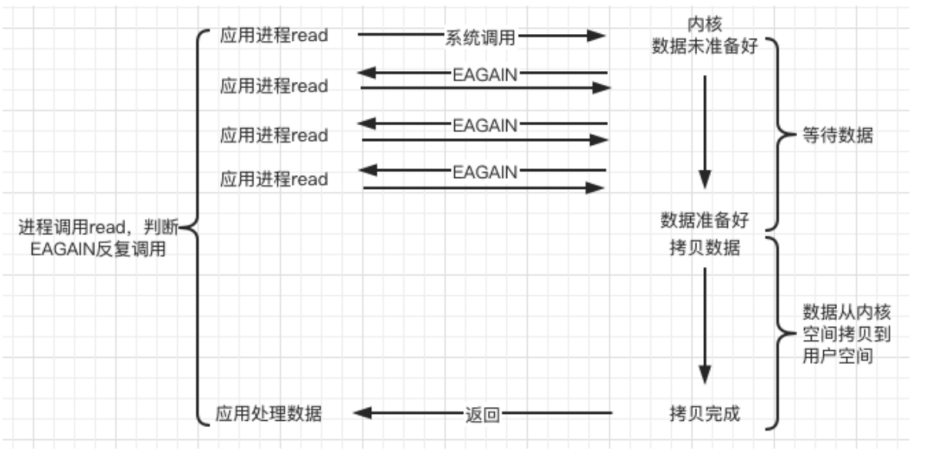
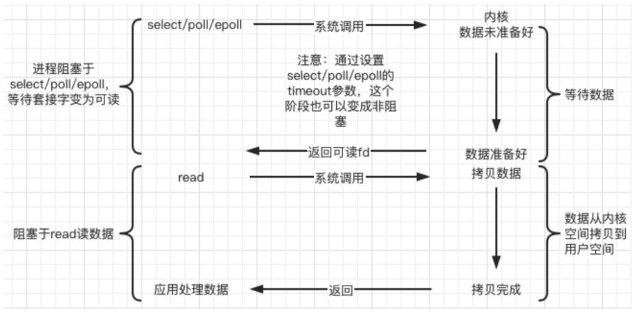
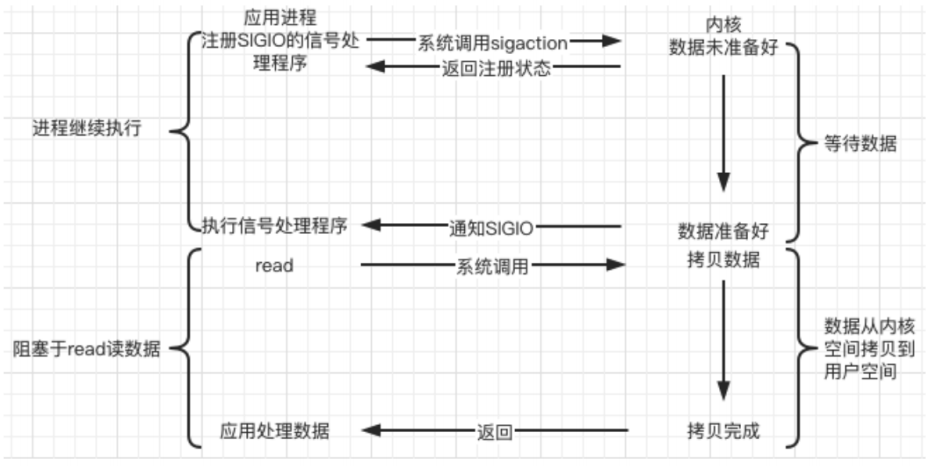

# 项目总结与实战

## 1. 阻塞/非阻塞 & 同步/异步

- 一个典型的网络IO接口调用，分为两个阶段，分别是`数据就绪` 和 `数据读写`

- `数据就绪阶段`分为`阻塞`和`非阻塞`

  - 阻塞：阻塞当前线程，直到满足条件
  - 非阻塞：直接返回，等满足条件时再通知

- `数据读写阶段`分为`同步`和`异步`

  - 同步：当A向B请求调用一个网络IO接口时(或者调用某个业务逻辑API接口时)，**数据的读写都是由请求方A自己来完成的(不管是阻塞还是非阻塞)**
  - 异步：A向B请求调用一个网络IO接口时(或者调用某个业务逻辑API接口时)，**向B传入请求的事件以及事件发生时通知的方式，A就可以处理其它逻辑了**，当B监听到事件处理完成后，会用事先约定好的通知方式，通知A处理结果

- 小结

  > 陈硕：在处理 IO 的时候，阻塞和非阻塞都是同步 IO，只有使用了特殊的 API 才是异步 IO


* 图示说明


* `sockfd`对应操作系统中的TCP接收缓冲区

- recv默认阻塞，直到读到数据才往下执行，如果设置为非阻塞，那么就应该通过返回值判断
  - `size == -1`：说明读取出错了，但有几种例外需要判断，如产生了`EINTR`(信号捕捉回收子进程资源时产生`SIGCHLD`导致这个信号)，`EAGAIN/EWOULDBLOCK`信号
  - `size == 0`：读到文件末尾，即对方连接已关闭
  - `size > 0`：读到了大小为`size`的数据

- 参考
  - [linux中对errno是EINTR的处理](https://blog.csdn.net/hnlyyk/article/details/51444617)
  - [Linux中的EAGAIN含义](https://www.cnblogs.com/pigerhan/archive/2013/02/27/2935403.html)

## 2. Unix/Linux上的I/O模型

### 2.1 阻塞(BIO, blocking)

- 调用者调用了某个函数，**等待这个函数返回，期间什么也不做**，不停的去检查这个函数有没有返回，必须等这个函数返回才能进行下一步动作


### 2.2 非阻塞(NIO, non-blocking)

- 非阻塞等待，**每隔一段时间就去检测IO事件是否就绪，没有就绪就可以做其他事**
- 非阻塞 I/O 执行系统调用总是立即返回，不管事件是否已经发生
- 若事件没有发生，则返回-1，此时可以根据 `errno` 区分这两种情况，对于`accept`，`recv` 和 `send`，事件未发生时，`errno` 通常被设置成 `EAGAIN`



### 2.3 IO 复用(IO multiplexing)

- Linux 用 `select/poll/epoll` 函数实现 IO 复用模型，这些函数也会使进程阻塞，但是**和阻塞IO所不同的是这些函数可以同时阻塞多个IO操作**
- 可以同时对多个读操作、写操作的IO函数进行检测。直到有数据可读或可写时，才真正调用IO操作函数



### 2.4 信号驱动(signal-driven)

- Linux 用套接口进行信号驱动 IO，安装一个信号处理函数，**进程继续运行并不阻塞，当IO事件就绪，进程收到SIGIO 信号，然后处理 IO 事件**
- 下图中，内核在第一个阶段是异步，在第二个阶段是同步
- 与非阻塞IO的区别在于它提供了消息通知机制，不需要用户进程不断的轮询检查，减少了系统API的调用次数，提高了效率



### 2.7 异步(asynchronous)

- Linux中，可以调用 `aio_read` 函数告诉内核**描述字缓冲区指针和缓冲区的大小、文件偏移及通知的方式**，然后立即返回，当内核将数据拷贝到缓冲区后，再通知应用程序

```c
/* Asynchronous I/O control block. */ 
struct aiocb { 
    int aio_fildes; /* File desriptor. */ 
    int aio_lio_opcode; /* Operation to be performed. */ 
    int aio_reqprio; /* Request priority offset. */ 
    volatile void *aio_buf; /* Location of buffer. */ 
    size_t aio_nbytes; /* Length of transfer. */ 
    struct sigevent aio_sigevent; /* Signal number and value. */ 
    
    /* Internal members. */ 
    struct aiocb *__next_prio; 
    int __abs_prio; 
    int __policy; 
    int __error_code; 
    __ssize_t __return_value; 
    
#ifndef __USE_FILE_OFFSET64 
    __off_t aio_offset; /* File offset. */ 
    char __pad[sizeof (__off64_t) - sizeof (__off_t)]; 
#else 
    __off64_t aio_offset; /* File offset. */ 
#endif 
    char __glibc_reserved[32]; 
};
```


## 3. Web Server (网页网页服务器)

一个 Web Server 就是一个服务器软件（程序），或者是运行这个服务器软件的硬件（计算机）。其主 要功能是通过 HTTP 协议与客户端（通常是浏览器（Browser））进行通信，来接收，存储，处理来自 客户端的 HTTP 请求，并对其请求做出 HTTP 响应，返回给客户端其请求的内容（文件、网页等）或返 回一个 Error 信息。


通常用户使用 Web 浏览器与相应服务器进行通信。在浏览器中键入“域名”或“IP地址:端口号”，浏览器则 先将你的域名解析成相应的 IP 地址或者直接根据你的IP地址向对应的 Web 服务器发送一个 HTTP 请 求。这一过程首先要通过 TCP 协议的三次握手建立与目标 Web 服务器的连接，然后 HTTP 协议生成针 对目标 Web 服务器的 HTTP 请求报文，通过 TCP、IP 等协议发送到目标 Web 服务器上。

## 4. HTTP协议(应用层的协议)

### 4.1 简介

超文本传输协议（Hypertext Transfer Protocol，HTTP）是一个简单的请求 - 响应协议，它通常运行在 TCP 之上。它指定了客户端可能发送给服务器什么样的消息以及得到什么样的响应。请求和响应消息的 头以 ASCII 形式给出；而消息内容则具有一个类似 MIME 的格式。HTTP是万维网的数据通信的基础。

### 4.2 概述

HTTP 是一个客户端终端（用户）和服务器端（网站）请求和应答的标准（TCP）。通过使用网页浏览 器、网络爬虫或者其它的工具，客户端发起一个HTTP请求到服务器上指定端口（默认端口为80）。我们 称这个客户端为用户代理程序（user agent）。应答的服务器上存储着一些资源，比如 HTML 文件和图 像。我们称这个应答服务器为源服务器（origin server）。在用户代理和源服务器中间可能存在多个“中 间层”，比如代理服务器、网关或者隧道（tunnel）。

通常，由HTTP客户端发起一个请求，创建一个到服务器指定端口（默认是80端口）的 TCP 连接。HTTP 服务器则在那个端口监听客户端的请求。一旦收到请求，服务器会向客户端返回一个状态，比 如"HTTP/1.1 200 OK"，以及返回的内容，如请求的文件、错误消息、或者其它信息。

### 4.3 工作原理

HTTP 协议定义 Web 客户端如何从 Web 服务器请求 Web 页面，以及服务器如何把 Web 页面传送给客 户端。HTTP 协议采用了请求/响应模型。客户端向服务器发送一个请求报文，请求报文包含请求的方 法、URL、协议版本、请求头部和请求数据。服务器以一个状态行作为响应，响应的内容包括协议的版 本、成功或者错误代码、服务器信息、响应头部和响应数据。

**以下是 HTTP 请求/响应的步骤：** 

1. 客户端连接到 Web 服务器 一个HTTP客户端，通常是浏览器，与 Web 服务器的 HTTP 端口（默认为 80 ）建立一个 TCP 套接 字连接。例如，http://www.baidu.com。（URL） 
2. 发送 HTTP 请求 通过 TCP 套接字，客户端向 Web 服务器发送一个文本的请求报文，一个请求报文由请求行、请求 头部、空行和请求数据 4 部分组成。 
3. 服务器接受请求并返回 HTTP 响应 Web 服务器解析请求，定位请求资源。服务器将资源复本写到 TCP 套接字，由客户端读取。一个 响应由状态行、响应头部、空行和响应数据 4 部分组成。 
4. 释放连接 TCP 连接 若 connection 模式为 close，则服务器主动关闭 TCP连接，客户端被动关闭连接，释放 TCP 连 接；若connection 模式为 keepalive，则该连接会保持一段时间，在该时间内可以继续接收请求; 
5. 客户端浏览器解析 HTML 内容 客户端浏览器首先解析状态行，查看表明请求是否成功的状态代码。然后解析每一个响应头，响应 头告知以下为若干字节的 HTML 文档和文档的字符集。客户端浏览器读取响应数据 HTML，根据 HTML 的语法对其进行格式化，并在浏览器窗口中显示。

例如：在浏览器地址栏键入URL，按下回车之后会经历以下流程：

1. 浏览器向 DNS 服务器请求解析该 URL 中的域名所对应的 IP 地址;
2. 解析出 IP 地址后，根据该 IP 地址和默认端口 80，和服务器建立 TCP 连接; 
3. 浏览器发出读取文件（ URL 中域名后面部分对应的文件）的 HTTP 请求，该请求报文作为 TCP 三 次握手的第三个报文的数据发送给服务器; 
4. 服务器对浏览器请求作出响应，并把对应的 HTML 文本发送给浏览器; 
5. 释放 TCP 连接; 
6. 浏览器将该 HTML 文本并显示内容。


HTTP 协议是基于 TCP/IP 协议之上的应用层协议，基于 请求-响应 的模式。HTTP 协议规定，请求从客 户端发出，最后服务器端响应该请求并返回。换句话说，肯定是先从客户端开始建立通信的，服务器端 在没有接收到请求之前不会发送响应。

### 4.4 HTTP 请求报文格式


```http
GET / HTTP/1.1
Host: www.baidu.com
User-Agent: Mozilla/5.0 (Windows NT 10.0; Win64; x64; rv:86.0) Gecko/20100101 Firefox/86.0
Accept: text/html,application/xhtml+xml,application/xml;q=0.9,image/webp,/;q=0.8
Accept-Language: zh-CN,zh;q=0.8,zh-TW;q=0.7,zh-HK;q=0.5,en-US;q=0.3,en;q=0.2
Accept-Encoding: gzip, deflate, br
Connection: keep-alive
Cookie: BAIDUID=6729CB682DADC2CF738F533E35162D98:FG=1;
BIDUPSID=6729CB682DADC2CFE015A8099199557E; PSTM=1614320692; BD_UPN=13314752;
BDORZ=FFFB88E999055A3F8A630C64834BD6D0;
__yjs_duid=1_d05d52b14af4a339210722080a668ec21614320694782; BD_HOME=1;
H_PS_PSSID=33514_33257_33273_31660_33570_26350;
BA_HECTOR=8h2001alag0lag85nk1g3hcm60q
Upgrade-Insecure-Requests: 1
Cache-Control: max-age=0
```

### 4.5 HTTP响应报文格式


```http
HTTP/1.1 200 OK
Bdpagetype: 1
Bdqid: 0xf3c9743300024ee4
Cache-Control: private
Connection: keep-alive
Content-Encoding: gzip
Content-Type: text/html;charset=utf-8
Date: Fri, 26 Feb 2021 08:44:35 GMT
Expires: Fri, 26 Feb 2021 08:44:35 GMT
Server: BWS/1.1
Set-Cookie: BDSVRTM=13; path=/
Set-Cookie: BD_HOME=1; path=/
Set-Cookie: H_PS_PSSID=33514_33257_33273_31660_33570_26350; path=/; domain=.baidu.com
Strict-Transport-Security: max-age=172800
Traceid: 1614329075128412289017566699583927635684
X-Ua-Compatible: IE=Edge,chrome=1
Transfer-Encoding: chunked
```

### 4.6 HTTP请求方法

HTTP/1.1 协议中共定义了**八种方法**（也叫“动作”）来以不同方式操作指定的资源：

1. **GET：**向指定的资源发出“显示”请求。使用 GET 方法应该只用在读取数据，而不应当被用于产生“副 作用”的操作中，例如在 Web Application 中。其中一个原因是 GET 可能会被网络蜘蛛等随意访 问。 
2. **HEAD：**与 GET 方法一样，都是向服务器发出指定资源的请求。只不过服务器将不传回资源的本文 部分。它的好处在于，使用这个方法可以在不必传输全部内容的情况下，就可以获取其中“关于该 资源的信息”（元信息或称元数据）。 
3. **POST：**向指定资源提交数据，请求服务器进行处理（例如提交表单或者上传文件）。数据被包含 在请求本文中。这个请求可能会创建新的资源或修改现有资源，或二者皆有。 
4. **PUT：**向指定资源位置上传其最新内容。 
5. **DELETE：**请求服务器删除 Request-URI 所标识的资源。 
6. **TRACE：**回显服务器收到的请求，主要用于测试或诊断。 
7. **OPTIONS：**这个方法可使服务器传回该资源所支持的所有 HTTP 请求方法。用'*'来代替资源名称， 向 Web 服务器发送 OPTIONS 请求，可以测试服务器功能是否正常运作。 
8. **CONNECT：**HTTP/1.1 协议中预留给能够将连接改为管道方式的代理服务器。通常用于SSL加密服 务器的链接（经由非加密的 HTTP 代理服务器）。

### 4.7 HTTP状态码

所有HTTP响应的第一行都是状态行，依次是当前HTTP版本号，3位数字组成的状态代码，以及描述状态 的短语，彼此由空格分隔。 

> `状态代码的第一个数字代表当前响应的类型：` 
>
> 1xx消息——请求已被服务器接收，继续处理 
>
> 2xx成功——请求已成功被服务器接收、理解、并接受 
>
> 3xx重定向——需要后续操作才能完成这一请求 
>
> 4xx请求错误——请求含有词法错误或者无法被执行 
>
> 5xx服务器错误——服务器在处理某个正确请求时发生错误

[状态码]:https://baike.baidu.com/item/HTTP%E7%8A%B6%E6%80%81%E7%A0%81/5053660?fr=aladdin


## 5. 服务器编程基本框架


| 模块         | 功能                       |
| ------------ | -------------------------- |
| I/O 处理单元 | 处理客户连接，读写网络数据 |
| 逻辑单元     | 业务进程或线程             |
| 网络存储单元 | 数据库、文件或缓存         |
| 请求队列     | 各单元之间的通信方式       |

**I/O 处理单元**是服务器管理客户连接的模块。它通常要完成以下工作：等待并接受新的客户连接，接收 客户数据，将服务器响应数据返回给客户端。但是数据的收发不一定在 I/O 处理单元中执行，也可能在 逻辑单元中执行，具体在何处执行取决于事件处理模式。 

**一个逻辑单元**通常是一个进程或线程。它分析并处理客户数据，然后将结果传递给 I/O 处理单元或者直 接发送给客户端（具体使用哪种方式取决于事件处理模式）。服务器通常拥有多个逻辑单元，以实现对 多个客户任务的并发处理。 

**网络存储单元**可以是数据库、缓存和文件，但不是必须的。 

**请求队列**是各单元之间的通信方式的抽象。I/O 处理单元接收到客户请求时，需要以某种方式通知一个 逻辑单元来处理该请求。同样，多个逻辑单元同时访问一个存储单元时，也需要采用某种机制来协调处 理竞态条件。请求队列通常被实现为池的一部分。

## 6. 两种高效的事件处理模式

服务器程序通常需要处理三类事件：`I/O 事件、信号及定时事件`。有两种高效的事件处理模式：`Reactor` 和 `Proactor`，同步 I/O 模型通常用于实现 Reactor 模式，异步 I/O 模型通常用于实现 Proactor 模式。

### 6.1 Reactor模式

**要求主线程（I/O处理单元）只负责监听文件描述符上是否有事件发生**，有的话就立即将该事件通知工作线程（逻辑单元），将 socket 可读可写事件放入请求队列，交给工作线程处理。除此之外，主线程不做任何其他实质性的工作。读写数据，接受新的连接，以及处理客户请求均在工作线程中完成。

`使用同步 I/O（以 epoll_wait 为例）实现的 Reactor 模式的工作流程是：` 

1. 主线程往 epoll 内核事件表中注册 socket 上的读就绪事件。 
2. 主线程调用 epoll_wait 等待 socket 上有数据可读。 
3. 当 socket 上有数据可读时， epoll_wait 通知主线程。主线程则将 socket 可读事件放入请求队列。
4. 睡眠在请求队列上的某个工作线程被唤醒，它从 socket 读取数据，并处理客户请求，然后往 epoll 内核事件表中注册该 socket 上的写就绪事件。
5. 当主线程调用 epoll_wait 等待 socket 可写。
6. 当 socket 可写时，epoll_wait 通知主线程。主线程将 socket 可写事件放入请求队列。 7. 睡眠在请求队列上的某个工作线程被唤醒，它往 socket 上写入服务器处理客户请求的结果。

**reactor 模式的工作流程：**

Reactor模式

### 6.3 Proactor模式

`Proactor 模式将所有 I/O 操作都交给主线程和内核来处理（进行读、写）`，**工作线程仅仅负责业务逻辑**。使用异步 I/O 模型（以 aio_read 和 aio_write 为例）实现的 Proactor 模式的工作流程是：

1. 主线程调用 aio_read 函数向内核注册 socket 上的读完成事件，并告诉内核用户读缓冲区的位置， 以及读操作完成时如何通知应用程序（这里以信号为例）。 
2. 主线程继续处理其他逻辑。 
3. 当 socket 上的数据被读入用户缓冲区后，内核将向应用程序发送一个信号，以通知应用程序数据 已经可用。 
4. 应用程序预先定义好的信号处理函数选择一个工作线程来处理客户请求。工作线程处理完客户请求 后，调用 aio_write 函数向内核注册 socket 上的写完成事件，并告诉内核用户写缓冲区的位置，以 及写操作完成时如何通知应用程序。
5. 主线程继续处理其他逻辑。 
6. 当用户缓冲区的数据被写入 socket 之后，内核将向应用程序发送一个信号，以通知应用程序数据 已经发送完毕。
7. 应用程序预先定义好的信号处理函数选择一个工作线程来做善后处理，比如决定是否关闭 socket

**Proactor 模式的工作流程：**


### 6.4 模拟 Proactor 模式

`使用同步 I/O 方式模拟出 Proactor 模式。`原理是：**主线程执行数据读写操作，读写完成之后，主线程向 工作线程通知这一”完成事件“。那么从工作线程的角度来看，它们就直接获得了数据读写的结果，接下 来要做的只是对读写的结果进行逻辑处理。**

使用同步 I/O 模型（以 epoll_wait为例）模拟出的 Proactor 模式的工作流程如下：

1. 主线程往 epoll 内核事件表中注册 socket 上的读就绪事件。
2. 主线程调用 epoll_wait 等待 socket 上有数据可读。 
3. 当 socket 上有数据可读时，epoll_wait 通知主线程。主线程从 socket 循环读取数据，直到没有更 多数据可读，然后将读取到的数据封装成一个请求对象并插入请求队列。 
4. 睡眠在请求队列上的某个工作线程被唤醒，它获得请求对象并处理客户请求，然后往 epoll 内核事 件表中注册 socket 上的写就绪事件。 
5. 主线程调用 epoll_wait 等待 socket 可写。
6. 当 socket 可写时，epoll_wait 通知主线程。主线程往 socket 上写入服务器处理客户请求的结果。

**同步 I/O 模拟 Proactor 模式的工作流程：**


## 7. 线程池

线程池是由服务器预先创建的一组子线程，线程池中的线程数量应该和 CPU 数量差不多。线程池中的所 有子线程都运行着相同的代码。当有新的任务到来时，主线程将通过某种方式选择线程池中的某一个子 线程来为之服务。相比与动态的创建子线程，选择一个已经存在的子线程的代价显然要小得多。至于主 线程选择哪个子线程来为新任务服务，则有多种方式：

*  主线程使用某种算法来主动选择子线程。最简单、最常用的算法是随机算法和 Round Robin（轮流 选取）算法，但更优秀、更智能的算法将使任务在各个工作线程中更均匀地分配，从而减轻服务器 的整体压力。 
* 主线程和所有子线程通过一个共享的工作队列来同步，子线程都睡眠在该工作队列上。当有新的任 务到来时，主线程将任务添加到工作队列中。这将唤醒正在等待任务的子线程，不过只有一个子线 程将获得新任务的”接管权“，它可以从工作队列中取出任务并执行之，而其他子线程将继续睡眠在 工作队列上。

**线程池的一般模型为：**


> 线程池中的线程数量最直接的限制因素是中央处理器(CPU)的处理器(processors/cores)的数量 N ：如果你的CPU是4-cores的，对于CPU密集型的任务(如视频剪辑等消耗CPU计算资源的任务)来 说，那线程池中的线程数量最好也设置为4（或者+1防止其他因素造成的线程阻塞）；对于IO密集 型的任务，一般要多于CPU的核数，因为线程间竞争的不是CPU的计算资源而是IO，IO的处理一 般较慢，多于cores数的线程将为CPU争取更多的任务，不至在线程处理IO的过程造成CPU空闲导 致资源浪费。

* 空间换时间，浪费服务器的硬件资源，换取运行效率。 
* 池是一组资源的集合，这组资源在服务器启动之初就被完全创建好并初始化，这称为静态资源。 
* 当服务器进入正式运行阶段，开始处理客户请求的时候，如果它需要相关的资源，可以直接从池中 获取，无需动态分配。 
* 当服务器处理完一个客户连接后，可以把相关的资源放回池中，无需执行系统调用释放资源。

## 8. 有限状态机

逻辑单元内部的一种高效编程方法：`有限状态机（finite state machine）`。

 有的应用层协议头部包含数据包类型字段，每种类型可以映射为逻辑单元的一种执行状态，服务器可以 根据它来编写相应的处理逻辑。如下是一种状态独立的有限状态机：

```c
STATE_MACHINE( Package _pack )
{
	PackageType _type = _pack.GetType();
	switch( _type )
	{
		case type_A:
			process_package_A( _pack );
			break;
		case type_B:
        process_package_B( _pack );
        break;
    }
}
```

这是一个简单的有限状态机，只不过该状态机的每个状态都是相互独立的，即状态之间没有相互转移。 状态之间的转移是需要状态机内部驱动，如下代码：

```c
STATE_MACHINE()
{
	State cur_State = type_A;
	while( cur_State != type_C )
	{
		Package _pack = getNewPackage();
		switch( cur_State )
		{
			case type_A:
				process_package_state_A( _pack );
                cur_State = type_B;
                break;
			case type_B:
                process_package_state_B( _pack );
                cur_State = type_C;
                break;
		}
	}
}
```

该状态机包含三种状态：type_A、type_B 和 type_C，其中 type_A 是状态机的开始状态，type_C 是状 态机的结束状态。状态机的当前状态记录在 cur_State 变量中。在一趟循环过程中，状态机先通过 getNewPackage 方法获得一个新的数据包，然后根据 cur_State 变量的值判断如何处理该数据包。数据 包处理完之后，状态机通过给 cur_State 变量传递目标状态值来实现状态转移。那么当状态机进入下一 趟循环时，它将执行新的状态对应的逻辑。

## 9. EPOLLONESHOT事件

即使可以使用 ET 模式，一个socket 上的某个事件还是可能被触发多次。这在并发程序中就会引起一个 问题。比如一个线程在读取完某个 socket 上的数据后开始处理这些数据，而在数据的处理过程中该 socket 上又有新数据可读（EPOLLIN 再次被触发），此时另外一个线程被唤醒来读取这些新的数据。于是就出现了两个线程同时操作一个 socket 的局面。一个socket连接在任一时刻都只被一个线程处理，可 以使用 epoll 的 EPOLLONESHOT 事件实现。 

对于注册了 EPOLLONESHOT 事件的文件描述符，操作系统最多触发其上注册的一个可读、可写或者异 常事件，且只触发一次，除非我们使用 epoll_ctl 函数重置该文件描述符上注册的 EPOLLONESHOT 事 件。这样，当一个线程在处理某个 socket 时，其他线程是不可能有机会操作该 socket 的。但反过来思 考，注册了 EPOLLONESHOT 事件的 socket 一旦被某个线程处理完毕， 该线程就应该立即重置这个 socket 上的 EPOLLONESHOT 事件，以确保这个 socket 下一次可读时，其 EPOLLIN 事件能被触发，进 而让其他工作线程有机会继续处理这个 socket。

## 10. 服务器压力测试

Webbench 是 Linux 上一款知名的、优秀的 web 性能压力测试工具。它是由Lionbridge公司开发。

> * 测试处在相同硬件上，不同服务的性能以及不同硬件上同一个服务的运行状况。 
> * 展示服务器的两项内容：每秒钟响应请求数和每秒钟传输数据量。

基本原理：Webbench 首先 fork 出多个子进程，每个子进程都循环做 web 访问测试。子进程把访问的 结果通过pipe 告诉父进程，父进程做最终的统计结果。

**测试示例：**

```shell
webbench -c 1000 -t 30 http://192.168.110.129:10000/index.html
参数：
-c 表示客户端数
-t 表示时间
```

